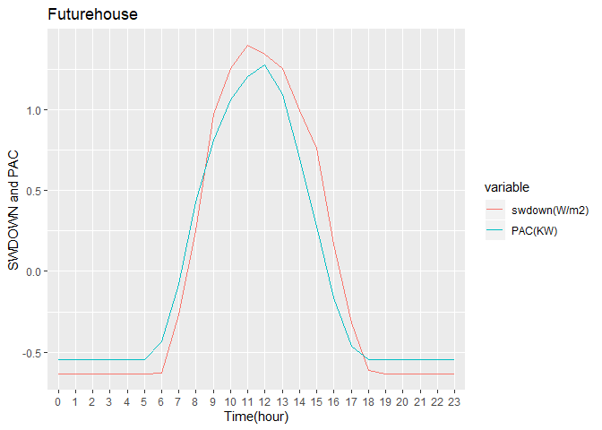

# 1. About the research
#### The data from Electronics Testing Center, Taiwan. Due to the limited dimensions, date from solar generator included DOWNWARD SHORT WAVE FLUX AT GROUND SURFACE(SWDOWN) and electricity production (PAC), and data from wind drive generator included 10 meter high of wind speed(WS10m), 65 meter high of wind speed (WS65m) and electricity production(PAC).   
#### 本次研究案電子檢驗中心提供兩種發電數據:風力發電及太陽能發電，由於本次提供數據維度有限，太陽能發電的數據僅能從地表輻射(SWDOWN)和發電量(PAC)觀察;風力發電僅能參考發電機10公尺觀測到的風速(WS10m)、65公尺觀測到的風速(WS65m)及發電量(PAC)三個變數。

# 2. Data preparation for solar generator

#### Load the library all we need in this study first. 

```r
library(lubridate)
```

```
## 
## Attaching package: 'lubridate'
```

```
## The following object is masked from 'package:base':
## 
##     date
```

```r
library(dygraphs)
library(ggplot2)
library(caret)
```

```
## Loading required package: lattice
```

```r
library(corrplot)
```

```
## corrplot 0.84 loaded
```

```r
library(Metrics)
```

```
## 
## Attaching package: 'Metrics'
```

```
## The following objects are masked from 'package:caret':
## 
##     precision, recall
```

```r
library(reshape2)
library(dplyr)
```

```
## 
## Attaching package: 'dplyr'
```

```
## The following objects are masked from 'package:lubridate':
## 
##     intersect, setdiff, union
```

```
## The following objects are masked from 'package:stats':
## 
##     filter, lag
```

```
## The following objects are masked from 'package:base':
## 
##     intersect, setdiff, setequal, union
```

```r
library(xts)
```

```
## Loading required package: zoo
```

```
## 
## Attaching package: 'zoo'
```

```
## The following objects are masked from 'package:base':
## 
##     as.Date, as.Date.numeric
```

```
## 
## Attaching package: 'xts'
```

```
## The following objects are masked from 'package:dplyr':
## 
##     first, last
```

### 2.1 loading data
#### Five observed sites near the solar generators. Each of the sites recorded multiple information, and the most important variable is SWDOWN and PAC. We combined all the sites to a big data frame.  

```r
chunghwa <- read.csv("C:/Users/Christine Liou/Documents/ETC/Data_1105/14.csv")
chunghwa$location <- "chunghwa"
dreamhouse <- read.csv("C:/Users/Christine Liou/Documents/ETC/Data_1105/19.csv")
dreamhouse$location <- "dreamhouse"
futurehouse <- read.csv("C:/Users/Christine Liou/Documents/ETC/Data_1105/18.csv")
futurehouse$location <- "futurehouse"
xinglongmarket <- read.csv("C:/Users/Christine Liou/Documents/ETC/Data_1105/39.csv")
xinglongmarket$location <- "xinglongmarket"
nuclearresearch <- read.csv("C:/Users/Christine Liou/Documents/ETC/Data_1105/40.csv")
nuclearresearch$location <- "nuclearresearch"
cbso <- rbind(chunghwa,dreamhouse,futurehouse,xinglongmarket,nuclearresearch)
rm(chunghwa,dreamhouse,futurehouse,xinglongmarket,nuclearresearch)

names(cbso)
```

```
##  [1] "SESSIONS"      "RANK"          "MYTIME"        "MYHOUR"       
##  [5] "INITIAL_DATE"  "FCST"          "STNNO"         "FCST_DATETIME"
##  [9] "WS10M"         "WS65M"         "SWDOWN"        "USER_ID"      
## [13] "INITIAL_TIME"  "EQUIPMENT_ID"  "T2"            "SHUM2"        
## [17] "RAIN"          "PAC"           "VAC"           "IAC"          
## [21] "EAC"           "location"
```

```r
names(cbso)[c(1:2,4:8,12:17)] 
```

```
##  [1] "SESSIONS"      "RANK"          "MYHOUR"        "INITIAL_DATE" 
##  [5] "FCST"          "STNNO"         "FCST_DATETIME" "USER_ID"      
##  [9] "INITIAL_TIME"  "EQUIPMENT_ID"  "T2"            "SHUM2"        
## [13] "RAIN"
```

```r
cbso <- cbso[,-c(1:2,4:8,12:17)] 
summary(cbso)
```

```
##            MYTIME         WS10M              WS65M          
##  2018/09/01 00:   5   Min.   :   0.043   Min.   :-999.0000  
##  2018/09/01 01:   5   1st Qu.:   1.232   1st Qu.:   1.7948  
##  2018/09/01 02:   5   Median :   2.197   Median :   3.0540  
##  2018/09/01 03:   5   Mean   :   5.789   Mean   :   0.7302  
##  2018/09/01 04:   5   3rd Qu.:   3.125   3rd Qu.:   4.2880  
##  2018/09/01 05:   5   Max.   :1412.799   Max.   :  10.3460  
##  (Other)      :6418                                         
##      SWDOWN            PAC                VAC             IAC         
##  Min.   :-999.0   Min.   :    0.00   Min.   :191.1   Min.   :  0.000  
##  1st Qu.:   0.0   1st Qu.:    0.00   1st Qu.:221.2   1st Qu.:  0.400  
##  Median :   0.0   Median :   53.33   Median :226.6   Median :  0.825  
##  Mean   : 165.5   Mean   : 4779.09   Mean   :274.1   Mean   : 12.608  
##  3rd Qu.: 253.4   3rd Qu.: 5401.49   3rd Qu.:230.9   3rd Qu.: 13.963  
##  Max.   : 988.9   Max.   :48605.86   Max.   :447.6   Max.   :126.870  
##                                                                       
##       EAC          location        
##  Min.   : 5317   Length:6448       
##  1st Qu.:17941   Class :character  
##  Median :32655   Mode  :character  
##  Mean   :29537                     
##  3rd Qu.:37748                     
##  Max.   :49195                     
## 
```


### 2.2 dealing time series 
#### Shift the data frame to be time series format. 

```r
head(cbso$MYTIME)
```

```
## [1] 2018/09/01 00 2018/09/01 01 2018/09/01 02 2018/09/01 03 2018/09/01 04
## [6] 2018/09/01 05
## 1503 Levels: 2018/09/01 00 2018/09/01 01 2018/09/01 02 ... 2018/11/05 10
```

```r
date <- substr(cbso$MYTIME, 1,10)
time <- paste(substr(cbso$MYTIME,12, 13),":00:00",sep = "") 
cbso$MYTIME <- as.POSIXct(paste(date,time, sep = " "))

cbso$location <- factor(cbso$location)

summary(cbso)
```

```
##      MYTIME                        WS10M              WS65M          
##  Min.   :2018-09-01 00:00:00   Min.   :   0.043   Min.   :-999.0000  
##  1st Qu.:2018-09-15 11:00:00   1st Qu.:   1.232   1st Qu.:   1.7948  
##  Median :2018-10-01 18:00:00   Median :   2.197   Median :   3.0540  
##  Mean   :2018-10-02 02:40:59   Mean   :   5.789   Mean   :   0.7302  
##  3rd Qu.:2018-10-18 00:00:00   3rd Qu.:   3.125   3rd Qu.:   4.2880  
##  Max.   :2018-11-05 10:00:00   Max.   :1412.799   Max.   :  10.3460  
##      SWDOWN            PAC                VAC             IAC         
##  Min.   :-999.0   Min.   :    0.00   Min.   :191.1   Min.   :  0.000  
##  1st Qu.:   0.0   1st Qu.:    0.00   1st Qu.:221.2   1st Qu.:  0.400  
##  Median :   0.0   Median :   53.33   Median :226.6   Median :  0.825  
##  Mean   : 165.5   Mean   : 4779.09   Mean   :274.1   Mean   : 12.608  
##  3rd Qu.: 253.4   3rd Qu.: 5401.49   3rd Qu.:230.9   3rd Qu.: 13.963  
##  Max.   : 988.9   Max.   :48605.86   Max.   :447.6   Max.   :126.870  
##       EAC                   location   
##  Min.   : 5317   chunghwa       :1503  
##  1st Qu.:17941   dreamhouse     :1503  
##  Median :32655   futurehouse    :1503  
##  Mean   :29537   nuclearresearch: 436  
##  3rd Qu.:37748   xinglongmarket :1503  
##  Max.   :49195
```

### 2.3 remove missing data
#### The missing data were recorded in "-999", therefore, we removed all the data showed "-999".

```r
table(cbso$WS65M=="-999")
```

```
## 
## FALSE  TRUE 
##  6432    16
```

```r
cbso <- subset(cbso,WS65M!="-999")
summary(cbso)
```

```
##      MYTIME                        WS10M           WS65M       
##  Min.   :2018-09-01 00:00:00   Min.   :0.043   Min.   : 0.086  
##  1st Qu.:2018-09-15 10:00:00   1st Qu.:1.229   1st Qu.: 1.803  
##  Median :2018-10-01 16:00:00   Median :2.192   Median : 3.058  
##  Mean   :2018-10-02 01:20:40   Mean   :2.289   Mean   : 3.217  
##  3rd Qu.:2018-10-17 22:00:00   3rd Qu.:3.119   3rd Qu.: 4.290  
##  Max.   :2018-11-05 10:00:00   Max.   :9.142   Max.   :10.346  
##      SWDOWN           PAC             VAC             IAC        
##  Min.   :  0.0   Min.   :    0   Min.   :191.1   Min.   :  0.00  
##  1st Qu.:  0.0   1st Qu.:    0   1st Qu.:221.2   1st Qu.:  0.40  
##  Median :  0.0   Median :   50   Median :226.6   Median :  0.81  
##  Mean   :168.4   Mean   : 4784   Mean   :274.1   Mean   : 12.62  
##  3rd Qu.:254.2   3rd Qu.: 5408   3rd Qu.:230.9   3rd Qu.: 13.97  
##  Max.   :988.9   Max.   :48606   Max.   :447.6   Max.   :126.87  
##       EAC                   location   
##  Min.   : 5317   chunghwa       :1499  
##  1st Qu.:17929   dreamhouse     :1499  
##  Median :32651   futurehouse    :1499  
##  Mean   :29523   nuclearresearch: 436  
##  3rd Qu.:37696   xinglongmarket :1499  
##  Max.   :49195
```

### 2.4 standardize data
#### Standardized the numeriacal data.

```r
cbso_sc <- cbso[,c(2:5)]
cbso_sc <- scale(cbso_sc)
cbso_z <- as.data.frame(cbso_sc)
cbso_z <- cbind(cbso$MYTIME,cbso$location,cbso_z)
colnames(cbso_z) <- c("mytime","location","ws10m","ws65m","swdown","pac")
summary(cbso_z)
```

```
##      mytime                               location        ws10m         
##  Min.   :2018-09-01 00:00:00   chunghwa       :1499   Min.   :-1.70944  
##  1st Qu.:2018-09-15 10:00:00   dreamhouse     :1499   1st Qu.:-0.80698  
##  Median :2018-10-01 16:00:00   futurehouse    :1499   Median :-0.07387  
##  Mean   :2018-10-02 01:20:40   nuclearresearch: 436   Mean   : 0.00000  
##  3rd Qu.:2018-10-17 22:00:00   xinglongmarket :1499   3rd Qu.: 0.63185  
##  Max.   :2018-11-05 10:00:00                          Max.   : 5.21567  
##      ws65m              swdown             pac          
##  Min.   :-1.77558   Min.   :-0.6335   Min.   :-0.55077  
##  1st Qu.:-0.80190   1st Qu.:-0.6335   1st Qu.:-0.55077  
##  Median :-0.09021   Median :-0.6335   Median :-0.54502  
##  Mean   : 0.00000   Mean   : 0.0000   Mean   : 0.00000  
##  3rd Qu.: 0.60872   3rd Qu.: 0.3228   3rd Qu.: 0.07185  
##  Max.   : 4.04270   Max.   : 3.0864   Max.   : 5.04569
```

# 3. Data visulation for solar generator
#### Preparing the data frame to draw prictures. 

```r
cbso_sc <- cbso_z[,-2]
lcbso_sc <- melt(cbso_sc, id.vars='mytime', variable.name = "variable")
lcbso_sc$month <- factor(month(lcbso_sc$mytime))
lcbso_sc$day <- factor(day(lcbso_sc$mytime)) 
lcbso_sc$hour <- factor(hour(lcbso_sc$mytime))

DF_hour <- aggregate(value ~ hour*variable, data = lcbso_sc, FUN = mean)
DF_month <- aggregate(value ~ month*variable, data = lcbso_sc, FUN = mean)
day <- subset(DF_hour,DF_hour$hour %in% c(6:18))
night <- subset(DF_hour,DF_hour$hour %in% c(0:5,19:23))
```

### 3.1 all solar data for different time range 
#### As the picture shows below, SWDOWN and PAC have the similar path during one day. These two variables rise when the sunrise, and decline to zero after the sunset. 

```r
mytheme <- theme_grey(base_family="STKaiti")
ggplot(data = DF_hour, mapping = aes(x = hour, y = value, color = variable, group = variable)) + geom_line()  + mytheme + theme(axis.text.x=element_text(angle=45, vjust=0.5)) + labs(x = "Time(hour)") + labs(y = "ws,swdown and pac") + ggtitle("solar generator for every hour (by mean)")
```

```
## Warning in grid.Call(C_stringMetric, as.graphicsAnnot(x$label)): font
## family not found in Windows font database

## Warning in grid.Call(C_stringMetric, as.graphicsAnnot(x$label)): font
## family not found in Windows font database
```

```
## Warning in grid.Call(C_textBounds, as.graphicsAnnot(x$label), x$x, x$y, :
## font family not found in Windows font database
```

```
## Warning in grid.Call(C_stringMetric, as.graphicsAnnot(x$label)): font
## family not found in Windows font database
```

```
## Warning in grid.Call(C_textBounds, as.graphicsAnnot(x$label), x$x, x$y, :
## font family not found in Windows font database

## Warning in grid.Call(C_textBounds, as.graphicsAnnot(x$label), x$x, x$y, :
## font family not found in Windows font database

## Warning in grid.Call(C_textBounds, as.graphicsAnnot(x$label), x$x, x$y, :
## font family not found in Windows font database

## Warning in grid.Call(C_textBounds, as.graphicsAnnot(x$label), x$x, x$y, :
## font family not found in Windows font database

## Warning in grid.Call(C_textBounds, as.graphicsAnnot(x$label), x$x, x$y, :
## font family not found in Windows font database

## Warning in grid.Call(C_textBounds, as.graphicsAnnot(x$label), x$x, x$y, :
## font family not found in Windows font database

## Warning in grid.Call(C_textBounds, as.graphicsAnnot(x$label), x$x, x$y, :
## font family not found in Windows font database

## Warning in grid.Call(C_textBounds, as.graphicsAnnot(x$label), x$x, x$y, :
## font family not found in Windows font database

## Warning in grid.Call(C_textBounds, as.graphicsAnnot(x$label), x$x, x$y, :
## font family not found in Windows font database
```

```
## Warning in grid.Call.graphics(C_text, as.graphicsAnnot(x$label), x$x,
## x$y, : font family not found in Windows font database

## Warning in grid.Call.graphics(C_text, as.graphicsAnnot(x$label), x$x,
## x$y, : font family not found in Windows font database

## Warning in grid.Call.graphics(C_text, as.graphicsAnnot(x$label), x$x,
## x$y, : font family not found in Windows font database

## Warning in grid.Call.graphics(C_text, as.graphicsAnnot(x$label), x$x,
## x$y, : font family not found in Windows font database

## Warning in grid.Call.graphics(C_text, as.graphicsAnnot(x$label), x$x,
## x$y, : font family not found in Windows font database

## Warning in grid.Call.graphics(C_text, as.graphicsAnnot(x$label), x$x,
## x$y, : font family not found in Windows font database

## Warning in grid.Call.graphics(C_text, as.graphicsAnnot(x$label), x$x,
## x$y, : font family not found in Windows font database

## Warning in grid.Call.graphics(C_text, as.graphicsAnnot(x$label), x$x,
## x$y, : font family not found in Windows font database

## Warning in grid.Call.graphics(C_text, as.graphicsAnnot(x$label), x$x,
## x$y, : font family not found in Windows font database

## Warning in grid.Call.graphics(C_text, as.graphicsAnnot(x$label), x$x,
## x$y, : font family not found in Windows font database

## Warning in grid.Call.graphics(C_text, as.graphicsAnnot(x$label), x$x,
## x$y, : font family not found in Windows font database

## Warning in grid.Call.graphics(C_text, as.graphicsAnnot(x$label), x$x,
## x$y, : font family not found in Windows font database

## Warning in grid.Call.graphics(C_text, as.graphicsAnnot(x$label), x$x,
## x$y, : font family not found in Windows font database

## Warning in grid.Call.graphics(C_text, as.graphicsAnnot(x$label), x$x,
## x$y, : font family not found in Windows font database

## Warning in grid.Call.graphics(C_text, as.graphicsAnnot(x$label), x$x,
## x$y, : font family not found in Windows font database

## Warning in grid.Call.graphics(C_text, as.graphicsAnnot(x$label), x$x,
## x$y, : font family not found in Windows font database

## Warning in grid.Call.graphics(C_text, as.graphicsAnnot(x$label), x$x,
## x$y, : font family not found in Windows font database

## Warning in grid.Call.graphics(C_text, as.graphicsAnnot(x$label), x$x,
## x$y, : font family not found in Windows font database

## Warning in grid.Call.graphics(C_text, as.graphicsAnnot(x$label), x$x,
## x$y, : font family not found in Windows font database

## Warning in grid.Call.graphics(C_text, as.graphicsAnnot(x$label), x$x,
## x$y, : font family not found in Windows font database

## Warning in grid.Call.graphics(C_text, as.graphicsAnnot(x$label), x$x,
## x$y, : font family not found in Windows font database

## Warning in grid.Call.graphics(C_text, as.graphicsAnnot(x$label), x$x,
## x$y, : font family not found in Windows font database

## Warning in grid.Call.graphics(C_text, as.graphicsAnnot(x$label), x$x,
## x$y, : font family not found in Windows font database

## Warning in grid.Call.graphics(C_text, as.graphicsAnnot(x$label), x$x,
## x$y, : font family not found in Windows font database

## Warning in grid.Call.graphics(C_text, as.graphicsAnnot(x$label), x$x,
## x$y, : font family not found in Windows font database

## Warning in grid.Call.graphics(C_text, as.graphicsAnnot(x$label), x$x,
## x$y, : font family not found in Windows font database

## Warning in grid.Call.graphics(C_text, as.graphicsAnnot(x$label), x$x,
## x$y, : font family not found in Windows font database

## Warning in grid.Call.graphics(C_text, as.graphicsAnnot(x$label), x$x,
## x$y, : font family not found in Windows font database

## Warning in grid.Call.graphics(C_text, as.graphicsAnnot(x$label), x$x,
## x$y, : font family not found in Windows font database

## Warning in grid.Call.graphics(C_text, as.graphicsAnnot(x$label), x$x,
## x$y, : font family not found in Windows font database

## Warning in grid.Call.graphics(C_text, as.graphicsAnnot(x$label), x$x,
## x$y, : font family not found in Windows font database

## Warning in grid.Call.graphics(C_text, as.graphicsAnnot(x$label), x$x,
## x$y, : font family not found in Windows font database

## Warning in grid.Call.graphics(C_text, as.graphicsAnnot(x$label), x$x,
## x$y, : font family not found in Windows font database

## Warning in grid.Call.graphics(C_text, as.graphicsAnnot(x$label), x$x,
## x$y, : font family not found in Windows font database

## Warning in grid.Call.graphics(C_text, as.graphicsAnnot(x$label), x$x,
## x$y, : font family not found in Windows font database

## Warning in grid.Call.graphics(C_text, as.graphicsAnnot(x$label), x$x,
## x$y, : font family not found in Windows font database

## Warning in grid.Call.graphics(C_text, as.graphicsAnnot(x$label), x$x,
## x$y, : font family not found in Windows font database

## Warning in grid.Call.graphics(C_text, as.graphicsAnnot(x$label), x$x,
## x$y, : font family not found in Windows font database

## Warning in grid.Call.graphics(C_text, as.graphicsAnnot(x$label), x$x,
## x$y, : font family not found in Windows font database

## Warning in grid.Call.graphics(C_text, as.graphicsAnnot(x$label), x$x,
## x$y, : font family not found in Windows font database

## Warning in grid.Call.graphics(C_text, as.graphicsAnnot(x$label), x$x,
## x$y, : font family not found in Windows font database

## Warning in grid.Call.graphics(C_text, as.graphicsAnnot(x$label), x$x,
## x$y, : font family not found in Windows font database

## Warning in grid.Call.graphics(C_text, as.graphicsAnnot(x$label), x$x,
## x$y, : font family not found in Windows font database

## Warning in grid.Call.graphics(C_text, as.graphicsAnnot(x$label), x$x,
## x$y, : font family not found in Windows font database

## Warning in grid.Call.graphics(C_text, as.graphicsAnnot(x$label), x$x,
## x$y, : font family not found in Windows font database

## Warning in grid.Call.graphics(C_text, as.graphicsAnnot(x$label), x$x,
## x$y, : font family not found in Windows font database

## Warning in grid.Call.graphics(C_text, as.graphicsAnnot(x$label), x$x,
## x$y, : font family not found in Windows font database
```

```
## Warning in grid.Call(C_textBounds, as.graphicsAnnot(x$label), x$x, x$y, :
## font family not found in Windows font database
```

```
## Warning in grid.Call.graphics(C_text, as.graphicsAnnot(x$label), x$x,
## x$y, : font family not found in Windows font database
```

```
## Warning in grid.Call(C_textBounds, as.graphicsAnnot(x$label), x$x, x$y, :
## font family not found in Windows font database

## Warning in grid.Call(C_textBounds, as.graphicsAnnot(x$label), x$x, x$y, :
## font family not found in Windows font database

## Warning in grid.Call(C_textBounds, as.graphicsAnnot(x$label), x$x, x$y, :
## font family not found in Windows font database
```

<!-- -->

#### Despite there are only three month of data, we can still find out that SWDOWN and PAC data in Sep to Nov go down smoothly, because of the shorter day light in winter. 

```r
mytheme <- theme_grey(base_family="STKaiti")
ggplot(data = DF_month, mapping = aes(x = month, y = value, color = variable, group = variable)) + geom_line()  + mytheme +  labs(x = "Time(month)") + labs(y = "ws,swdown and pac")+ ggtitle("solar generator for month (by mean)")
```

```
## Warning in grid.Call(C_textBounds, as.graphicsAnnot(x$label), x$x, x$y, :
## font family not found in Windows font database

## Warning in grid.Call(C_textBounds, as.graphicsAnnot(x$label), x$x, x$y, :
## font family not found in Windows font database

## Warning in grid.Call(C_textBounds, as.graphicsAnnot(x$label), x$x, x$y, :
## font family not found in Windows font database

## Warning in grid.Call(C_textBounds, as.graphicsAnnot(x$label), x$x, x$y, :
## font family not found in Windows font database

## Warning in grid.Call(C_textBounds, as.graphicsAnnot(x$label), x$x, x$y, :
## font family not found in Windows font database

## Warning in grid.Call(C_textBounds, as.graphicsAnnot(x$label), x$x, x$y, :
## font family not found in Windows font database

## Warning in grid.Call(C_textBounds, as.graphicsAnnot(x$label), x$x, x$y, :
## font family not found in Windows font database

## Warning in grid.Call(C_textBounds, as.graphicsAnnot(x$label), x$x, x$y, :
## font family not found in Windows font database

## Warning in grid.Call(C_textBounds, as.graphicsAnnot(x$label), x$x, x$y, :
## font family not found in Windows font database

## Warning in grid.Call(C_textBounds, as.graphicsAnnot(x$label), x$x, x$y, :
## font family not found in Windows font database

## Warning in grid.Call(C_textBounds, as.graphicsAnnot(x$label), x$x, x$y, :
## font family not found in Windows font database

## Warning in grid.Call(C_textBounds, as.graphicsAnnot(x$label), x$x, x$y, :
## font family not found in Windows font database
```

```
## Warning in grid.Call.graphics(C_text, as.graphicsAnnot(x$label), x$x,
## x$y, : font family not found in Windows font database
```

```
## Warning in grid.Call(C_textBounds, as.graphicsAnnot(x$label), x$x, x$y, :
## font family not found in Windows font database

## Warning in grid.Call(C_textBounds, as.graphicsAnnot(x$label), x$x, x$y, :
## font family not found in Windows font database

## Warning in grid.Call(C_textBounds, as.graphicsAnnot(x$label), x$x, x$y, :
## font family not found in Windows font database
```

<!-- -->

### 3.2 solar data visulation for different location 
#### Three month of the PAC data were draw by different locations. As the picture showed below, the red line (chungwa) were higher than other locations and the xinglongmarket was the lowest.


```r
pac_graph <- ggplot(cbso_z, aes(x=mytime, y=pac, colour = location, group = location)) + geom_line() + ggtitle("發電量(PAC)")+  labs(x = "Time")+ labs(y = "electricity production(PAC)")
pac_graph
```

<!-- -->

#### different location of the generators
#### 

```r
chunghwa <- filter(cbso_z, cbso_z$location=="chunghwa")
chunghwa_graph <- chunghwa[,c(1,5,6)]
lchunghwa <- melt(chunghwa_graph,id.vars = "mytime",measure.vars = colnames(chunghwa_graph[-1]))
lchunghwa$hour <- factor(hour(lchunghwa$mytime))
DF_chunghwa <- aggregate(value ~ hour*variable, data = lchunghwa, FUN = mean)
mytheme <- theme_grey(base_family="STKaiti")
graph_chunghwa <- ggplot(data = DF_chunghwa, mapping = aes(x = hour, y = value, color = variable, group = variable)) + geom_line()  + mytheme  + labs(x = "Time(hour)") + labs(y = "SWDOWN and PAC")+ ggtitle("Chunghwa") + scale_color_discrete(labels=c("swdown(W/m2)","PAC(KW)"))
graph_chunghwa
```

```
## Warning in grid.Call(C_textBounds, as.graphicsAnnot(x$label), x$x, x$y, :
## font family not found in Windows font database

## Warning in grid.Call(C_textBounds, as.graphicsAnnot(x$label), x$x, x$y, :
## font family not found in Windows font database

## Warning in grid.Call(C_textBounds, as.graphicsAnnot(x$label), x$x, x$y, :
## font family not found in Windows font database

## Warning in grid.Call(C_textBounds, as.graphicsAnnot(x$label), x$x, x$y, :
## font family not found in Windows font database

## Warning in grid.Call(C_textBounds, as.graphicsAnnot(x$label), x$x, x$y, :
## font family not found in Windows font database

## Warning in grid.Call(C_textBounds, as.graphicsAnnot(x$label), x$x, x$y, :
## font family not found in Windows font database

## Warning in grid.Call(C_textBounds, as.graphicsAnnot(x$label), x$x, x$y, :
## font family not found in Windows font database

## Warning in grid.Call(C_textBounds, as.graphicsAnnot(x$label), x$x, x$y, :
## font family not found in Windows font database

## Warning in grid.Call(C_textBounds, as.graphicsAnnot(x$label), x$x, x$y, :
## font family not found in Windows font database

## Warning in grid.Call(C_textBounds, as.graphicsAnnot(x$label), x$x, x$y, :
## font family not found in Windows font database

## Warning in grid.Call(C_textBounds, as.graphicsAnnot(x$label), x$x, x$y, :
## font family not found in Windows font database

## Warning in grid.Call(C_textBounds, as.graphicsAnnot(x$label), x$x, x$y, :
## font family not found in Windows font database
```

```
## Warning in grid.Call.graphics(C_text, as.graphicsAnnot(x$label), x$x,
## x$y, : font family not found in Windows font database
```

```
## Warning in grid.Call(C_textBounds, as.graphicsAnnot(x$label), x$x, x$y, :
## font family not found in Windows font database

## Warning in grid.Call(C_textBounds, as.graphicsAnnot(x$label), x$x, x$y, :
## font family not found in Windows font database

## Warning in grid.Call(C_textBounds, as.graphicsAnnot(x$label), x$x, x$y, :
## font family not found in Windows font database
```

<!-- -->


```r
chunghwa_xts <-  xts(chunghwa_graph, order.by = chunghwa_graph$mytime) 

dygraph(chunghwa_xts,main = " Chunghwa SWDOWN and PAC + PAC") %>%
  dyAxis("y",valueRange = c(-0.7:5)) %>%
  dyRangeSelector()
```

<!--html_preserve--><div id="htmlwidget-0682655041ffd43ca3cd" style="width:672px;height:480px;" class="dygraphs html-widget"></div>
<script type="application/json" data-for="htmlwidget-0682655041ffd43ca3cd">{"x":{"attrs":{"axes":{"x":{"pixelsPerLabel":60},"y":{"valueRange":[-0.7,0.3,1.3,2.3,3.3,4.3]}},"title":" Chunghwa SWDOWN and PAC + PAC","labels":["hour","mytime","swdown","pac"],"legend":"auto","retainDateWindow":false,"showRangeSelector":true,"rangeSelectorHeight":40,"rangeSelectorPlotFillColor":" #A7B1C4","rangeSelectorPlotStrokeColor":"#808FAB","interactionModel":"Dygraph.Interaction.defaultModel"},"scale":"hourly","annotations":[],"shadings":[],"events":[],"format":"date","data":[["2018-09-01T07:00:00.000Z","2018-09-01T08:00:00.000Z","2018-09-01T09:00:00.000Z","2018-09-01T10:00:00.000Z","2018-09-01T11:00:00.000Z","2018-09-01T12:00:00.000Z","2018-09-01T13:00:00.000Z","2018-09-01T14:00:00.000Z","2018-09-01T15:00:00.000Z","2018-09-01T16:00:00.000Z","2018-09-01T17:00:00.000Z","2018-09-01T18:00:00.000Z","2018-09-01T19:00:00.000Z","2018-09-01T20:00:00.000Z","2018-09-01T21:00:00.000Z","2018-09-01T22:00:00.000Z","2018-09-01T23:00:00.000Z","2018-09-02T00:00:00.000Z","2018-09-02T01:00:00.000Z","2018-09-02T02:00:00.000Z","2018-09-02T03:00:00.000Z","2018-09-02T04:00:00.000Z","2018-09-02T05:00:00.000Z","2018-09-02T06:00:00.000Z","2018-09-02T07:00:00.000Z","2018-09-02T08:00:00.000Z","2018-09-02T09:00:00.000Z","2018-09-02T10:00:00.000Z","2018-09-02T11:00:00.000Z","2018-09-02T12:00:00.000Z","2018-09-02T13:00:00.000Z","2018-09-02T14:00:00.000Z","2018-09-02T15:00:00.000Z","2018-09-02T16:00:00.000Z","2018-09-02T17:00:00.000Z","2018-09-02T18:00:00.000Z","2018-09-02T19:00:00.000Z","2018-09-02T20:00:00.000Z","2018-09-02T21:00:00.000Z","2018-09-02T22:00:00.000Z","2018-09-02T23:00:00.000Z","2018-09-03T00:00:00.000Z","2018-09-03T01:00:00.000Z","2018-09-03T02:00:00.000Z","2018-09-03T03:00:00.000Z","2018-09-03T04:00:00.000Z","2018-09-03T05:00:00.000Z","2018-09-03T06:00:00.000Z","2018-09-03T07:00:00.000Z","2018-09-03T08:00:00.000Z","2018-09-03T09:00:00.000Z","2018-09-03T10:00:00.000Z","2018-09-03T11:00:00.000Z","2018-09-03T12:00:00.000Z","2018-09-03T13:00:00.000Z","2018-09-03T14:00:00.000Z","2018-09-03T15:00:00.000Z","2018-09-03T16:00:00.000Z","2018-09-03T17:00:00.000Z","2018-09-03T18:00:00.000Z","2018-09-03T19:00:00.000Z","2018-09-03T20:00:00.000Z","2018-09-03T21:00:00.000Z","2018-09-03T22:00:00.000Z","2018-09-03T23:00:00.000Z","2018-09-04T00:00:00.000Z","2018-09-04T01:00:00.000Z","2018-09-04T02:00:00.000Z","2018-09-04T03:00:00.000Z","2018-09-04T04:00:00.000Z","2018-09-04T05:00:00.000Z","2018-09-04T06:00:00.000Z","2018-09-04T07:00:00.000Z","2018-09-04T08:00:00.000Z","2018-09-04T09:00:00.000Z","2018-09-04T10:00:00.000Z","2018-09-04T11:00:00.000Z","2018-09-04T12:00:00.000Z","2018-09-04T13:00:00.000Z","2018-09-04T14:00:00.000Z","2018-09-04T15:00:00.000Z","2018-09-04T16:00:00.000Z","2018-09-04T17:00:00.000Z","2018-09-04T18:00:00.000Z","2018-09-04T19:00:00.000Z","2018-09-04T20:00:00.000Z","2018-09-04T21:00:00.000Z","2018-09-04T22:00:00.000Z","2018-09-04T23:00:00.000Z","2018-09-05T00:00:00.000Z","2018-09-05T01:00:00.000Z","2018-09-05T02:00:00.000Z","2018-09-05T03:00:00.000Z","2018-09-05T04:00:00.000Z","2018-09-05T05:00:00.000Z","2018-09-05T06:00:00.000Z","2018-09-05T07:00:00.000Z","2018-09-05T08:00:00.000Z","2018-09-05T09:00:00.000Z","2018-09-05T10:00:00.000Z","2018-09-05T11:00:00.000Z","2018-09-05T12:00:00.000Z","2018-09-05T13:00:00.000Z","2018-09-05T14:00:00.000Z","2018-09-05T15:00:00.000Z","2018-09-05T16:00:00.000Z","2018-09-05T17:00:00.000Z","2018-09-05T18:00:00.000Z","2018-09-05T19:00:00.000Z","2018-09-05T20:00:00.000Z","2018-09-05T21:00:00.000Z","2018-09-05T22:00:00.000Z","2018-09-05T23:00:00.000Z","2018-09-06T00:00:00.000Z","2018-09-06T01:00:00.000Z","2018-09-06T02:00:00.000Z","2018-09-06T03:00:00.000Z","2018-09-06T04:00:00.000Z","2018-09-06T05:00:00.000Z","2018-09-06T06:00:00.000Z","2018-09-06T07:00:00.000Z","2018-09-06T08:00:00.000Z","2018-09-06T09:00:00.000Z","2018-09-06T10:00:00.000Z","2018-09-06T11:00:00.000Z","2018-09-06T12:00:00.000Z","2018-09-06T13:00:00.000Z","2018-09-06T14:00:00.000Z","2018-09-06T15:00:00.000Z","2018-09-06T16:00:00.000Z","2018-09-06T17:00:00.000Z","2018-09-06T18:00:00.000Z","2018-09-06T19:00:00.000Z","2018-09-06T20:00:00.000Z","2018-09-06T21:00:00.000Z","2018-09-06T22:00:00.000Z","2018-09-06T23:00:00.000Z","2018-09-07T00:00:00.000Z","2018-09-07T01:00:00.000Z","2018-09-07T02:00:00.000Z","2018-09-07T03:00:00.000Z","2018-09-07T04:00:00.000Z","2018-09-07T05:00:00.000Z","2018-09-07T06:00:00.000Z","2018-09-07T07:00:00.000Z","2018-09-07T08:00:00.000Z","2018-09-07T09:00:00.000Z","2018-09-07T10:00:00.000Z","2018-09-07T11:00:00.000Z","2018-09-07T12:00:00.000Z","2018-09-07T13:00:00.000Z","2018-09-07T14:00:00.000Z","2018-09-07T15:00:00.000Z","2018-09-07T16:00:00.000Z","2018-09-07T17:00:00.000Z","2018-09-07T18:00:00.000Z","2018-09-07T19:00:00.000Z","2018-09-07T20:00:00.000Z","2018-09-07T21:00:00.000Z","2018-09-07T22:00:00.000Z","2018-09-07T23:00:00.000Z","2018-09-08T00:00:00.000Z","2018-09-08T01:00:00.000Z","2018-09-08T02:00:00.000Z","2018-09-08T03:00:00.000Z","2018-09-08T04:00:00.000Z","2018-09-08T05:00:00.000Z","2018-09-08T06:00:00.000Z","2018-09-08T07:00:00.000Z","2018-09-08T08:00:00.000Z","2018-09-08T09:00:00.000Z","2018-09-08T10:00:00.000Z","2018-09-08T11:00:00.000Z","2018-09-08T12:00:00.000Z","2018-09-08T13:00:00.000Z","2018-09-08T14:00:00.000Z","2018-09-08T15:00:00.000Z","2018-09-08T16:00:00.000Z","2018-09-08T17:00:00.000Z","2018-09-08T18:00:00.000Z","2018-09-08T19:00:00.000Z","2018-09-08T20:00:00.000Z","2018-09-08T21:00:00.000Z","2018-09-08T22:00:00.000Z","2018-09-08T23:00:00.000Z","2018-09-09T00:00:00.000Z","2018-09-09T01:00:00.000Z","2018-09-09T02:00:00.000Z","2018-09-09T03:00:00.000Z","2018-09-09T04:00:00.000Z","2018-09-09T05:00:00.000Z","2018-09-09T06:00:00.000Z","2018-09-09T07:00:00.000Z","2018-09-09T08:00:00.000Z","2018-09-09T09:00:00.000Z","2018-09-09T10:00:00.000Z","2018-09-09T11:00:00.000Z","2018-09-09T12:00:00.000Z","2018-09-09T13:00:00.000Z","2018-09-09T14:00:00.000Z","2018-09-09T15:00:00.000Z","2018-09-09T16:00:00.000Z","2018-09-09T17:00:00.000Z","2018-09-09T18:00:00.000Z","2018-09-09T19:00:00.000Z","2018-09-09T20:00:00.000Z","2018-09-09T21:00:00.000Z","2018-09-09T22:00:00.000Z","2018-09-09T23:00:00.000Z","2018-09-10T00:00:00.000Z","2018-09-10T01:00:00.000Z","2018-09-10T02:00:00.000Z","2018-09-10T03:00:00.000Z","2018-09-10T04:00:00.000Z","2018-09-10T05:00:00.000Z","2018-09-10T06:00:00.000Z","2018-09-10T07:00:00.000Z","2018-09-10T18:00:00.000Z","2018-09-10T19:00:00.000Z","2018-09-10T20:00:00.000Z","2018-09-10T21:00:00.000Z","2018-09-10T22:00:00.000Z","2018-09-10T23:00:00.000Z","2018-09-11T00:00:00.000Z","2018-09-11T01:00:00.000Z","2018-09-11T02:00:00.000Z","2018-09-11T03:00:00.000Z","2018-09-11T04:00:00.000Z","2018-09-11T05:00:00.000Z","2018-09-11T06:00:00.000Z","2018-09-11T07:00:00.000Z","2018-09-11T08:00:00.000Z","2018-09-11T09:00:00.000Z","2018-09-11T10:00:00.000Z","2018-09-11T11:00:00.000Z","2018-09-11T12:00:00.000Z","2018-09-11T13:00:00.000Z","2018-09-11T14:00:00.000Z","2018-09-11T15:00:00.000Z","2018-09-11T16:00:00.000Z","2018-09-11T17:00:00.000Z","2018-09-11T18:00:00.000Z","2018-09-11T19:00:00.000Z","2018-09-11T20:00:00.000Z","2018-09-11T21:00:00.000Z","2018-09-11T22:00:00.000Z","2018-09-11T23:00:00.000Z","2018-09-12T00:00:00.000Z","2018-09-12T01:00:00.000Z","2018-09-12T02:00:00.000Z","2018-09-12T03:00:00.000Z","2018-09-12T04:00:00.000Z","2018-09-12T05:00:00.000Z","2018-09-12T06:00:00.000Z","2018-09-12T07:00:00.000Z","2018-09-12T08:00:00.000Z","2018-09-12T09:00:00.000Z","2018-09-12T10:00:00.000Z","2018-09-12T11:00:00.000Z","2018-09-12T12:00:00.000Z","2018-09-12T13:00:00.000Z","2018-09-12T14:00:00.000Z","2018-09-12T15:00:00.000Z","2018-09-12T16:00:00.000Z","2018-09-12T17:00:00.000Z","2018-09-12T18:00:00.000Z","2018-09-12T19:00:00.000Z","2018-09-12T20:00:00.000Z","2018-09-12T21:00:00.000Z","2018-09-12T22:00:00.000Z","2018-09-12T23:00:00.000Z","2018-09-13T00:00:00.000Z","2018-09-13T01:00:00.000Z","2018-09-13T02:00:00.000Z","2018-09-13T03:00:00.000Z","2018-09-13T04:00:00.000Z","2018-09-13T05:00:00.000Z","2018-09-13T06:00:00.000Z","2018-09-13T07:00:00.000Z","2018-09-13T08:00:00.000Z","2018-09-13T09:00:00.000Z","2018-09-13T10:00:00.000Z","2018-09-13T11:00:00.000Z","2018-09-13T12:00:00.000Z","2018-09-13T13:00:00.000Z","2018-09-13T14:00:00.000Z","2018-09-13T15:00:00.000Z","2018-09-13T16:00:00.000Z","2018-09-13T17:00:00.000Z","2018-09-13T18:00:00.000Z","2018-09-13T19:00:00.000Z","2018-09-13T20:00:00.000Z","2018-09-13T21:00:00.000Z","2018-09-13T22:00:00.000Z","2018-09-13T23:00:00.000Z","2018-09-14T00:00:00.000Z","2018-09-14T01:00:00.000Z","2018-09-14T02:00:00.000Z","2018-09-14T03:00:00.000Z","2018-09-14T04:00:00.000Z","2018-09-14T05:00:00.000Z","2018-09-14T06:00:00.000Z","2018-09-14T07:00:00.000Z","2018-09-14T08:00:00.000Z","2018-09-14T09:00:00.000Z","2018-09-14T10:00:00.000Z","2018-09-14T11:00:00.000Z","2018-09-14T12:00:00.000Z","2018-09-14T13:00:00.000Z","2018-09-14T14:00:00.000Z","2018-09-14T15:00:00.000Z","2018-09-14T16:00:00.000Z","2018-09-14T17:00:00.000Z","2018-09-14T18:00:00.000Z","2018-09-14T19:00:00.000Z","2018-09-14T20:00:00.000Z","2018-09-14T21:00:00.000Z","2018-09-14T22:00:00.000Z","2018-09-14T23:00:00.000Z","2018-09-15T00:00:00.000Z","2018-09-15T01:00:00.000Z","2018-09-15T02:00:00.000Z","2018-09-15T03:00:00.000Z","2018-09-15T04:00:00.000Z","2018-09-15T05:00:00.000Z","2018-09-15T06:00:00.000Z","2018-09-15T07:00:00.000Z","2018-09-15T08:00:00.000Z","2018-09-15T09:00:00.000Z","2018-09-15T10:00:00.000Z","2018-09-15T11:00:00.000Z","2018-09-15T12:00:00.000Z","2018-09-15T13:00:00.000Z","2018-09-15T14:00:00.000Z","2018-09-15T15:00:00.000Z","2018-09-15T16:00:00.000Z","2018-09-15T17:00:00.000Z","2018-09-15T18:00:00.000Z","2018-09-15T19:00:00.000Z","2018-09-15T20:00:00.000Z","2018-09-15T21:00:00.000Z","2018-09-15T22:00:00.000Z","2018-09-15T23:00:00.000Z","2018-09-16T00:00:00.000Z","2018-09-16T01:00:00.000Z","2018-09-16T02:00:00.000Z","2018-09-16T03:00:00.000Z","2018-09-16T04:00:00.000Z","2018-09-16T05:00:00.000Z","2018-09-16T06:00:00.000Z","2018-09-16T07:00:00.000Z","2018-09-16T08:00:00.000Z","2018-09-16T09:00:00.000Z","2018-09-16T10:00:00.000Z","2018-09-16T11:00:00.000Z","2018-09-16T12:00:00.000Z","2018-09-16T13:00:00.000Z","2018-09-16T14:00:00.000Z","2018-09-16T15:00:00.000Z","2018-09-16T16:00:00.000Z","2018-09-16T17:00:00.000Z","2018-09-16T18:00:00.000Z","2018-09-16T19:00:00.000Z","2018-09-16T20:00:00.000Z","2018-09-16T21:00:00.000Z","2018-09-16T22:00:00.000Z","2018-09-16T23:00:00.000Z","2018-09-17T00:00:00.000Z","2018-09-17T01:00:00.000Z","2018-09-17T02:00:00.000Z","2018-09-17T03:00:00.000Z","2018-09-17T04:00:00.000Z","2018-09-17T05:00:00.000Z","2018-09-17T06:00:00.000Z","2018-09-17T07:00:00.000Z","2018-09-17T08:00:00.000Z","2018-09-17T09:00:00.000Z","2018-09-17T10:00:00.000Z","2018-09-17T11:00:00.000Z","2018-09-17T12:00:00.000Z","2018-09-17T13:00:00.000Z","2018-09-17T14:00:00.000Z","2018-09-17T15:00:00.000Z","2018-09-17T16:00:00.000Z","2018-09-17T17:00:00.000Z","2018-09-17T18:00:00.000Z","2018-09-17T19:00:00.000Z","2018-09-17T20:00:00.000Z","2018-09-17T21:00:00.000Z","2018-09-17T22:00:00.000Z","2018-09-17T23:00:00.000Z","2018-09-18T00:00:00.000Z","2018-09-18T01:00:00.000Z","2018-09-18T02:00:00.000Z","2018-09-18T03:00:00.000Z","2018-09-18T04:00:00.000Z","2018-09-18T05:00:00.000Z","2018-09-18T06:00:00.000Z","2018-09-18T07:00:00.000Z","2018-09-18T08:00:00.000Z","2018-09-18T09:00:00.000Z","2018-09-18T10:00:00.000Z","2018-09-18T11:00:00.000Z","2018-09-18T12:00:00.000Z","2018-09-18T13:00:00.000Z","2018-09-18T14:00:00.000Z","2018-09-18T15:00:00.000Z","2018-09-18T16:00:00.000Z","2018-09-18T17:00:00.000Z","2018-09-18T18:00:00.000Z","2018-09-18T19:00:00.000Z","2018-09-18T20:00:00.000Z","2018-09-18T21:00:00.000Z","2018-09-18T22:00:00.000Z","2018-09-18T23:00:00.000Z","2018-09-19T00:00:00.000Z","2018-09-19T01:00:00.000Z","2018-09-19T02:00:00.000Z","2018-09-19T03:00:00.000Z","2018-09-19T04:00:00.000Z","2018-09-19T05:00:00.000Z","2018-09-19T06:00:00.000Z","2018-09-19T07:00:00.000Z","2018-09-19T08:00:00.000Z","2018-09-19T09:00:00.000Z","2018-09-19T10:00:00.000Z","2018-09-19T11:00:00.000Z","2018-09-19T12:00:00.000Z","2018-09-19T13:00:00.000Z","2018-09-19T14:00:00.000Z","2018-09-19T15:00:00.000Z","2018-09-19T16:00:00.000Z","2018-09-19T17:00:00.000Z","2018-09-19T18:00:00.000Z","2018-09-19T19:00:00.000Z","2018-09-19T20:00:00.000Z","2018-09-19T21:00:00.000Z","2018-09-19T22:00:00.000Z","2018-09-19T23:00:00.000Z","2018-09-20T00:00:00.000Z","2018-09-20T01:00:00.000Z","2018-09-20T02:00:00.000Z","2018-09-20T03:00:00.000Z","2018-09-20T04:00:00.000Z","2018-09-20T05:00:00.000Z","2018-09-20T06:00:00.000Z","2018-09-20T07:00:00.000Z","2018-09-20T08:00:00.000Z","2018-09-20T09:00:00.000Z","2018-09-20T10:00:00.000Z","2018-09-20T11:00:00.000Z","2018-09-20T12:00:00.000Z","2018-09-20T13:00:00.000Z","2018-09-20T14:00:00.000Z","2018-09-20T15:00:00.000Z","2018-09-20T16:00:00.000Z","2018-09-20T17:00:00.000Z","2018-09-20T18:00:00.000Z","2018-09-20T19:00:00.000Z","2018-09-20T20:00:00.000Z","2018-09-20T21:00:00.000Z","2018-09-20T22:00:00.000Z","2018-09-20T23:00:00.000Z","2018-09-21T00:00:00.000Z","2018-09-21T01:00:00.000Z","2018-09-21T02:00:00.000Z","2018-09-21T03:00:00.000Z","2018-09-21T04:00:00.000Z","2018-09-21T05:00:00.000Z","2018-09-21T06:00:00.000Z","2018-09-21T07:00:00.000Z","2018-09-21T08:00:00.000Z","2018-09-21T09:00:00.000Z","2018-09-21T10:00:00.000Z","2018-09-21T11:00:00.000Z","2018-09-21T12:00:00.000Z","2018-09-21T13:00:00.000Z","2018-09-21T14:00:00.000Z","2018-09-21T15:00:00.000Z","2018-09-21T16:00:00.000Z","2018-09-21T17:00:00.000Z","2018-09-21T18:00:00.000Z","2018-09-21T19:00:00.000Z","2018-09-21T20:00:00.000Z","2018-09-21T21:00:00.000Z","2018-09-21T22:00:00.000Z","2018-09-21T23:00:00.000Z","2018-09-22T00:00:00.000Z","2018-09-22T01:00:00.000Z","2018-09-22T02:00:00.000Z","2018-09-22T03:00:00.000Z","2018-09-22T04:00:00.000Z","2018-09-22T05:00:00.000Z","2018-09-22T06:00:00.000Z","2018-09-22T07:00:00.000Z","2018-09-22T08:00:00.000Z","2018-09-22T09:00:00.000Z","2018-09-22T10:00:00.000Z","2018-09-22T11:00:00.000Z","2018-09-22T12:00:00.000Z","2018-09-22T13:00:00.000Z","2018-09-22T14:00:00.000Z","2018-09-22T15:00:00.000Z","2018-09-22T16:00:00.000Z","2018-09-22T17:00:00.000Z","2018-09-22T18:00:00.000Z","2018-09-22T19:00:00.000Z","2018-09-22T20:00:00.000Z","2018-09-22T21:00:00.000Z","2018-09-22T22:00:00.000Z","2018-09-22T23:00:00.000Z","2018-09-23T00:00:00.000Z","2018-09-23T01:00:00.000Z","2018-09-23T02:00:00.000Z","2018-09-23T03:00:00.000Z","2018-09-23T04:00:00.000Z","2018-09-23T05:00:00.000Z","2018-09-23T06:00:00.000Z","2018-09-23T07:00:00.000Z","2018-09-23T08:00:00.000Z","2018-09-23T09:00:00.000Z","2018-09-23T10:00:00.000Z","2018-09-23T11:00:00.000Z","2018-09-23T12:00:00.000Z","2018-09-23T13:00:00.000Z","2018-09-23T14:00:00.000Z","2018-09-23T15:00:00.000Z","2018-09-23T16:00:00.000Z","2018-09-23T17:00:00.000Z","2018-09-23T18:00:00.000Z","2018-09-23T19:00:00.000Z","2018-09-23T20:00:00.000Z","2018-09-23T21:00:00.000Z","2018-09-23T22:00:00.000Z","2018-09-23T23:00:00.000Z","2018-09-24T00:00:00.000Z","2018-09-24T01:00:00.000Z","2018-09-24T02:00:00.000Z","2018-09-24T03:00:00.000Z","2018-09-24T04:00:00.000Z","2018-09-24T05:00:00.000Z","2018-09-24T06:00:00.000Z","2018-09-24T07:00:00.000Z","2018-09-24T08:00:00.000Z","2018-09-24T09:00:00.000Z","2018-09-24T10:00:00.000Z","2018-09-24T11:00:00.000Z","2018-09-24T12:00:00.000Z","2018-09-24T13:00:00.000Z","2018-09-24T14:00:00.000Z","2018-09-24T15:00:00.000Z","2018-09-24T16:00:00.000Z","2018-09-24T17:00:00.000Z","2018-09-24T18:00:00.000Z","2018-09-24T19:00:00.000Z","2018-09-24T20:00:00.000Z","2018-09-24T21:00:00.000Z","2018-09-24T22:00:00.000Z","2018-09-24T23:00:00.000Z","2018-09-25T00:00:00.000Z","2018-09-25T01:00:00.000Z","2018-09-25T02:00:00.000Z","2018-09-25T03:00:00.000Z","2018-09-25T04:00:00.000Z","2018-09-25T05:00:00.000Z","2018-09-25T06:00:00.000Z","2018-09-25T07:00:00.000Z","2018-09-25T08:00:00.000Z","2018-09-25T09:00:00.000Z","2018-09-25T10:00:00.000Z","2018-09-25T11:00:00.000Z","2018-09-25T12:00:00.000Z","2018-09-25T13:00:00.000Z","2018-09-25T14:00:00.000Z","2018-09-25T15:00:00.000Z","2018-09-25T16:00:00.000Z","2018-09-25T17:00:00.000Z","2018-09-25T18:00:00.000Z","2018-09-25T19:00:00.000Z","2018-09-25T20:00:00.000Z","2018-09-25T21:00:00.000Z","2018-09-25T22:00:00.000Z","2018-09-25T23:00:00.000Z","2018-09-26T00:00:00.000Z","2018-09-26T01:00:00.000Z","2018-09-26T02:00:00.000Z","2018-09-26T03:00:00.000Z","2018-09-26T04:00:00.000Z","2018-09-26T05:00:00.000Z","2018-09-26T06:00:00.000Z","2018-09-26T07:00:00.000Z","2018-09-26T08:00:00.000Z","2018-09-26T09:00:00.000Z","2018-09-26T10:00:00.000Z","2018-09-26T11:00:00.000Z","2018-09-26T12:00:00.000Z","2018-09-26T13:00:00.000Z","2018-09-26T14:00:00.000Z","2018-09-26T15:00:00.000Z","2018-09-26T16:00:00.000Z","2018-09-26T17:00:00.000Z","2018-09-26T18:00:00.000Z","2018-09-26T19:00:00.000Z","2018-09-26T20:00:00.000Z","2018-09-26T21:00:00.000Z","2018-09-26T22:00:00.000Z","2018-09-26T23:00:00.000Z","2018-09-27T00:00:00.000Z","2018-09-27T01:00:00.000Z","2018-09-27T02:00:00.000Z","2018-09-27T03:00:00.000Z","2018-09-27T04:00:00.000Z","2018-09-27T05:00:00.000Z","2018-09-27T06:00:00.000Z","2018-09-27T07:00:00.000Z","2018-09-27T08:00:00.000Z","2018-09-27T09:00:00.000Z","2018-09-27T10:00:00.000Z","2018-09-27T11:00:00.000Z","2018-09-27T12:00:00.000Z","2018-09-27T13:00:00.000Z","2018-09-27T14:00:00.000Z","2018-09-27T15:00:00.000Z","2018-09-27T16:00:00.000Z","2018-09-27T17:00:00.000Z","2018-09-27T18:00:00.000Z","2018-09-27T19:00:00.000Z","2018-09-27T20:00:00.000Z","2018-09-27T21:00:00.000Z","2018-09-27T22:00:00.000Z","2018-09-27T23:00:00.000Z","2018-09-28T00:00:00.000Z","2018-09-28T01:00:00.000Z","2018-09-28T02:00:00.000Z","2018-09-28T03:00:00.000Z","2018-09-28T04:00:00.000Z","2018-09-28T05:00:00.000Z","2018-09-28T06:00:00.000Z","2018-09-28T07:00:00.000Z","2018-09-28T08:00:00.000Z","2018-09-28T09:00:00.000Z","2018-09-28T10:00:00.000Z","2018-09-28T11:00:00.000Z","2018-09-28T12:00:00.000Z","2018-09-28T13:00:00.000Z","2018-09-28T14:00:00.000Z","2018-09-28T15:00:00.000Z","2018-09-28T16:00:00.000Z","2018-09-28T17:00:00.000Z","2018-09-28T18:00:00.000Z","2018-09-28T19:00:00.000Z","2018-09-28T20:00:00.000Z","2018-09-28T21:00:00.000Z","2018-09-28T22:00:00.000Z","2018-09-28T23:00:00.000Z","2018-09-29T00:00:00.000Z","2018-09-29T01:00:00.000Z","2018-09-29T02:00:00.000Z","2018-09-29T03:00:00.000Z","2018-09-29T04:00:00.000Z","2018-09-29T05:00:00.000Z","2018-09-29T06:00:00.000Z","2018-09-29T07:00:00.000Z","2018-09-29T08:00:00.000Z","2018-09-29T09:00:00.000Z","2018-09-29T10:00:00.000Z","2018-09-29T11:00:00.000Z","2018-09-29T12:00:00.000Z","2018-09-29T13:00:00.000Z","2018-09-29T14:00:00.000Z","2018-09-29T15:00:00.000Z","2018-09-29T16:00:00.000Z","2018-09-29T17:00:00.000Z","2018-09-29T18:00:00.000Z","2018-09-29T19:00:00.000Z","2018-09-29T20:00:00.000Z","2018-09-29T21:00:00.000Z","2018-09-29T22:00:00.000Z","2018-09-29T23:00:00.000Z","2018-09-30T00:00:00.000Z","2018-09-30T01:00:00.000Z","2018-09-30T02:00:00.000Z","2018-09-30T03:00:00.000Z","2018-09-30T04:00:00.000Z","2018-09-30T05:00:00.000Z","2018-09-30T06:00:00.000Z","2018-09-30T07:00:00.000Z","2018-09-30T08:00:00.000Z","2018-09-30T09:00:00.000Z","2018-09-30T10:00:00.000Z","2018-09-30T11:00:00.000Z","2018-09-30T12:00:00.000Z","2018-09-30T13:00:00.000Z","2018-09-30T14:00:00.000Z","2018-09-30T15:00:00.000Z","2018-09-30T16:00:00.000Z","2018-09-30T17:00:00.000Z","2018-09-30T18:00:00.000Z","2018-09-30T19:00:00.000Z","2018-09-30T20:00:00.000Z","2018-09-30T21:00:00.000Z","2018-09-30T22:00:00.000Z","2018-09-30T23:00:00.000Z","2018-10-01T00:00:00.000Z","2018-10-01T01:00:00.000Z","2018-10-01T02:00:00.000Z","2018-10-01T03:00:00.000Z","2018-10-01T04:00:00.000Z","2018-10-01T05:00:00.000Z","2018-10-01T06:00:00.000Z","2018-10-01T07:00:00.000Z","2018-10-01T08:00:00.000Z","2018-10-01T09:00:00.000Z","2018-10-01T10:00:00.000Z","2018-10-01T11:00:00.000Z","2018-10-01T12:00:00.000Z","2018-10-01T13:00:00.000Z","2018-10-01T14:00:00.000Z","2018-10-01T15:00:00.000Z","2018-10-01T16:00:00.000Z","2018-10-01T17:00:00.000Z","2018-10-01T18:00:00.000Z","2018-10-01T19:00:00.000Z","2018-10-01T20:00:00.000Z","2018-10-01T21:00:00.000Z","2018-10-01T22:00:00.000Z","2018-10-01T23:00:00.000Z","2018-10-02T00:00:00.000Z","2018-10-02T01:00:00.000Z","2018-10-02T02:00:00.000Z","2018-10-02T03:00:00.000Z","2018-10-02T04:00:00.000Z","2018-10-02T05:00:00.000Z","2018-10-02T06:00:00.000Z","2018-10-02T07:00:00.000Z","2018-10-02T08:00:00.000Z","2018-10-02T09:00:00.000Z","2018-10-02T10:00:00.000Z","2018-10-02T11:00:00.000Z","2018-10-02T12:00:00.000Z","2018-10-02T13:00:00.000Z","2018-10-02T14:00:00.000Z","2018-10-02T15:00:00.000Z","2018-10-02T16:00:00.000Z","2018-10-02T17:00:00.000Z","2018-10-02T18:00:00.000Z","2018-10-02T19:00:00.000Z","2018-10-02T20:00:00.000Z","2018-10-02T21:00:00.000Z","2018-10-02T22:00:00.000Z","2018-10-02T23:00:00.000Z","2018-10-03T00:00:00.000Z","2018-10-03T01:00:00.000Z","2018-10-03T02:00:00.000Z","2018-10-03T03:00:00.000Z","2018-10-03T04:00:00.000Z","2018-10-03T05:00:00.000Z","2018-10-03T06:00:00.000Z","2018-10-03T07:00:00.000Z","2018-10-03T08:00:00.000Z","2018-10-03T09:00:00.000Z","2018-10-03T10:00:00.000Z","2018-10-03T11:00:00.000Z","2018-10-03T12:00:00.000Z","2018-10-03T13:00:00.000Z","2018-10-03T14:00:00.000Z","2018-10-03T15:00:00.000Z","2018-10-03T16:00:00.000Z","2018-10-03T17:00:00.000Z","2018-10-03T18:00:00.000Z","2018-10-03T19:00:00.000Z","2018-10-03T20:00:00.000Z","2018-10-03T21:00:00.000Z","2018-10-03T22:00:00.000Z","2018-10-03T23:00:00.000Z","2018-10-04T00:00:00.000Z","2018-10-04T01:00:00.000Z","2018-10-04T02:00:00.000Z","2018-10-04T03:00:00.000Z","2018-10-04T04:00:00.000Z","2018-10-04T05:00:00.000Z","2018-10-04T06:00:00.000Z","2018-10-04T07:00:00.000Z","2018-10-04T08:00:00.000Z","2018-10-04T09:00:00.000Z","2018-10-04T10:00:00.000Z","2018-10-04T11:00:00.000Z","2018-10-04T12:00:00.000Z","2018-10-04T13:00:00.000Z","2018-10-04T14:00:00.000Z","2018-10-04T15:00:00.000Z","2018-10-04T16:00:00.000Z","2018-10-04T17:00:00.000Z","2018-10-04T18:00:00.000Z","2018-10-04T19:00:00.000Z","2018-10-04T20:00:00.000Z","2018-10-04T21:00:00.000Z","2018-10-04T22:00:00.000Z","2018-10-04T23:00:00.000Z","2018-10-05T00:00:00.000Z","2018-10-05T01:00:00.000Z","2018-10-05T02:00:00.000Z","2018-10-05T03:00:00.000Z","2018-10-05T04:00:00.000Z","2018-10-05T05:00:00.000Z","2018-10-05T06:00:00.000Z","2018-10-05T07:00:00.000Z","2018-10-05T08:00:00.000Z","2018-10-05T09:00:00.000Z","2018-10-05T10:00:00.000Z","2018-10-05T11:00:00.000Z","2018-10-05T12:00:00.000Z","2018-10-05T13:00:00.000Z","2018-10-05T14:00:00.000Z","2018-10-05T15:00:00.000Z","2018-10-05T16:00:00.000Z","2018-10-05T17:00:00.000Z","2018-10-05T18:00:00.000Z","2018-10-05T19:00:00.000Z","2018-10-05T20:00:00.000Z","2018-10-05T21:00:00.000Z","2018-10-05T22:00:00.000Z","2018-10-05T23:00:00.000Z","2018-10-06T00:00:00.000Z","2018-10-06T01:00:00.000Z","2018-10-06T02:00:00.000Z","2018-10-06T03:00:00.000Z","2018-10-06T04:00:00.000Z","2018-10-06T05:00:00.000Z","2018-10-06T06:00:00.000Z","2018-10-06T07:00:00.000Z","2018-10-06T08:00:00.000Z","2018-10-06T09:00:00.000Z","2018-10-06T10:00:00.000Z","2018-10-06T11:00:00.000Z","2018-10-06T12:00:00.000Z","2018-10-06T13:00:00.000Z","2018-10-06T14:00:00.000Z","2018-10-06T15:00:00.000Z","2018-10-06T16:00:00.000Z","2018-10-06T17:00:00.000Z","2018-10-06T18:00:00.000Z","2018-10-06T19:00:00.000Z","2018-10-06T20:00:00.000Z","2018-10-06T21:00:00.000Z","2018-10-06T22:00:00.000Z","2018-10-06T23:00:00.000Z","2018-10-07T00:00:00.000Z","2018-10-07T01:00:00.000Z","2018-10-07T02:00:00.000Z","2018-10-07T03:00:00.000Z","2018-10-07T04:00:00.000Z","2018-10-07T05:00:00.000Z","2018-10-07T06:00:00.000Z","2018-10-07T07:00:00.000Z","2018-10-07T08:00:00.000Z","2018-10-07T09:00:00.000Z","2018-10-07T10:00:00.000Z","2018-10-07T11:00:00.000Z","2018-10-07T12:00:00.000Z","2018-10-07T13:00:00.000Z","2018-10-07T14:00:00.000Z","2018-10-07T15:00:00.000Z","2018-10-07T16:00:00.000Z","2018-10-07T17:00:00.000Z","2018-10-07T18:00:00.000Z","2018-10-07T19:00:00.000Z","2018-10-07T20:00:00.000Z","2018-10-07T21:00:00.000Z","2018-10-07T22:00:00.000Z","2018-10-07T23:00:00.000Z","2018-10-08T00:00:00.000Z","2018-10-08T01:00:00.000Z","2018-10-08T02:00:00.000Z","2018-10-08T03:00:00.000Z","2018-10-08T04:00:00.000Z","2018-10-08T05:00:00.000Z","2018-10-08T06:00:00.000Z","2018-10-08T07:00:00.000Z","2018-10-08T08:00:00.000Z","2018-10-08T09:00:00.000Z","2018-10-08T10:00:00.000Z","2018-10-08T11:00:00.000Z","2018-10-08T12:00:00.000Z","2018-10-08T13:00:00.000Z","2018-10-08T14:00:00.000Z","2018-10-08T15:00:00.000Z","2018-10-08T16:00:00.000Z","2018-10-08T17:00:00.000Z","2018-10-08T18:00:00.000Z","2018-10-08T19:00:00.000Z","2018-10-08T20:00:00.000Z","2018-10-08T21:00:00.000Z","2018-10-08T22:00:00.000Z","2018-10-08T23:00:00.000Z","2018-10-09T00:00:00.000Z","2018-10-09T01:00:00.000Z","2018-10-09T02:00:00.000Z","2018-10-09T03:00:00.000Z","2018-10-09T04:00:00.000Z","2018-10-09T05:00:00.000Z","2018-10-09T06:00:00.000Z","2018-10-09T07:00:00.000Z","2018-10-09T08:00:00.000Z","2018-10-09T09:00:00.000Z","2018-10-09T10:00:00.000Z","2018-10-09T11:00:00.000Z","2018-10-09T12:00:00.000Z","2018-10-09T13:00:00.000Z","2018-10-09T14:00:00.000Z","2018-10-09T15:00:00.000Z","2018-10-09T16:00:00.000Z","2018-10-09T17:00:00.000Z","2018-10-09T18:00:00.000Z","2018-10-09T19:00:00.000Z","2018-10-09T20:00:00.000Z","2018-10-09T21:00:00.000Z","2018-10-09T22:00:00.000Z","2018-10-09T23:00:00.000Z","2018-10-10T00:00:00.000Z","2018-10-10T01:00:00.000Z","2018-10-10T02:00:00.000Z","2018-10-10T03:00:00.000Z","2018-10-10T04:00:00.000Z","2018-10-10T05:00:00.000Z","2018-10-10T06:00:00.000Z","2018-10-10T07:00:00.000Z","2018-10-10T08:00:00.000Z","2018-10-10T09:00:00.000Z","2018-10-10T10:00:00.000Z","2018-10-10T11:00:00.000Z","2018-10-10T12:00:00.000Z","2018-10-10T13:00:00.000Z","2018-10-10T14:00:00.000Z","2018-10-10T15:00:00.000Z","2018-10-10T16:00:00.000Z","2018-10-10T17:00:00.000Z","2018-10-10T18:00:00.000Z","2018-10-10T19:00:00.000Z","2018-10-10T20:00:00.000Z","2018-10-10T21:00:00.000Z","2018-10-10T22:00:00.000Z","2018-10-10T23:00:00.000Z","2018-10-11T00:00:00.000Z","2018-10-11T01:00:00.000Z","2018-10-11T02:00:00.000Z","2018-10-11T03:00:00.000Z","2018-10-11T04:00:00.000Z","2018-10-11T05:00:00.000Z","2018-10-11T06:00:00.000Z","2018-10-11T07:00:00.000Z","2018-10-11T08:00:00.000Z","2018-10-11T09:00:00.000Z","2018-10-11T10:00:00.000Z","2018-10-11T11:00:00.000Z","2018-10-11T12:00:00.000Z","2018-10-11T13:00:00.000Z","2018-10-11T14:00:00.000Z","2018-10-11T15:00:00.000Z","2018-10-11T16:00:00.000Z","2018-10-11T17:00:00.000Z","2018-10-11T18:00:00.000Z","2018-10-11T19:00:00.000Z","2018-10-11T20:00:00.000Z","2018-10-11T21:00:00.000Z","2018-10-11T22:00:00.000Z","2018-10-11T23:00:00.000Z","2018-10-12T00:00:00.000Z","2018-10-12T01:00:00.000Z","2018-10-12T02:00:00.000Z","2018-10-12T03:00:00.000Z","2018-10-12T04:00:00.000Z","2018-10-12T05:00:00.000Z","2018-10-12T06:00:00.000Z","2018-10-12T07:00:00.000Z","2018-10-12T08:00:00.000Z","2018-10-12T09:00:00.000Z","2018-10-12T10:00:00.000Z","2018-10-12T11:00:00.000Z","2018-10-12T12:00:00.000Z","2018-10-12T13:00:00.000Z","2018-10-12T14:00:00.000Z","2018-10-12T15:00:00.000Z","2018-10-12T16:00:00.000Z","2018-10-12T17:00:00.000Z","2018-10-12T18:00:00.000Z","2018-10-12T19:00:00.000Z","2018-10-12T20:00:00.000Z","2018-10-12T21:00:00.000Z","2018-10-12T22:00:00.000Z","2018-10-12T23:00:00.000Z","2018-10-13T00:00:00.000Z","2018-10-13T01:00:00.000Z","2018-10-13T02:00:00.000Z","2018-10-13T03:00:00.000Z","2018-10-13T04:00:00.000Z","2018-10-13T05:00:00.000Z","2018-10-13T06:00:00.000Z","2018-10-13T07:00:00.000Z","2018-10-13T08:00:00.000Z","2018-10-13T09:00:00.000Z","2018-10-13T10:00:00.000Z","2018-10-13T11:00:00.000Z","2018-10-13T12:00:00.000Z","2018-10-13T13:00:00.000Z","2018-10-13T14:00:00.000Z","2018-10-13T15:00:00.000Z","2018-10-13T16:00:00.000Z","2018-10-13T17:00:00.000Z","2018-10-13T18:00:00.000Z","2018-10-13T19:00:00.000Z","2018-10-13T20:00:00.000Z","2018-10-13T22:00:00.000Z","2018-10-13T23:00:00.000Z","2018-10-14T00:00:00.000Z","2018-10-14T01:00:00.000Z","2018-10-14T02:00:00.000Z","2018-10-14T03:00:00.000Z","2018-10-14T04:00:00.000Z","2018-10-14T05:00:00.000Z","2018-10-14T06:00:00.000Z","2018-10-14T07:00:00.000Z","2018-10-14T08:00:00.000Z","2018-10-14T09:00:00.000Z","2018-10-14T10:00:00.000Z","2018-10-14T11:00:00.000Z","2018-10-14T12:00:00.000Z","2018-10-14T13:00:00.000Z","2018-10-14T14:00:00.000Z","2018-10-14T15:00:00.000Z","2018-10-14T16:00:00.000Z","2018-10-14T17:00:00.000Z","2018-10-14T18:00:00.000Z","2018-10-14T19:00:00.000Z","2018-10-14T20:00:00.000Z","2018-10-14T21:00:00.000Z","2018-10-14T22:00:00.000Z","2018-10-14T23:00:00.000Z","2018-10-15T00:00:00.000Z","2018-10-15T01:00:00.000Z","2018-10-15T02:00:00.000Z","2018-10-15T03:00:00.000Z","2018-10-15T04:00:00.000Z","2018-10-15T05:00:00.000Z","2018-10-15T06:00:00.000Z","2018-10-15T07:00:00.000Z","2018-10-15T08:00:00.000Z","2018-10-15T09:00:00.000Z","2018-10-15T10:00:00.000Z","2018-10-15T11:00:00.000Z","2018-10-15T12:00:00.000Z","2018-10-15T13:00:00.000Z","2018-10-15T14:00:00.000Z","2018-10-15T15:00:00.000Z","2018-10-15T16:00:00.000Z","2018-10-15T17:00:00.000Z","2018-10-15T18:00:00.000Z","2018-10-15T19:00:00.000Z","2018-10-15T20:00:00.000Z","2018-10-15T21:00:00.000Z","2018-10-15T22:00:00.000Z","2018-10-15T23:00:00.000Z","2018-10-16T00:00:00.000Z","2018-10-16T01:00:00.000Z","2018-10-16T02:00:00.000Z","2018-10-16T03:00:00.000Z","2018-10-16T04:00:00.000Z","2018-10-16T05:00:00.000Z","2018-10-16T06:00:00.000Z","2018-10-16T07:00:00.000Z","2018-10-16T08:00:00.000Z","2018-10-16T09:00:00.000Z","2018-10-16T10:00:00.000Z","2018-10-16T11:00:00.000Z","2018-10-16T12:00:00.000Z","2018-10-16T13:00:00.000Z","2018-10-16T14:00:00.000Z","2018-10-16T15:00:00.000Z","2018-10-16T16:00:00.000Z","2018-10-16T17:00:00.000Z","2018-10-16T18:00:00.000Z","2018-10-16T19:00:00.000Z","2018-10-16T20:00:00.000Z","2018-10-16T21:00:00.000Z","2018-10-16T22:00:00.000Z","2018-10-16T23:00:00.000Z","2018-10-17T00:00:00.000Z","2018-10-17T01:00:00.000Z","2018-10-17T02:00:00.000Z","2018-10-17T03:00:00.000Z","2018-10-17T04:00:00.000Z","2018-10-17T05:00:00.000Z","2018-10-17T06:00:00.000Z","2018-10-17T07:00:00.000Z","2018-10-17T08:00:00.000Z","2018-10-17T09:00:00.000Z","2018-10-17T10:00:00.000Z","2018-10-17T11:00:00.000Z","2018-10-17T12:00:00.000Z","2018-10-17T13:00:00.000Z","2018-10-17T14:00:00.000Z","2018-10-17T15:00:00.000Z","2018-10-17T16:00:00.000Z","2018-10-17T17:00:00.000Z","2018-10-17T18:00:00.000Z","2018-10-17T19:00:00.000Z","2018-10-17T20:00:00.000Z","2018-10-17T21:00:00.000Z","2018-10-17T22:00:00.000Z","2018-10-17T23:00:00.000Z","2018-10-18T00:00:00.000Z","2018-10-18T01:00:00.000Z","2018-10-18T02:00:00.000Z","2018-10-18T03:00:00.000Z","2018-10-18T04:00:00.000Z","2018-10-18T05:00:00.000Z","2018-10-18T06:00:00.000Z","2018-10-18T07:00:00.000Z","2018-10-18T08:00:00.000Z","2018-10-18T09:00:00.000Z","2018-10-18T10:00:00.000Z","2018-10-18T11:00:00.000Z","2018-10-18T12:00:00.000Z","2018-10-18T13:00:00.000Z","2018-10-18T14:00:00.000Z","2018-10-18T15:00:00.000Z","2018-10-18T16:00:00.000Z","2018-10-18T17:00:00.000Z","2018-10-18T18:00:00.000Z","2018-10-18T19:00:00.000Z","2018-10-18T20:00:00.000Z","2018-10-18T21:00:00.000Z","2018-10-18T22:00:00.000Z","2018-10-18T23:00:00.000Z","2018-10-19T00:00:00.000Z","2018-10-19T01:00:00.000Z","2018-10-19T02:00:00.000Z","2018-10-19T03:00:00.000Z","2018-10-19T04:00:00.000Z","2018-10-19T05:00:00.000Z","2018-10-19T06:00:00.000Z","2018-10-19T07:00:00.000Z","2018-10-19T08:00:00.000Z","2018-10-19T09:00:00.000Z","2018-10-19T10:00:00.000Z","2018-10-19T11:00:00.000Z","2018-10-19T12:00:00.000Z","2018-10-19T13:00:00.000Z","2018-10-19T14:00:00.000Z","2018-10-19T15:00:00.000Z","2018-10-19T16:00:00.000Z","2018-10-19T17:00:00.000Z","2018-10-19T18:00:00.000Z","2018-10-19T19:00:00.000Z","2018-10-19T20:00:00.000Z","2018-10-19T21:00:00.000Z","2018-10-19T22:00:00.000Z","2018-10-19T23:00:00.000Z","2018-10-20T00:00:00.000Z","2018-10-20T01:00:00.000Z","2018-10-20T02:00:00.000Z","2018-10-20T03:00:00.000Z","2018-10-20T04:00:00.000Z","2018-10-20T05:00:00.000Z","2018-10-20T06:00:00.000Z","2018-10-20T07:00:00.000Z","2018-10-20T08:00:00.000Z","2018-10-20T09:00:00.000Z","2018-10-20T10:00:00.000Z","2018-10-20T11:00:00.000Z","2018-10-20T12:00:00.000Z","2018-10-20T13:00:00.000Z","2018-10-20T14:00:00.000Z","2018-10-20T15:00:00.000Z","2018-10-20T16:00:00.000Z","2018-10-20T17:00:00.000Z","2018-10-20T18:00:00.000Z","2018-10-20T19:00:00.000Z","2018-10-20T20:00:00.000Z","2018-10-20T21:00:00.000Z","2018-10-20T22:00:00.000Z","2018-10-20T23:00:00.000Z","2018-10-21T00:00:00.000Z","2018-10-21T01:00:00.000Z","2018-10-21T02:00:00.000Z","2018-10-21T03:00:00.000Z","2018-10-21T04:00:00.000Z","2018-10-21T05:00:00.000Z","2018-10-21T06:00:00.000Z","2018-10-21T07:00:00.000Z","2018-10-21T08:00:00.000Z","2018-10-21T09:00:00.000Z","2018-10-21T10:00:00.000Z","2018-10-21T11:00:00.000Z","2018-10-21T12:00:00.000Z","2018-10-21T13:00:00.000Z","2018-10-21T14:00:00.000Z","2018-10-21T15:00:00.000Z","2018-10-21T16:00:00.000Z","2018-10-21T17:00:00.000Z","2018-10-21T18:00:00.000Z","2018-10-21T19:00:00.000Z","2018-10-21T20:00:00.000Z","2018-10-21T21:00:00.000Z","2018-10-21T22:00:00.000Z","2018-10-21T23:00:00.000Z","2018-10-22T00:00:00.000Z","2018-10-22T01:00:00.000Z","2018-10-22T02:00:00.000Z","2018-10-22T03:00:00.000Z","2018-10-22T04:00:00.000Z","2018-10-22T05:00:00.000Z","2018-10-22T06:00:00.000Z","2018-10-22T07:00:00.000Z","2018-10-22T08:00:00.000Z","2018-10-22T09:00:00.000Z","2018-10-22T10:00:00.000Z","2018-10-22T11:00:00.000Z","2018-10-22T12:00:00.000Z","2018-10-22T13:00:00.000Z","2018-10-22T14:00:00.000Z","2018-10-22T15:00:00.000Z","2018-10-22T16:00:00.000Z","2018-10-22T17:00:00.000Z","2018-10-22T18:00:00.000Z","2018-10-22T19:00:00.000Z","2018-10-22T20:00:00.000Z","2018-10-22T21:00:00.000Z","2018-10-22T22:00:00.000Z","2018-10-22T23:00:00.000Z","2018-10-23T00:00:00.000Z","2018-10-23T01:00:00.000Z","2018-10-23T02:00:00.000Z","2018-10-23T03:00:00.000Z","2018-10-23T04:00:00.000Z","2018-10-23T05:00:00.000Z","2018-10-23T06:00:00.000Z","2018-10-23T07:00:00.000Z","2018-10-23T08:00:00.000Z","2018-10-23T09:00:00.000Z","2018-10-23T10:00:00.000Z","2018-10-23T11:00:00.000Z","2018-10-23T13:00:00.000Z","2018-10-23T14:00:00.000Z","2018-10-23T15:00:00.000Z","2018-10-23T16:00:00.000Z","2018-10-23T17:00:00.000Z","2018-10-23T18:00:00.000Z","2018-10-23T19:00:00.000Z","2018-10-23T20:00:00.000Z","2018-10-23T21:00:00.000Z","2018-10-23T22:00:00.000Z","2018-10-23T23:00:00.000Z","2018-10-24T00:00:00.000Z","2018-10-24T01:00:00.000Z","2018-10-24T02:00:00.000Z","2018-10-24T03:00:00.000Z","2018-10-24T04:00:00.000Z","2018-10-24T05:00:00.000Z","2018-10-24T06:00:00.000Z","2018-10-24T07:00:00.000Z","2018-10-24T08:00:00.000Z","2018-10-24T09:00:00.000Z","2018-10-24T10:00:00.000Z","2018-10-24T11:00:00.000Z","2018-10-24T12:00:00.000Z","2018-10-24T13:00:00.000Z","2018-10-24T14:00:00.000Z","2018-10-24T15:00:00.000Z","2018-10-24T16:00:00.000Z","2018-10-24T17:00:00.000Z","2018-10-24T18:00:00.000Z","2018-10-24T19:00:00.000Z","2018-10-24T20:00:00.000Z","2018-10-24T21:00:00.000Z","2018-10-24T22:00:00.000Z","2018-10-24T23:00:00.000Z","2018-10-25T00:00:00.000Z","2018-10-25T01:00:00.000Z","2018-10-25T02:00:00.000Z","2018-10-25T03:00:00.000Z","2018-10-25T04:00:00.000Z","2018-10-25T05:00:00.000Z","2018-10-25T06:00:00.000Z","2018-10-25T07:00:00.000Z","2018-10-25T08:00:00.000Z","2018-10-25T09:00:00.000Z","2018-10-25T10:00:00.000Z","2018-10-25T11:00:00.000Z","2018-10-25T12:00:00.000Z","2018-10-25T13:00:00.000Z","2018-10-25T14:00:00.000Z","2018-10-25T15:00:00.000Z","2018-10-25T16:00:00.000Z","2018-10-25T17:00:00.000Z","2018-10-25T18:00:00.000Z","2018-10-25T19:00:00.000Z","2018-10-25T20:00:00.000Z","2018-10-25T21:00:00.000Z","2018-10-25T22:00:00.000Z","2018-10-25T23:00:00.000Z","2018-10-26T00:00:00.000Z","2018-10-26T01:00:00.000Z","2018-10-26T02:00:00.000Z","2018-10-26T03:00:00.000Z","2018-10-26T04:00:00.000Z","2018-10-26T05:00:00.000Z","2018-10-26T06:00:00.000Z","2018-10-26T07:00:00.000Z","2018-10-26T08:00:00.000Z","2018-10-26T09:00:00.000Z","2018-10-26T10:00:00.000Z","2018-10-26T11:00:00.000Z","2018-10-26T12:00:00.000Z","2018-10-26T13:00:00.000Z","2018-10-26T14:00:00.000Z","2018-10-26T15:00:00.000Z","2018-10-26T16:00:00.000Z","2018-10-26T17:00:00.000Z","2018-10-26T18:00:00.000Z","2018-10-26T19:00:00.000Z","2018-10-26T20:00:00.000Z","2018-10-26T21:00:00.000Z","2018-10-26T22:00:00.000Z","2018-10-27T00:00:00.000Z","2018-10-27T01:00:00.000Z","2018-10-27T02:00:00.000Z","2018-10-28T15:00:00.000Z","2018-10-28T16:00:00.000Z","2018-10-28T17:00:00.000Z","2018-10-29T16:00:00.000Z","2018-10-29T17:00:00.000Z","2018-10-29T18:00:00.000Z","2018-10-29T19:00:00.000Z","2018-10-29T20:00:00.000Z","2018-10-29T21:00:00.000Z","2018-10-29T22:00:00.000Z","2018-10-29T23:00:00.000Z","2018-10-30T00:00:00.000Z","2018-10-30T01:00:00.000Z","2018-10-30T02:00:00.000Z","2018-10-30T03:00:00.000Z","2018-10-30T04:00:00.000Z","2018-10-30T05:00:00.000Z","2018-10-30T06:00:00.000Z","2018-10-30T07:00:00.000Z","2018-10-30T08:00:00.000Z","2018-10-30T09:00:00.000Z","2018-10-30T10:00:00.000Z","2018-10-30T11:00:00.000Z","2018-10-30T12:00:00.000Z","2018-10-30T13:00:00.000Z","2018-10-30T14:00:00.000Z","2018-10-30T15:00:00.000Z","2018-10-30T16:00:00.000Z","2018-10-30T17:00:00.000Z","2018-10-30T18:00:00.000Z","2018-10-30T19:00:00.000Z","2018-10-30T20:00:00.000Z","2018-10-30T21:00:00.000Z","2018-10-30T22:00:00.000Z","2018-10-30T23:00:00.000Z","2018-10-31T00:00:00.000Z","2018-10-31T01:00:00.000Z","2018-10-31T02:00:00.000Z","2018-10-31T03:00:00.000Z","2018-10-31T04:00:00.000Z","2018-10-31T05:00:00.000Z","2018-10-31T06:00:00.000Z","2018-10-31T07:00:00.000Z","2018-10-31T08:00:00.000Z","2018-10-31T09:00:00.000Z","2018-10-31T10:00:00.000Z","2018-10-31T11:00:00.000Z","2018-10-31T12:00:00.000Z","2018-10-31T13:00:00.000Z","2018-10-31T14:00:00.000Z","2018-10-31T15:00:00.000Z","2018-10-31T16:00:00.000Z","2018-10-31T17:00:00.000Z","2018-10-31T18:00:00.000Z","2018-10-31T19:00:00.000Z","2018-10-31T20:00:00.000Z","2018-10-31T21:00:00.000Z","2018-10-31T22:00:00.000Z","2018-10-31T23:00:00.000Z","2018-11-01T00:00:00.000Z","2018-11-01T01:00:00.000Z","2018-11-01T02:00:00.000Z","2018-11-01T03:00:00.000Z","2018-11-01T04:00:00.000Z","2018-11-01T05:00:00.000Z","2018-11-01T06:00:00.000Z","2018-11-01T07:00:00.000Z","2018-11-01T08:00:00.000Z","2018-11-01T09:00:00.000Z","2018-11-01T10:00:00.000Z","2018-11-01T11:00:00.000Z","2018-11-01T12:00:00.000Z","2018-11-01T13:00:00.000Z","2018-11-01T14:00:00.000Z","2018-11-01T15:00:00.000Z","2018-11-01T16:00:00.000Z","2018-11-01T17:00:00.000Z","2018-11-01T18:00:00.000Z","2018-11-01T19:00:00.000Z","2018-11-01T20:00:00.000Z","2018-11-01T21:00:00.000Z","2018-11-01T22:00:00.000Z","2018-11-01T23:00:00.000Z","2018-11-02T00:00:00.000Z","2018-11-02T01:00:00.000Z","2018-11-02T02:00:00.000Z","2018-11-02T03:00:00.000Z","2018-11-02T04:00:00.000Z","2018-11-02T05:00:00.000Z","2018-11-02T06:00:00.000Z","2018-11-02T07:00:00.000Z","2018-11-02T08:00:00.000Z","2018-11-02T09:00:00.000Z","2018-11-02T10:00:00.000Z","2018-11-02T11:00:00.000Z","2018-11-02T12:00:00.000Z","2018-11-02T13:00:00.000Z","2018-11-02T14:00:00.000Z","2018-11-02T15:00:00.000Z","2018-11-02T16:00:00.000Z","2018-11-02T17:00:00.000Z","2018-11-02T18:00:00.000Z","2018-11-02T19:00:00.000Z","2018-11-02T20:00:00.000Z","2018-11-02T21:00:00.000Z","2018-11-02T22:00:00.000Z","2018-11-02T23:00:00.000Z","2018-11-03T00:00:00.000Z","2018-11-03T01:00:00.000Z","2018-11-03T02:00:00.000Z","2018-11-03T03:00:00.000Z","2018-11-03T04:00:00.000Z","2018-11-03T05:00:00.000Z","2018-11-03T06:00:00.000Z","2018-11-03T07:00:00.000Z","2018-11-03T08:00:00.000Z","2018-11-03T09:00:00.000Z","2018-11-03T10:00:00.000Z","2018-11-03T11:00:00.000Z","2018-11-03T12:00:00.000Z","2018-11-03T13:00:00.000Z","2018-11-03T14:00:00.000Z","2018-11-03T15:00:00.000Z","2018-11-03T16:00:00.000Z","2018-11-03T17:00:00.000Z","2018-11-03T18:00:00.000Z","2018-11-03T19:00:00.000Z","2018-11-03T20:00:00.000Z","2018-11-03T21:00:00.000Z","2018-11-03T22:00:00.000Z","2018-11-04T00:00:00.000Z","2018-11-04T01:00:00.000Z","2018-11-04T02:00:00.000Z","2018-11-04T03:00:00.000Z","2018-11-04T04:00:00.000Z","2018-11-04T05:00:00.000Z","2018-11-04T06:00:00.000Z","2018-11-04T07:00:00.000Z","2018-11-04T08:00:00.000Z","2018-11-04T10:00:00.000Z","2018-11-04T11:00:00.000Z","2018-11-04T12:00:00.000Z","2018-11-04T13:00:00.000Z","2018-11-04T14:00:00.000Z","2018-11-04T15:00:00.000Z","2018-11-04T16:00:00.000Z","2018-11-04T17:00:00.000Z","2018-11-04T18:00:00.000Z","2018-11-04T19:00:00.000Z","2018-11-04T20:00:00.000Z","2018-11-04T21:00:00.000Z","2018-11-04T22:00:00.000Z","2018-11-04T23:00:00.000Z","2018-11-05T00:00:00.000Z","2018-11-05T01:00:00.000Z","2018-11-05T02:00:00.000Z","2018-11-05T03:00:00.000Z","2018-11-05T04:00:00.000Z","2018-11-05T05:00:00.000Z","2018-11-05T06:00:00.000Z","2018-11-05T07:00:00.000Z","2018-11-05T08:00:00.000Z","2018-11-05T09:00:00.000Z","2018-11-05T10:00:00.000Z","2018-11-05T11:00:00.000Z","2018-11-05T12:00:00.000Z","2018-11-05T13:00:00.000Z","2018-11-05T14:00:00.000Z","2018-11-05T15:00:00.000Z","2018-11-05T16:00:00.000Z","2018-11-05T17:00:00.000Z","2018-11-05T18:00:00.000Z"],["2018-09-01 00:00:00","2018-09-01 01:00:00","2018-09-01 02:00:00","2018-09-01 03:00:00","2018-09-01 04:00:00","2018-09-01 05:00:00","2018-09-01 06:00:00","2018-09-01 07:00:00","2018-09-01 08:00:00","2018-09-01 09:00:00","2018-09-01 10:00:00","2018-09-01 11:00:00","2018-09-01 12:00:00","2018-09-01 13:00:00","2018-09-01 14:00:00","2018-09-01 15:00:00","2018-09-01 16:00:00","2018-09-01 17:00:00","2018-09-01 18:00:00","2018-09-01 19:00:00","2018-09-01 20:00:00","2018-09-01 21:00:00","2018-09-01 22:00:00","2018-09-01 23:00:00","2018-09-02 00:00:00","2018-09-02 01:00:00","2018-09-02 02:00:00","2018-09-02 03:00:00","2018-09-02 04:00:00","2018-09-02 05:00:00","2018-09-02 06:00:00","2018-09-02 07:00:00","2018-09-02 08:00:00","2018-09-02 09:00:00","2018-09-02 10:00:00","2018-09-02 11:00:00","2018-09-02 12:00:00","2018-09-02 13:00:00","2018-09-02 14:00:00","2018-09-02 15:00:00","2018-09-02 16:00:00","2018-09-02 17:00:00","2018-09-02 18:00:00","2018-09-02 19:00:00","2018-09-02 20:00:00","2018-09-02 21:00:00","2018-09-02 22:00:00","2018-09-02 23:00:00","2018-09-03 00:00:00","2018-09-03 01:00:00","2018-09-03 02:00:00","2018-09-03 03:00:00","2018-09-03 04:00:00","2018-09-03 05:00:00","2018-09-03 06:00:00","2018-09-03 07:00:00","2018-09-03 08:00:00","2018-09-03 09:00:00","2018-09-03 10:00:00","2018-09-03 11:00:00","2018-09-03 12:00:00","2018-09-03 13:00:00","2018-09-03 14:00:00","2018-09-03 15:00:00","2018-09-03 16:00:00","2018-09-03 17:00:00","2018-09-03 18:00:00","2018-09-03 19:00:00","2018-09-03 20:00:00","2018-09-03 21:00:00","2018-09-03 22:00:00","2018-09-03 23:00:00","2018-09-04 00:00:00","2018-09-04 01:00:00","2018-09-04 02:00:00","2018-09-04 03:00:00","2018-09-04 04:00:00","2018-09-04 05:00:00","2018-09-04 06:00:00","2018-09-04 07:00:00","2018-09-04 08:00:00","2018-09-04 09:00:00","2018-09-04 10:00:00","2018-09-04 11:00:00","2018-09-04 12:00:00","2018-09-04 13:00:00","2018-09-04 14:00:00","2018-09-04 15:00:00","2018-09-04 16:00:00","2018-09-04 17:00:00","2018-09-04 18:00:00","2018-09-04 19:00:00","2018-09-04 20:00:00","2018-09-04 21:00:00","2018-09-04 22:00:00","2018-09-04 23:00:00","2018-09-05 00:00:00","2018-09-05 01:00:00","2018-09-05 02:00:00","2018-09-05 03:00:00","2018-09-05 04:00:00","2018-09-05 05:00:00","2018-09-05 06:00:00","2018-09-05 07:00:00","2018-09-05 08:00:00","2018-09-05 09:00:00","2018-09-05 10:00:00","2018-09-05 11:00:00","2018-09-05 12:00:00","2018-09-05 13:00:00","2018-09-05 14:00:00","2018-09-05 15:00:00","2018-09-05 16:00:00","2018-09-05 17:00:00","2018-09-05 18:00:00","2018-09-05 19:00:00","2018-09-05 20:00:00","2018-09-05 21:00:00","2018-09-05 22:00:00","2018-09-05 23:00:00","2018-09-06 00:00:00","2018-09-06 01:00:00","2018-09-06 02:00:00","2018-09-06 03:00:00","2018-09-06 04:00:00","2018-09-06 05:00:00","2018-09-06 06:00:00","2018-09-06 07:00:00","2018-09-06 08:00:00","2018-09-06 09:00:00","2018-09-06 10:00:00","2018-09-06 11:00:00","2018-09-06 12:00:00","2018-09-06 13:00:00","2018-09-06 14:00:00","2018-09-06 15:00:00","2018-09-06 16:00:00","2018-09-06 17:00:00","2018-09-06 18:00:00","2018-09-06 19:00:00","2018-09-06 20:00:00","2018-09-06 21:00:00","2018-09-06 22:00:00","2018-09-06 23:00:00","2018-09-07 00:00:00","2018-09-07 01:00:00","2018-09-07 02:00:00","2018-09-07 03:00:00","2018-09-07 04:00:00","2018-09-07 05:00:00","2018-09-07 06:00:00","2018-09-07 07:00:00","2018-09-07 08:00:00","2018-09-07 09:00:00","2018-09-07 10:00:00","2018-09-07 11:00:00","2018-09-07 12:00:00","2018-09-07 13:00:00","2018-09-07 14:00:00","2018-09-07 15:00:00","2018-09-07 16:00:00","2018-09-07 17:00:00","2018-09-07 18:00:00","2018-09-07 19:00:00","2018-09-07 20:00:00","2018-09-07 21:00:00","2018-09-07 22:00:00","2018-09-07 23:00:00","2018-09-08 00:00:00","2018-09-08 01:00:00","2018-09-08 02:00:00","2018-09-08 03:00:00","2018-09-08 04:00:00","2018-09-08 05:00:00","2018-09-08 06:00:00","2018-09-08 07:00:00","2018-09-08 08:00:00","2018-09-08 09:00:00","2018-09-08 10:00:00","2018-09-08 11:00:00","2018-09-08 12:00:00","2018-09-08 13:00:00","2018-09-08 14:00:00","2018-09-08 15:00:00","2018-09-08 16:00:00","2018-09-08 17:00:00","2018-09-08 18:00:00","2018-09-08 19:00:00","2018-09-08 20:00:00","2018-09-08 21:00:00","2018-09-08 22:00:00","2018-09-08 23:00:00","2018-09-09 00:00:00","2018-09-09 01:00:00","2018-09-09 02:00:00","2018-09-09 03:00:00","2018-09-09 04:00:00","2018-09-09 05:00:00","2018-09-09 06:00:00","2018-09-09 07:00:00","2018-09-09 08:00:00","2018-09-09 09:00:00","2018-09-09 10:00:00","2018-09-09 11:00:00","2018-09-09 12:00:00","2018-09-09 13:00:00","2018-09-09 14:00:00","2018-09-09 15:00:00","2018-09-09 16:00:00","2018-09-09 17:00:00","2018-09-09 18:00:00","2018-09-09 19:00:00","2018-09-09 20:00:00","2018-09-09 21:00:00","2018-09-09 22:00:00","2018-09-09 23:00:00","2018-09-10 00:00:00","2018-09-10 11:00:00","2018-09-10 12:00:00","2018-09-10 13:00:00","2018-09-10 14:00:00","2018-09-10 15:00:00","2018-09-10 16:00:00","2018-09-10 17:00:00","2018-09-10 18:00:00","2018-09-10 19:00:00","2018-09-10 20:00:00","2018-09-10 21:00:00","2018-09-10 22:00:00","2018-09-10 23:00:00","2018-09-11 00:00:00","2018-09-11 01:00:00","2018-09-11 02:00:00","2018-09-11 03:00:00","2018-09-11 04:00:00","2018-09-11 05:00:00","2018-09-11 06:00:00","2018-09-11 07:00:00","2018-09-11 08:00:00","2018-09-11 09:00:00","2018-09-11 10:00:00","2018-09-11 11:00:00","2018-09-11 12:00:00","2018-09-11 13:00:00","2018-09-11 14:00:00","2018-09-11 15:00:00","2018-09-11 16:00:00","2018-09-11 17:00:00","2018-09-11 18:00:00","2018-09-11 19:00:00","2018-09-11 20:00:00","2018-09-11 21:00:00","2018-09-11 22:00:00","2018-09-11 23:00:00","2018-09-12 00:00:00","2018-09-12 01:00:00","2018-09-12 02:00:00","2018-09-12 03:00:00","2018-09-12 04:00:00","2018-09-12 05:00:00","2018-09-12 06:00:00","2018-09-12 07:00:00","2018-09-12 08:00:00","2018-09-12 09:00:00","2018-09-12 10:00:00","2018-09-12 11:00:00","2018-09-12 12:00:00","2018-09-12 13:00:00","2018-09-12 14:00:00","2018-09-12 15:00:00","2018-09-12 16:00:00","2018-09-12 17:00:00","2018-09-12 18:00:00","2018-09-12 19:00:00","2018-09-12 20:00:00","2018-09-12 21:00:00","2018-09-12 22:00:00","2018-09-12 23:00:00","2018-09-13 00:00:00","2018-09-13 01:00:00","2018-09-13 02:00:00","2018-09-13 03:00:00","2018-09-13 04:00:00","2018-09-13 05:00:00","2018-09-13 06:00:00","2018-09-13 07:00:00","2018-09-13 08:00:00","2018-09-13 09:00:00","2018-09-13 10:00:00","2018-09-13 11:00:00","2018-09-13 12:00:00","2018-09-13 13:00:00","2018-09-13 14:00:00","2018-09-13 15:00:00","2018-09-13 16:00:00","2018-09-13 17:00:00","2018-09-13 18:00:00","2018-09-13 19:00:00","2018-09-13 20:00:00","2018-09-13 21:00:00","2018-09-13 22:00:00","2018-09-13 23:00:00","2018-09-14 00:00:00","2018-09-14 01:00:00","2018-09-14 02:00:00","2018-09-14 03:00:00","2018-09-14 04:00:00","2018-09-14 05:00:00","2018-09-14 06:00:00","2018-09-14 07:00:00","2018-09-14 08:00:00","2018-09-14 09:00:00","2018-09-14 10:00:00","2018-09-14 11:00:00","2018-09-14 12:00:00","2018-09-14 13:00:00","2018-09-14 14:00:00","2018-09-14 15:00:00","2018-09-14 16:00:00","2018-09-14 17:00:00","2018-09-14 18:00:00","2018-09-14 19:00:00","2018-09-14 20:00:00","2018-09-14 21:00:00","2018-09-14 22:00:00","2018-09-14 23:00:00","2018-09-15 00:00:00","2018-09-15 01:00:00","2018-09-15 02:00:00","2018-09-15 03:00:00","2018-09-15 04:00:00","2018-09-15 05:00:00","2018-09-15 06:00:00","2018-09-15 07:00:00","2018-09-15 08:00:00","2018-09-15 09:00:00","2018-09-15 10:00:00","2018-09-15 11:00:00","2018-09-15 12:00:00","2018-09-15 13:00:00","2018-09-15 14:00:00","2018-09-15 15:00:00","2018-09-15 16:00:00","2018-09-15 17:00:00","2018-09-15 18:00:00","2018-09-15 19:00:00","2018-09-15 20:00:00","2018-09-15 21:00:00","2018-09-15 22:00:00","2018-09-15 23:00:00","2018-09-16 00:00:00","2018-09-16 01:00:00","2018-09-16 02:00:00","2018-09-16 03:00:00","2018-09-16 04:00:00","2018-09-16 05:00:00","2018-09-16 06:00:00","2018-09-16 07:00:00","2018-09-16 08:00:00","2018-09-16 09:00:00","2018-09-16 10:00:00","2018-09-16 11:00:00","2018-09-16 12:00:00","2018-09-16 13:00:00","2018-09-16 14:00:00","2018-09-16 15:00:00","2018-09-16 16:00:00","2018-09-16 17:00:00","2018-09-16 18:00:00","2018-09-16 19:00:00","2018-09-16 20:00:00","2018-09-16 21:00:00","2018-09-16 22:00:00","2018-09-16 23:00:00","2018-09-17 00:00:00","2018-09-17 01:00:00","2018-09-17 02:00:00","2018-09-17 03:00:00","2018-09-17 04:00:00","2018-09-17 05:00:00","2018-09-17 06:00:00","2018-09-17 07:00:00","2018-09-17 08:00:00","2018-09-17 09:00:00","2018-09-17 10:00:00","2018-09-17 11:00:00","2018-09-17 12:00:00","2018-09-17 13:00:00","2018-09-17 14:00:00","2018-09-17 15:00:00","2018-09-17 16:00:00","2018-09-17 17:00:00","2018-09-17 18:00:00","2018-09-17 19:00:00","2018-09-17 20:00:00","2018-09-17 21:00:00","2018-09-17 22:00:00","2018-09-17 23:00:00","2018-09-18 00:00:00","2018-09-18 01:00:00","2018-09-18 02:00:00","2018-09-18 03:00:00","2018-09-18 04:00:00","2018-09-18 05:00:00","2018-09-18 06:00:00","2018-09-18 07:00:00","2018-09-18 08:00:00","2018-09-18 09:00:00","2018-09-18 10:00:00","2018-09-18 11:00:00","2018-09-18 12:00:00","2018-09-18 13:00:00","2018-09-18 14:00:00","2018-09-18 15:00:00","2018-09-18 16:00:00","2018-09-18 17:00:00","2018-09-18 18:00:00","2018-09-18 19:00:00","2018-09-18 20:00:00","2018-09-18 21:00:00","2018-09-18 22:00:00","2018-09-18 23:00:00","2018-09-19 00:00:00","2018-09-19 01:00:00","2018-09-19 02:00:00","2018-09-19 03:00:00","2018-09-19 04:00:00","2018-09-19 05:00:00","2018-09-19 06:00:00","2018-09-19 07:00:00","2018-09-19 08:00:00","2018-09-19 09:00:00","2018-09-19 10:00:00","2018-09-19 11:00:00","2018-09-19 12:00:00","2018-09-19 13:00:00","2018-09-19 14:00:00","2018-09-19 15:00:00","2018-09-19 16:00:00","2018-09-19 17:00:00","2018-09-19 18:00:00","2018-09-19 19:00:00","2018-09-19 20:00:00","2018-09-19 21:00:00","2018-09-19 22:00:00","2018-09-19 23:00:00","2018-09-20 00:00:00","2018-09-20 01:00:00","2018-09-20 02:00:00","2018-09-20 03:00:00","2018-09-20 04:00:00","2018-09-20 05:00:00","2018-09-20 06:00:00","2018-09-20 07:00:00","2018-09-20 08:00:00","2018-09-20 09:00:00","2018-09-20 10:00:00","2018-09-20 11:00:00","2018-09-20 12:00:00","2018-09-20 13:00:00","2018-09-20 14:00:00","2018-09-20 15:00:00","2018-09-20 16:00:00","2018-09-20 17:00:00","2018-09-20 18:00:00","2018-09-20 19:00:00","2018-09-20 20:00:00","2018-09-20 21:00:00","2018-09-20 22:00:00","2018-09-20 23:00:00","2018-09-21 00:00:00","2018-09-21 01:00:00","2018-09-21 02:00:00","2018-09-21 03:00:00","2018-09-21 04:00:00","2018-09-21 05:00:00","2018-09-21 06:00:00","2018-09-21 07:00:00","2018-09-21 08:00:00","2018-09-21 09:00:00","2018-09-21 10:00:00","2018-09-21 11:00:00","2018-09-21 12:00:00","2018-09-21 13:00:00","2018-09-21 14:00:00","2018-09-21 15:00:00","2018-09-21 16:00:00","2018-09-21 17:00:00","2018-09-21 18:00:00","2018-09-21 19:00:00","2018-09-21 20:00:00","2018-09-21 21:00:00","2018-09-21 22:00:00","2018-09-21 23:00:00","2018-09-22 00:00:00","2018-09-22 01:00:00","2018-09-22 02:00:00","2018-09-22 03:00:00","2018-09-22 04:00:00","2018-09-22 05:00:00","2018-09-22 06:00:00","2018-09-22 07:00:00","2018-09-22 08:00:00","2018-09-22 09:00:00","2018-09-22 10:00:00","2018-09-22 11:00:00","2018-09-22 12:00:00","2018-09-22 13:00:00","2018-09-22 14:00:00","2018-09-22 15:00:00","2018-09-22 16:00:00","2018-09-22 17:00:00","2018-09-22 18:00:00","2018-09-22 19:00:00","2018-09-22 20:00:00","2018-09-22 21:00:00","2018-09-22 22:00:00","2018-09-22 23:00:00","2018-09-23 00:00:00","2018-09-23 01:00:00","2018-09-23 02:00:00","2018-09-23 03:00:00","2018-09-23 04:00:00","2018-09-23 05:00:00","2018-09-23 06:00:00","2018-09-23 07:00:00","2018-09-23 08:00:00","2018-09-23 09:00:00","2018-09-23 10:00:00","2018-09-23 11:00:00","2018-09-23 12:00:00","2018-09-23 13:00:00","2018-09-23 14:00:00","2018-09-23 15:00:00","2018-09-23 16:00:00","2018-09-23 17:00:00","2018-09-23 18:00:00","2018-09-23 19:00:00","2018-09-23 20:00:00","2018-09-23 21:00:00","2018-09-23 22:00:00","2018-09-23 23:00:00","2018-09-24 00:00:00","2018-09-24 01:00:00","2018-09-24 02:00:00","2018-09-24 03:00:00","2018-09-24 04:00:00","2018-09-24 05:00:00","2018-09-24 06:00:00","2018-09-24 07:00:00","2018-09-24 08:00:00","2018-09-24 09:00:00","2018-09-24 10:00:00","2018-09-24 11:00:00","2018-09-24 12:00:00","2018-09-24 13:00:00","2018-09-24 14:00:00","2018-09-24 15:00:00","2018-09-24 16:00:00","2018-09-24 17:00:00","2018-09-24 18:00:00","2018-09-24 19:00:00","2018-09-24 20:00:00","2018-09-24 21:00:00","2018-09-24 22:00:00","2018-09-24 23:00:00","2018-09-25 00:00:00","2018-09-25 01:00:00","2018-09-25 02:00:00","2018-09-25 03:00:00","2018-09-25 04:00:00","2018-09-25 05:00:00","2018-09-25 06:00:00","2018-09-25 07:00:00","2018-09-25 08:00:00","2018-09-25 09:00:00","2018-09-25 10:00:00","2018-09-25 11:00:00","2018-09-25 12:00:00","2018-09-25 13:00:00","2018-09-25 14:00:00","2018-09-25 15:00:00","2018-09-25 16:00:00","2018-09-25 17:00:00","2018-09-25 18:00:00","2018-09-25 19:00:00","2018-09-25 20:00:00","2018-09-25 21:00:00","2018-09-25 22:00:00","2018-09-25 23:00:00","2018-09-26 00:00:00","2018-09-26 01:00:00","2018-09-26 02:00:00","2018-09-26 03:00:00","2018-09-26 04:00:00","2018-09-26 05:00:00","2018-09-26 06:00:00","2018-09-26 07:00:00","2018-09-26 08:00:00","2018-09-26 09:00:00","2018-09-26 10:00:00","2018-09-26 11:00:00","2018-09-26 12:00:00","2018-09-26 13:00:00","2018-09-26 14:00:00","2018-09-26 15:00:00","2018-09-26 16:00:00","2018-09-26 17:00:00","2018-09-26 18:00:00","2018-09-26 19:00:00","2018-09-26 20:00:00","2018-09-26 21:00:00","2018-09-26 22:00:00","2018-09-26 23:00:00","2018-09-27 00:00:00","2018-09-27 01:00:00","2018-09-27 02:00:00","2018-09-27 03:00:00","2018-09-27 04:00:00","2018-09-27 05:00:00","2018-09-27 06:00:00","2018-09-27 07:00:00","2018-09-27 08:00:00","2018-09-27 09:00:00","2018-09-27 10:00:00","2018-09-27 11:00:00","2018-09-27 12:00:00","2018-09-27 13:00:00","2018-09-27 14:00:00","2018-09-27 15:00:00","2018-09-27 16:00:00","2018-09-27 17:00:00","2018-09-27 18:00:00","2018-09-27 19:00:00","2018-09-27 20:00:00","2018-09-27 21:00:00","2018-09-27 22:00:00","2018-09-27 23:00:00","2018-09-28 00:00:00","2018-09-28 01:00:00","2018-09-28 02:00:00","2018-09-28 03:00:00","2018-09-28 04:00:00","2018-09-28 05:00:00","2018-09-28 06:00:00","2018-09-28 07:00:00","2018-09-28 08:00:00","2018-09-28 09:00:00","2018-09-28 10:00:00","2018-09-28 11:00:00","2018-09-28 12:00:00","2018-09-28 13:00:00","2018-09-28 14:00:00","2018-09-28 15:00:00","2018-09-28 16:00:00","2018-09-28 17:00:00","2018-09-28 18:00:00","2018-09-28 19:00:00","2018-09-28 20:00:00","2018-09-28 21:00:00","2018-09-28 22:00:00","2018-09-28 23:00:00","2018-09-29 00:00:00","2018-09-29 01:00:00","2018-09-29 02:00:00","2018-09-29 03:00:00","2018-09-29 04:00:00","2018-09-29 05:00:00","2018-09-29 06:00:00","2018-09-29 07:00:00","2018-09-29 08:00:00","2018-09-29 09:00:00","2018-09-29 10:00:00","2018-09-29 11:00:00","2018-09-29 12:00:00","2018-09-29 13:00:00","2018-09-29 14:00:00","2018-09-29 15:00:00","2018-09-29 16:00:00","2018-09-29 17:00:00","2018-09-29 18:00:00","2018-09-29 19:00:00","2018-09-29 20:00:00","2018-09-29 21:00:00","2018-09-29 22:00:00","2018-09-29 23:00:00","2018-09-30 00:00:00","2018-09-30 01:00:00","2018-09-30 02:00:00","2018-09-30 03:00:00","2018-09-30 04:00:00","2018-09-30 05:00:00","2018-09-30 06:00:00","2018-09-30 07:00:00","2018-09-30 08:00:00","2018-09-30 09:00:00","2018-09-30 10:00:00","2018-09-30 11:00:00","2018-09-30 12:00:00","2018-09-30 13:00:00","2018-09-30 14:00:00","2018-09-30 15:00:00","2018-09-30 16:00:00","2018-09-30 17:00:00","2018-09-30 18:00:00","2018-09-30 19:00:00","2018-09-30 20:00:00","2018-09-30 21:00:00","2018-09-30 22:00:00","2018-09-30 23:00:00","2018-10-01 00:00:00","2018-10-01 01:00:00","2018-10-01 02:00:00","2018-10-01 03:00:00","2018-10-01 04:00:00","2018-10-01 05:00:00","2018-10-01 06:00:00","2018-10-01 07:00:00","2018-10-01 08:00:00","2018-10-01 09:00:00","2018-10-01 10:00:00","2018-10-01 11:00:00","2018-10-01 12:00:00","2018-10-01 13:00:00","2018-10-01 14:00:00","2018-10-01 15:00:00","2018-10-01 16:00:00","2018-10-01 17:00:00","2018-10-01 18:00:00","2018-10-01 19:00:00","2018-10-01 20:00:00","2018-10-01 21:00:00","2018-10-01 22:00:00","2018-10-01 23:00:00","2018-10-02 00:00:00","2018-10-02 01:00:00","2018-10-02 02:00:00","2018-10-02 03:00:00","2018-10-02 04:00:00","2018-10-02 05:00:00","2018-10-02 06:00:00","2018-10-02 07:00:00","2018-10-02 08:00:00","2018-10-02 09:00:00","2018-10-02 10:00:00","2018-10-02 11:00:00","2018-10-02 12:00:00","2018-10-02 13:00:00","2018-10-02 14:00:00","2018-10-02 15:00:00","2018-10-02 16:00:00","2018-10-02 17:00:00","2018-10-02 18:00:00","2018-10-02 19:00:00","2018-10-02 20:00:00","2018-10-02 21:00:00","2018-10-02 22:00:00","2018-10-02 23:00:00","2018-10-03 00:00:00","2018-10-03 01:00:00","2018-10-03 02:00:00","2018-10-03 03:00:00","2018-10-03 04:00:00","2018-10-03 05:00:00","2018-10-03 06:00:00","2018-10-03 07:00:00","2018-10-03 08:00:00","2018-10-03 09:00:00","2018-10-03 10:00:00","2018-10-03 11:00:00","2018-10-03 12:00:00","2018-10-03 13:00:00","2018-10-03 14:00:00","2018-10-03 15:00:00","2018-10-03 16:00:00","2018-10-03 17:00:00","2018-10-03 18:00:00","2018-10-03 19:00:00","2018-10-03 20:00:00","2018-10-03 21:00:00","2018-10-03 22:00:00","2018-10-03 23:00:00","2018-10-04 00:00:00","2018-10-04 01:00:00","2018-10-04 02:00:00","2018-10-04 03:00:00","2018-10-04 04:00:00","2018-10-04 05:00:00","2018-10-04 06:00:00","2018-10-04 07:00:00","2018-10-04 08:00:00","2018-10-04 09:00:00","2018-10-04 10:00:00","2018-10-04 11:00:00","2018-10-04 12:00:00","2018-10-04 13:00:00","2018-10-04 14:00:00","2018-10-04 15:00:00","2018-10-04 16:00:00","2018-10-04 17:00:00","2018-10-04 18:00:00","2018-10-04 19:00:00","2018-10-04 20:00:00","2018-10-04 21:00:00","2018-10-04 22:00:00","2018-10-04 23:00:00","2018-10-05 00:00:00","2018-10-05 01:00:00","2018-10-05 02:00:00","2018-10-05 03:00:00","2018-10-05 04:00:00","2018-10-05 05:00:00","2018-10-05 06:00:00","2018-10-05 07:00:00","2018-10-05 08:00:00","2018-10-05 09:00:00","2018-10-05 10:00:00","2018-10-05 11:00:00","2018-10-05 12:00:00","2018-10-05 13:00:00","2018-10-05 14:00:00","2018-10-05 15:00:00","2018-10-05 16:00:00","2018-10-05 17:00:00","2018-10-05 18:00:00","2018-10-05 19:00:00","2018-10-05 20:00:00","2018-10-05 21:00:00","2018-10-05 22:00:00","2018-10-05 23:00:00","2018-10-06 00:00:00","2018-10-06 01:00:00","2018-10-06 02:00:00","2018-10-06 03:00:00","2018-10-06 04:00:00","2018-10-06 05:00:00","2018-10-06 06:00:00","2018-10-06 07:00:00","2018-10-06 08:00:00","2018-10-06 09:00:00","2018-10-06 10:00:00","2018-10-06 11:00:00","2018-10-06 12:00:00","2018-10-06 13:00:00","2018-10-06 14:00:00","2018-10-06 15:00:00","2018-10-06 16:00:00","2018-10-06 17:00:00","2018-10-06 18:00:00","2018-10-06 19:00:00","2018-10-06 20:00:00","2018-10-06 21:00:00","2018-10-06 22:00:00","2018-10-06 23:00:00","2018-10-07 00:00:00","2018-10-07 01:00:00","2018-10-07 02:00:00","2018-10-07 03:00:00","2018-10-07 04:00:00","2018-10-07 05:00:00","2018-10-07 06:00:00","2018-10-07 07:00:00","2018-10-07 08:00:00","2018-10-07 09:00:00","2018-10-07 10:00:00","2018-10-07 11:00:00","2018-10-07 12:00:00","2018-10-07 13:00:00","2018-10-07 14:00:00","2018-10-07 15:00:00","2018-10-07 16:00:00","2018-10-07 17:00:00","2018-10-07 18:00:00","2018-10-07 19:00:00","2018-10-07 20:00:00","2018-10-07 21:00:00","2018-10-07 22:00:00","2018-10-07 23:00:00","2018-10-08 00:00:00","2018-10-08 01:00:00","2018-10-08 02:00:00","2018-10-08 03:00:00","2018-10-08 04:00:00","2018-10-08 05:00:00","2018-10-08 06:00:00","2018-10-08 07:00:00","2018-10-08 08:00:00","2018-10-08 09:00:00","2018-10-08 10:00:00","2018-10-08 11:00:00","2018-10-08 12:00:00","2018-10-08 13:00:00","2018-10-08 14:00:00","2018-10-08 15:00:00","2018-10-08 16:00:00","2018-10-08 17:00:00","2018-10-08 18:00:00","2018-10-08 19:00:00","2018-10-08 20:00:00","2018-10-08 21:00:00","2018-10-08 22:00:00","2018-10-08 23:00:00","2018-10-09 00:00:00","2018-10-09 01:00:00","2018-10-09 02:00:00","2018-10-09 03:00:00","2018-10-09 04:00:00","2018-10-09 05:00:00","2018-10-09 06:00:00","2018-10-09 07:00:00","2018-10-09 08:00:00","2018-10-09 09:00:00","2018-10-09 10:00:00","2018-10-09 11:00:00","2018-10-09 12:00:00","2018-10-09 13:00:00","2018-10-09 14:00:00","2018-10-09 15:00:00","2018-10-09 16:00:00","2018-10-09 17:00:00","2018-10-09 18:00:00","2018-10-09 19:00:00","2018-10-09 20:00:00","2018-10-09 21:00:00","2018-10-09 22:00:00","2018-10-09 23:00:00","2018-10-10 00:00:00","2018-10-10 01:00:00","2018-10-10 02:00:00","2018-10-10 03:00:00","2018-10-10 04:00:00","2018-10-10 05:00:00","2018-10-10 06:00:00","2018-10-10 07:00:00","2018-10-10 08:00:00","2018-10-10 09:00:00","2018-10-10 10:00:00","2018-10-10 11:00:00","2018-10-10 12:00:00","2018-10-10 13:00:00","2018-10-10 14:00:00","2018-10-10 15:00:00","2018-10-10 16:00:00","2018-10-10 17:00:00","2018-10-10 18:00:00","2018-10-10 19:00:00","2018-10-10 20:00:00","2018-10-10 21:00:00","2018-10-10 22:00:00","2018-10-10 23:00:00","2018-10-11 00:00:00","2018-10-11 01:00:00","2018-10-11 02:00:00","2018-10-11 03:00:00","2018-10-11 04:00:00","2018-10-11 05:00:00","2018-10-11 06:00:00","2018-10-11 07:00:00","2018-10-11 08:00:00","2018-10-11 09:00:00","2018-10-11 10:00:00","2018-10-11 11:00:00","2018-10-11 12:00:00","2018-10-11 13:00:00","2018-10-11 14:00:00","2018-10-11 15:00:00","2018-10-11 16:00:00","2018-10-11 17:00:00","2018-10-11 18:00:00","2018-10-11 19:00:00","2018-10-11 20:00:00","2018-10-11 21:00:00","2018-10-11 22:00:00","2018-10-11 23:00:00","2018-10-12 00:00:00","2018-10-12 01:00:00","2018-10-12 02:00:00","2018-10-12 03:00:00","2018-10-12 04:00:00","2018-10-12 05:00:00","2018-10-12 06:00:00","2018-10-12 07:00:00","2018-10-12 08:00:00","2018-10-12 09:00:00","2018-10-12 10:00:00","2018-10-12 11:00:00","2018-10-12 12:00:00","2018-10-12 13:00:00","2018-10-12 14:00:00","2018-10-12 15:00:00","2018-10-12 16:00:00","2018-10-12 17:00:00","2018-10-12 18:00:00","2018-10-12 19:00:00","2018-10-12 20:00:00","2018-10-12 21:00:00","2018-10-12 22:00:00","2018-10-12 23:00:00","2018-10-13 00:00:00","2018-10-13 01:00:00","2018-10-13 02:00:00","2018-10-13 03:00:00","2018-10-13 04:00:00","2018-10-13 05:00:00","2018-10-13 06:00:00","2018-10-13 07:00:00","2018-10-13 08:00:00","2018-10-13 09:00:00","2018-10-13 10:00:00","2018-10-13 11:00:00","2018-10-13 12:00:00","2018-10-13 13:00:00","2018-10-13 15:00:00","2018-10-13 16:00:00","2018-10-13 17:00:00","2018-10-13 18:00:00","2018-10-13 19:00:00","2018-10-13 20:00:00","2018-10-13 21:00:00","2018-10-13 22:00:00","2018-10-13 23:00:00","2018-10-14 00:00:00","2018-10-14 01:00:00","2018-10-14 02:00:00","2018-10-14 03:00:00","2018-10-14 04:00:00","2018-10-14 05:00:00","2018-10-14 06:00:00","2018-10-14 07:00:00","2018-10-14 08:00:00","2018-10-14 09:00:00","2018-10-14 10:00:00","2018-10-14 11:00:00","2018-10-14 12:00:00","2018-10-14 13:00:00","2018-10-14 14:00:00","2018-10-14 15:00:00","2018-10-14 16:00:00","2018-10-14 17:00:00","2018-10-14 18:00:00","2018-10-14 19:00:00","2018-10-14 20:00:00","2018-10-14 21:00:00","2018-10-14 22:00:00","2018-10-14 23:00:00","2018-10-15 00:00:00","2018-10-15 01:00:00","2018-10-15 02:00:00","2018-10-15 03:00:00","2018-10-15 04:00:00","2018-10-15 05:00:00","2018-10-15 06:00:00","2018-10-15 07:00:00","2018-10-15 08:00:00","2018-10-15 09:00:00","2018-10-15 10:00:00","2018-10-15 11:00:00","2018-10-15 12:00:00","2018-10-15 13:00:00","2018-10-15 14:00:00","2018-10-15 15:00:00","2018-10-15 16:00:00","2018-10-15 17:00:00","2018-10-15 18:00:00","2018-10-15 19:00:00","2018-10-15 20:00:00","2018-10-15 21:00:00","2018-10-15 22:00:00","2018-10-15 23:00:00","2018-10-16 00:00:00","2018-10-16 01:00:00","2018-10-16 02:00:00","2018-10-16 03:00:00","2018-10-16 04:00:00","2018-10-16 05:00:00","2018-10-16 06:00:00","2018-10-16 07:00:00","2018-10-16 08:00:00","2018-10-16 09:00:00","2018-10-16 10:00:00","2018-10-16 11:00:00","2018-10-16 12:00:00","2018-10-16 13:00:00","2018-10-16 14:00:00","2018-10-16 15:00:00","2018-10-16 16:00:00","2018-10-16 17:00:00","2018-10-16 18:00:00","2018-10-16 19:00:00","2018-10-16 20:00:00","2018-10-16 21:00:00","2018-10-16 22:00:00","2018-10-16 23:00:00","2018-10-17 00:00:00","2018-10-17 01:00:00","2018-10-17 02:00:00","2018-10-17 03:00:00","2018-10-17 04:00:00","2018-10-17 05:00:00","2018-10-17 06:00:00","2018-10-17 07:00:00","2018-10-17 08:00:00","2018-10-17 09:00:00","2018-10-17 10:00:00","2018-10-17 11:00:00","2018-10-17 12:00:00","2018-10-17 13:00:00","2018-10-17 14:00:00","2018-10-17 15:00:00","2018-10-17 16:00:00","2018-10-17 17:00:00","2018-10-17 18:00:00","2018-10-17 19:00:00","2018-10-17 20:00:00","2018-10-17 21:00:00","2018-10-17 22:00:00","2018-10-17 23:00:00","2018-10-18 00:00:00","2018-10-18 01:00:00","2018-10-18 02:00:00","2018-10-18 03:00:00","2018-10-18 04:00:00","2018-10-18 05:00:00","2018-10-18 06:00:00","2018-10-18 07:00:00","2018-10-18 08:00:00","2018-10-18 09:00:00","2018-10-18 10:00:00","2018-10-18 11:00:00","2018-10-18 12:00:00","2018-10-18 13:00:00","2018-10-18 14:00:00","2018-10-18 15:00:00","2018-10-18 16:00:00","2018-10-18 17:00:00","2018-10-18 18:00:00","2018-10-18 19:00:00","2018-10-18 20:00:00","2018-10-18 21:00:00","2018-10-18 22:00:00","2018-10-18 23:00:00","2018-10-19 00:00:00","2018-10-19 01:00:00","2018-10-19 02:00:00","2018-10-19 03:00:00","2018-10-19 04:00:00","2018-10-19 05:00:00","2018-10-19 06:00:00","2018-10-19 07:00:00","2018-10-19 08:00:00","2018-10-19 09:00:00","2018-10-19 10:00:00","2018-10-19 11:00:00","2018-10-19 12:00:00","2018-10-19 13:00:00","2018-10-19 14:00:00","2018-10-19 15:00:00","2018-10-19 16:00:00","2018-10-19 17:00:00","2018-10-19 18:00:00","2018-10-19 19:00:00","2018-10-19 20:00:00","2018-10-19 21:00:00","2018-10-19 22:00:00","2018-10-19 23:00:00","2018-10-20 00:00:00","2018-10-20 01:00:00","2018-10-20 02:00:00","2018-10-20 03:00:00","2018-10-20 04:00:00","2018-10-20 05:00:00","2018-10-20 06:00:00","2018-10-20 07:00:00","2018-10-20 08:00:00","2018-10-20 09:00:00","2018-10-20 10:00:00","2018-10-20 11:00:00","2018-10-20 12:00:00","2018-10-20 13:00:00","2018-10-20 14:00:00","2018-10-20 15:00:00","2018-10-20 16:00:00","2018-10-20 17:00:00","2018-10-20 18:00:00","2018-10-20 19:00:00","2018-10-20 20:00:00","2018-10-20 21:00:00","2018-10-20 22:00:00","2018-10-20 23:00:00","2018-10-21 00:00:00","2018-10-21 01:00:00","2018-10-21 02:00:00","2018-10-21 03:00:00","2018-10-21 04:00:00","2018-10-21 05:00:00","2018-10-21 06:00:00","2018-10-21 07:00:00","2018-10-21 08:00:00","2018-10-21 09:00:00","2018-10-21 10:00:00","2018-10-21 11:00:00","2018-10-21 12:00:00","2018-10-21 13:00:00","2018-10-21 14:00:00","2018-10-21 15:00:00","2018-10-21 16:00:00","2018-10-21 17:00:00","2018-10-21 18:00:00","2018-10-21 19:00:00","2018-10-21 20:00:00","2018-10-21 21:00:00","2018-10-21 22:00:00","2018-10-21 23:00:00","2018-10-22 00:00:00","2018-10-22 01:00:00","2018-10-22 02:00:00","2018-10-22 03:00:00","2018-10-22 04:00:00","2018-10-22 05:00:00","2018-10-22 06:00:00","2018-10-22 07:00:00","2018-10-22 08:00:00","2018-10-22 09:00:00","2018-10-22 10:00:00","2018-10-22 11:00:00","2018-10-22 12:00:00","2018-10-22 13:00:00","2018-10-22 14:00:00","2018-10-22 15:00:00","2018-10-22 16:00:00","2018-10-22 17:00:00","2018-10-22 18:00:00","2018-10-22 19:00:00","2018-10-22 20:00:00","2018-10-22 21:00:00","2018-10-22 22:00:00","2018-10-22 23:00:00","2018-10-23 00:00:00","2018-10-23 01:00:00","2018-10-23 02:00:00","2018-10-23 03:00:00","2018-10-23 04:00:00","2018-10-23 06:00:00","2018-10-23 07:00:00","2018-10-23 08:00:00","2018-10-23 09:00:00","2018-10-23 10:00:00","2018-10-23 11:00:00","2018-10-23 12:00:00","2018-10-23 13:00:00","2018-10-23 14:00:00","2018-10-23 15:00:00","2018-10-23 16:00:00","2018-10-23 17:00:00","2018-10-23 18:00:00","2018-10-23 19:00:00","2018-10-23 20:00:00","2018-10-23 21:00:00","2018-10-23 22:00:00","2018-10-23 23:00:00","2018-10-24 00:00:00","2018-10-24 01:00:00","2018-10-24 02:00:00","2018-10-24 03:00:00","2018-10-24 04:00:00","2018-10-24 05:00:00","2018-10-24 06:00:00","2018-10-24 07:00:00","2018-10-24 08:00:00","2018-10-24 09:00:00","2018-10-24 10:00:00","2018-10-24 11:00:00","2018-10-24 12:00:00","2018-10-24 13:00:00","2018-10-24 14:00:00","2018-10-24 15:00:00","2018-10-24 16:00:00","2018-10-24 17:00:00","2018-10-24 18:00:00","2018-10-24 19:00:00","2018-10-24 20:00:00","2018-10-24 21:00:00","2018-10-24 22:00:00","2018-10-24 23:00:00","2018-10-25 00:00:00","2018-10-25 01:00:00","2018-10-25 02:00:00","2018-10-25 03:00:00","2018-10-25 04:00:00","2018-10-25 05:00:00","2018-10-25 06:00:00","2018-10-25 07:00:00","2018-10-25 08:00:00","2018-10-25 09:00:00","2018-10-25 10:00:00","2018-10-25 11:00:00","2018-10-25 12:00:00","2018-10-25 13:00:00","2018-10-25 14:00:00","2018-10-25 15:00:00","2018-10-25 16:00:00","2018-10-25 17:00:00","2018-10-25 18:00:00","2018-10-25 19:00:00","2018-10-25 20:00:00","2018-10-25 21:00:00","2018-10-25 22:00:00","2018-10-25 23:00:00","2018-10-26 00:00:00","2018-10-26 01:00:00","2018-10-26 02:00:00","2018-10-26 03:00:00","2018-10-26 04:00:00","2018-10-26 05:00:00","2018-10-26 06:00:00","2018-10-26 07:00:00","2018-10-26 08:00:00","2018-10-26 09:00:00","2018-10-26 10:00:00","2018-10-26 11:00:00","2018-10-26 12:00:00","2018-10-26 13:00:00","2018-10-26 14:00:00","2018-10-26 15:00:00","2018-10-26 17:00:00","2018-10-26 18:00:00","2018-10-26 19:00:00","2018-10-28 08:00:00","2018-10-28 09:00:00","2018-10-28 10:00:00","2018-10-29 09:00:00","2018-10-29 10:00:00","2018-10-29 11:00:00","2018-10-29 12:00:00","2018-10-29 13:00:00","2018-10-29 14:00:00","2018-10-29 15:00:00","2018-10-29 16:00:00","2018-10-29 17:00:00","2018-10-29 18:00:00","2018-10-29 19:00:00","2018-10-29 20:00:00","2018-10-29 21:00:00","2018-10-29 22:00:00","2018-10-29 23:00:00","2018-10-30 00:00:00","2018-10-30 01:00:00","2018-10-30 02:00:00","2018-10-30 03:00:00","2018-10-30 04:00:00","2018-10-30 05:00:00","2018-10-30 06:00:00","2018-10-30 07:00:00","2018-10-30 08:00:00","2018-10-30 09:00:00","2018-10-30 10:00:00","2018-10-30 11:00:00","2018-10-30 12:00:00","2018-10-30 13:00:00","2018-10-30 14:00:00","2018-10-30 15:00:00","2018-10-30 16:00:00","2018-10-30 17:00:00","2018-10-30 18:00:00","2018-10-30 19:00:00","2018-10-30 20:00:00","2018-10-30 21:00:00","2018-10-30 22:00:00","2018-10-30 23:00:00","2018-10-31 00:00:00","2018-10-31 01:00:00","2018-10-31 02:00:00","2018-10-31 03:00:00","2018-10-31 04:00:00","2018-10-31 05:00:00","2018-10-31 06:00:00","2018-10-31 07:00:00","2018-10-31 08:00:00","2018-10-31 09:00:00","2018-10-31 10:00:00","2018-10-31 11:00:00","2018-10-31 12:00:00","2018-10-31 13:00:00","2018-10-31 14:00:00","2018-10-31 15:00:00","2018-10-31 16:00:00","2018-10-31 17:00:00","2018-10-31 18:00:00","2018-10-31 19:00:00","2018-10-31 20:00:00","2018-10-31 21:00:00","2018-10-31 22:00:00","2018-10-31 23:00:00","2018-11-01 00:00:00","2018-11-01 01:00:00","2018-11-01 02:00:00","2018-11-01 03:00:00","2018-11-01 04:00:00","2018-11-01 05:00:00","2018-11-01 06:00:00","2018-11-01 07:00:00","2018-11-01 08:00:00","2018-11-01 09:00:00","2018-11-01 10:00:00","2018-11-01 11:00:00","2018-11-01 12:00:00","2018-11-01 13:00:00","2018-11-01 14:00:00","2018-11-01 15:00:00","2018-11-01 16:00:00","2018-11-01 17:00:00","2018-11-01 18:00:00","2018-11-01 19:00:00","2018-11-01 20:00:00","2018-11-01 21:00:00","2018-11-01 22:00:00","2018-11-01 23:00:00","2018-11-02 00:00:00","2018-11-02 01:00:00","2018-11-02 02:00:00","2018-11-02 03:00:00","2018-11-02 04:00:00","2018-11-02 05:00:00","2018-11-02 06:00:00","2018-11-02 07:00:00","2018-11-02 08:00:00","2018-11-02 09:00:00","2018-11-02 10:00:00","2018-11-02 11:00:00","2018-11-02 12:00:00","2018-11-02 13:00:00","2018-11-02 14:00:00","2018-11-02 15:00:00","2018-11-02 16:00:00","2018-11-02 17:00:00","2018-11-02 18:00:00","2018-11-02 19:00:00","2018-11-02 20:00:00","2018-11-02 21:00:00","2018-11-02 22:00:00","2018-11-02 23:00:00","2018-11-03 00:00:00","2018-11-03 01:00:00","2018-11-03 02:00:00","2018-11-03 03:00:00","2018-11-03 04:00:00","2018-11-03 05:00:00","2018-11-03 06:00:00","2018-11-03 07:00:00","2018-11-03 08:00:00","2018-11-03 09:00:00","2018-11-03 10:00:00","2018-11-03 11:00:00","2018-11-03 12:00:00","2018-11-03 13:00:00","2018-11-03 14:00:00","2018-11-03 15:00:00","2018-11-03 17:00:00","2018-11-03 18:00:00","2018-11-03 19:00:00","2018-11-03 20:00:00","2018-11-03 21:00:00","2018-11-03 22:00:00","2018-11-03 23:00:00","2018-11-04 00:00:00","2018-11-04 01:00:00","2018-11-04 02:00:00","2018-11-04 03:00:00","2018-11-04 04:00:00","2018-11-04 05:00:00","2018-11-04 06:00:00","2018-11-04 07:00:00","2018-11-04 08:00:00","2018-11-04 09:00:00","2018-11-04 10:00:00","2018-11-04 11:00:00","2018-11-04 12:00:00","2018-11-04 13:00:00","2018-11-04 14:00:00","2018-11-04 15:00:00","2018-11-04 16:00:00","2018-11-04 17:00:00","2018-11-04 18:00:00","2018-11-04 19:00:00","2018-11-04 20:00:00","2018-11-04 21:00:00","2018-11-04 22:00:00","2018-11-04 23:00:00","2018-11-05 00:00:00","2018-11-05 01:00:00","2018-11-05 02:00:00","2018-11-05 03:00:00","2018-11-05 04:00:00","2018-11-05 05:00:00","2018-11-05 06:00:00","2018-11-05 07:00:00","2018-11-05 08:00:00","2018-11-05 09:00:00","2018-11-05 10:00:00"],["-0.633516565","-0.633516565","-0.633516565","-0.633516565","-0.633516565","-0.633516565","-0.611276528"," 0.135137791"," 1.005057297"," 1.255197525"," 2.439227461"," 2.864432745"," 3.031861252"," 2.817676754"," 2.102899565"," 1.555122032"," 0.584964362","-0.217125287","-0.560634549","-0.633516565","-0.633516565","-0.633516565","-0.633516565","-0.633516565","-0.633516565","-0.633516565","-0.633516565","-0.633516565","-0.633516565","-0.633516565","-0.613420780"," 0.136616197"," 1.013848732"," 1.816028666"," 2.455226595"," 2.803851967"," 2.421998203"," 1.980015083"," 1.705039143"," 1.553011636"," 0.167403150","-0.246433834","-0.527616821","-0.633516565","-0.633516565","-0.633516565","-0.633516565","-0.633516565","-0.633516565","-0.633516565","-0.633516565","-0.633516565","-0.633516565","-0.633516565","-0.615685412"," 0.136563531"," 1.015567896"," 1.820433788"," 2.472929845"," 2.896284301"," 3.065924774"," 2.962993127"," 2.610681144"," 2.011599547"," 1.252037574"," 0.386989660","-0.442663039","-0.633516565","-0.633516565","-0.633516565","-0.633516565","-0.633516565","-0.633516565","-0.633516565","-0.633516565","-0.633516565","-0.633516565","-0.633516565","-0.618405227"," 0.120180689"," 0.987786659"," 1.789022369"," 2.420911030"," 2.840292976"," 2.983137815"," 2.909469573"," 2.235809367"," 1.907667249"," 1.007427260"," 0.252304266","-0.491597140","-0.633516565","-0.633516565","-0.633516565","-0.633516565","-0.633516565","-0.633516565","-0.633516565","-0.633516565","-0.633516565","-0.633516565","-0.633516565","-0.620289912","-0.066448283"," 0.653971676"," 1.498543859"," 2.344033932"," 2.729653305"," 2.884126012"," 2.323005210"," 1.803163150"," 1.026522393","-0.001135102","-0.013955475","-0.516037857","-0.633516565","-0.633516565","-0.633516565","-0.633516565","-0.633516565","-0.633516565","-0.633516565","-0.633516565","-0.633516565","-0.633516565","-0.633516565","-0.622306262"," 0.005083230"," 0.932077472"," 1.509031887"," 2.319318600"," 2.526325495"," 1.800435811"," 1.992722601"," 1.820366075"," 1.066330254"," 0.045165706","-0.391121979","-0.505704064","-0.633516565","-0.633516565","-0.633516565","-0.633516565","-0.633516565","-0.633516565","-0.633516565","-0.633516565","-0.633516565","-0.633516565","-0.633516565","-0.623893761"," 0.054416087"," 0.890956727"," 1.732925712"," 2.304278737"," 2.682570033"," 2.486683156"," 2.085884732"," 1.196967902"," 0.091838937","-0.096479105","-0.081187198","-0.557324124","-0.633516565","-0.633516565","-0.633516565","-0.633516565","-0.633516565","-0.633516565","-0.633516565","-0.633516565","-0.633516565","-0.633516565","-0.633516565","-0.630559754","-0.322825653"," 0.385048547"," 0.928127533"," 0.736946727"," 2.070739538"," 2.782563677"," 1.940771499"," 1.046791223"," 0.758551012"," 0.303108004","-0.183392809","-0.600619216","-0.633516565","-0.633516565","-0.633516565","-0.633516565","-0.633516565","-0.633516565","-0.633516565","-0.633516565","-0.633516565","-0.633516565","-0.633516565","-0.628073173"," 0.077318209"," 0.784955413"," 0.251788893"," 0.498746599"," 0.723355175","-0.075314955","-0.364868051","-0.364499390","-0.142889006","-0.331812705","-0.602710803","-0.627648084","-0.633516565","-0.633516565","-0.633516565","-0.633516565","-0.633516565","-0.633516565","-0.358984523","-0.160934584"," 0.021627832","-0.070458411"," 0.139448868","-0.234339497","-0.599129525","-0.618849125","-0.633516565","-0.633516565","-0.633516565","-0.633516565","-0.633516565","-0.633516565","-0.633516565","-0.633516565","-0.633516565","-0.633516565","-0.633516565","-0.630935938"," 0.072687376"," 0.938976699"," 1.706694356"," 2.200888145"," 2.612595924"," 2.497577464"," 2.190983203"," 1.840382861"," 0.970568687","-0.081198484","-0.388661731","-0.624254899","-0.633516565","-0.633516565","-0.633516565","-0.633516565","-0.633516565","-0.633516565","-0.633516565","-0.633516565","-0.633516565","-0.633516565","-0.633516565","-0.632403058","-0.075375145"," 0.600384171"," 1.482586106"," 2.275643561"," 2.570707762"," 2.492325926"," 1.780264790"," 1.411885960"," 1.093287647"," 0.553500277","-0.343075674","-0.599264952","-0.633516565","-0.633516565","-0.633516565","-0.633516565","-0.633516565","-0.633516565","-0.633516565","-0.633516565","-0.633516565","-0.633516565","-0.633516565","-0.633219379"," 0.081535239"," 0.953779566"," 1.748571232"," 2.381953346"," 2.742413489"," 2.970727483"," 2.850581626"," 2.478474807"," 1.873378017"," 1.098388711"," 0.234672491","-0.559197523","-0.633516565","-0.633516565","-0.633516565","-0.633516565","-0.633516565","-0.633516565","-0.633516565","-0.633516565","-0.633516565","-0.633516565","-0.633516565","-0.633486470"," 0.079872503"," 0.958511969"," 1.774362453"," 2.416867045"," 2.821536408"," 2.981140275"," 2.888591324"," 2.515893895"," 1.892890716"," 1.103154971"," 0.145042734","-0.569309367","-0.633516565","-0.633516565","-0.633516565","-0.633516565","-0.633516565","-0.633516565","-0.633516565","-0.633516565","-0.633516565","-0.633516565","-0.633516565","-0.633516565","-0.295371697"," 0.251834035"," 1.391707415"," 1.679368302"," 1.568600728"," 0.889854506"," 0.725770281"," 0.645684328"," 0.694580810"," 0.563563216","-0.056607292","-0.596635421","-0.633516565","-0.633516565","-0.633516565","-0.633516565","-0.633516565","-0.633516565","-0.633516565","-0.633516565","-0.633516565","-0.633516565","-0.633516565","-0.633516565","-0.171053952"," 0.713051477"," 1.208099206"," 1.389533068"," 2.352968318"," 2.197931334"," 2.486167783"," 2.044681226"," 1.549404025"," 0.337227953","-0.222267732","-0.598283110","-0.633516565","-0.633516565","-0.633516565","-0.633516565","-0.633516565","-0.633516565","-0.633516565","-0.633516565","-0.633516565","-0.633516565","-0.633516565","-0.633516565"," 0.029918942"," 0.887352878"," 1.708123857"," 2.327857992"," 2.680124832"," 2.858364887"," 2.693565910"," 2.219027769"," 1.667507200"," 0.988482601"," 0.038477143","-0.597786546","-0.633516565","-0.633516565","-0.633516565","-0.633516565","-0.633516565","-0.633516565","-0.633516565","-0.633516565","-0.633516565","-0.633516565","-0.633516565","-0.633516565","-0.163643114"," 0.729133371"," 1.589046365"," 2.371062800"," 2.573487766"," 2.608518082"," 2.669238048"," 2.457269277"," 1.866286936"," 1.071878978"," 0.174892986","-0.602669423","-0.633516565","-0.633516565","-0.633516565","-0.633516565","-0.633516565","-0.633516565","-0.633516565","-0.633516565","-0.633516565","-0.633516565","-0.633516565","-0.633516565"," 0.063737943"," 0.928906236"," 1.731071122"," 2.367710995"," 2.771496325"," 2.911324163"," 2.641377812"," 2.213144241"," 1.577576494"," 0.697018487"," 0.102951432","-0.613326734","-0.633516565","-0.633516565","-0.633516565","-0.633516565","-0.633516565","-0.633516565","-0.633516565","-0.633516565","-0.633516565","-0.633516565","-0.633516565","-0.633516565"," 0.062744815"," 0.942851401"," 1.743857638"," 2.360676342"," 2.495760492"," 2.363663248"," 2.035366894"," 1.570135562"," 0.864631325"," 0.300741803","-0.156333846","-0.622588401","-0.633516565","-0.633516565","-0.633516565","-0.633516565","-0.633516565","-0.633516565","-0.633516565","-0.633516565","-0.633516565","-0.633516565","-0.633516565","-0.633516565"," 0.046219023"," 0.924640302"," 1.711103240"," 2.344936776"," 2.714391493"," 2.725105232"," 2.247704326"," 1.616613177"," 0.836007434"," 0.385112499","-0.133608531","-0.626730194","-0.633516565","-0.633516565","-0.633516565","-0.633516565","-0.633516565","-0.633516565","-0.633516565","-0.633516565","-0.633516565","-0.633516565","-0.633516565","-0.633516565","-0.212614833"," 0.593206568"," 1.706122555"," 2.278641753"," 2.448887883"," 2.427385168"," 2.472617611"," 1.855892954"," 1.040858791"," 0.231742012","-0.265250591","-0.631947875","-0.633516565","-0.633516565","-0.633516565","-0.633516565","-0.633516565","-0.633516565","-0.633516565","-0.633516565","-0.633516565","-0.633516565","-0.633516565","-0.633516565","-0.002015374"," 0.876947610"," 1.673037114"," 2.162363074"," 1.714330904"," 0.931795334"," 0.147728692"," 0.653749727"," 0.642445378","-0.064409362","-0.617927473","-0.633512803","-0.633516565","-0.633516565","-0.633516565","-0.633516565","-0.633516565","-0.633516565","-0.633516565","-0.633516565","-0.633516565","-0.633516565","-0.633516565","-0.633516565","-0.360635974","-0.545068027"," 0.446791736"," 1.347731428","-0.124941236","-0.371120240","-0.145796914","-0.198639573"," 0.286093172","-0.279906745","-0.550936508","-0.633516565","-0.633516565","-0.633516565","-0.633516565","-0.633516565","-0.633516565","-0.633516565","-0.633516565","-0.633516565","-0.633516565","-0.633516565","-0.633516565","-0.633516565","-0.555510914","-0.548611687"," 0.948753738"," 0.789247680"," 0.394701446"," 0.141036367"," 0.124954473","-0.112948469"," 0.123366973"," 0.017282899","-0.311859870","-0.633516565","-0.633516565","-0.633516565","-0.633516565","-0.633516565","-0.633516565","-0.633516565","-0.633516565","-0.633516565","-0.633516565","-0.633516565","-0.633516565","-0.633516565","-0.600472504","-0.553991128"," 0.013389388","-0.339419159","-0.284710623","-0.241960999","-0.293257539","-0.384350655","-0.371259428","-0.445668754","-0.578920885","-0.633516565","-0.633516565","-0.633516565","-0.633516565","-0.633516565","-0.633516565","-0.633516565","-0.633516565","-0.633516565","-0.633516565","-0.633516565","-0.633516565","-0.633516565","-0.592982668","-0.563038369"," 0.073955118"," 0.368353472"," 0.356684224"," 0.687959960"," 0.206560211"," 0.054028617"," 0.319626273"," 0.004195435","-0.386600239","-0.633516565","-0.633516565","-0.633516565","-0.633516565","-0.633516565","-0.633516565","-0.633516565","-0.633516565","-0.633516565","-0.633516565","-0.633516565","-0.633516565","-0.633516565","-0.433085377","-0.404920432","-0.313605367","-0.316321421","-0.084749667","-0.232894948","-0.040875250","-0.051709368","-0.130963952","-0.373900245","-0.522271237","-0.633516565","-0.633516565","-0.633516565","-0.633516565","-0.633516565","-0.633516565","-0.633516565","-0.633516565","-0.633516565","-0.633516565","-0.633516565","-0.633516565","-0.633516565","-0.602545282","-0.447809245","-0.396817414","-0.282453515"," 0.070810214"," 0.608385619","-0.081010391"," 0.698914458"," 1.004124359"," 0.747961414","-0.004757760","-0.633516565","-0.633516565","-0.633516565","-0.633516565","-0.633516565","-0.633516565","-0.633516565","-0.633516565","-0.633516565","-0.633516565","-0.633516565","-0.633516565","-0.633516565"," 0.013483434"," 0.828859925"," 1.252176762"," 2.187409449"," 2.721121437"," 2.870541984"," 2.728073329"," 2.326221589"," 1.668507851"," 0.856626115","-0.017954318","-0.633516565","-0.633516565","-0.633516565","-0.633516565","-0.633516565","-0.633516565","-0.633516565","-0.633516565","-0.633516565","-0.633516565","-0.633516565","-0.633516565","-0.633516565"," 0.032762898"," 0.931185915"," 1.753826532"," 2.375893011"," 2.763889871"," 2.897397807"," 2.737000191"," 2.319864068"," 1.701198298"," 0.874698026","-0.014373040","-0.633516565","-0.633516565","-0.633516565","-0.633516565","-0.633516565","-0.633516565","-0.633516565","-0.633516565","-0.633516565","-0.633516565","-0.633516565","-0.633516565","-0.633516565","-0.121578145"," 0.692951931"," 1.598131224"," 2.071800379"," 2.324107431"," 2.265543003"," 2.043586529"," 1.797463953"," 1.484775500"," 0.649483793","-0.052390262","-0.633516565","-0.633516565","-0.633516565","-0.633516565","-0.633516565","-0.633516565","-0.633516565","-0.633516565","-0.633516565","-0.633516565","-0.633516565","-0.633516565","-0.633516565","-0.125392658","-0.241840619"," 1.057102445"," 1.502678128"," 1.743564214"," 0.999072199"," 1.187928184"," 1.039083199"," 0.114835105","-0.276235183","-0.403235125","-0.633516565","-0.633516565","-0.633516565","-0.633516565","-0.633516565","-0.633516565","-0.633516565","-0.633516565","-0.633516565","-0.633516565","-0.633516565","-0.633516565","-0.633516565","-0.433739939","-0.580346625","-0.568594616","-0.507325420","-0.548694448","-0.505278976","-0.527613059","-0.574993517","-0.578081993","-0.599201000","-0.622644828","-0.633516565","-0.633516565","-0.633516565","-0.633516565","-0.633516565","-0.633516565","-0.633516565","-0.633516565","-0.633516565","-0.633516565","-0.633516565","-0.633516565","-0.633516565","-0.620052916","-0.470493180"," 0.452931069"," 0.449206841"," 1.522491774"," 2.558978324"," 1.178516044"," 0.293677055"," 0.876898706"," 0.421564792","-0.357551259","-0.633516565","-0.633516565","-0.633516565","-0.633516565","-0.633516565","-0.633516565","-0.633516565","-0.633516565","-0.633516565","-0.633516565","-0.633516565","-0.633516565","-0.633516565","-0.081315101"," 0.662646494"," 1.561543504"," 1.901550486"," 2.168378267"," 2.160790622"," 2.203457486"," 1.933439660"," 1.301283908"," 0.675775339","-0.195457051","-0.633516565","-0.633516565","-0.633516565","-0.633516565","-0.633516565","-0.633516565","-0.633516565","-0.633516565","-0.633516565","-0.633516565","-0.633516565","-0.633516565","-0.633516565","-0.451386761","-0.092322264"," 0.034583631"," 0.411197143"," 0.486140651"," 0.398290247"," 0.387839838"," 0.115843280"," 0.643882403","-0.141203699","-0.555018112","-0.633516565","-0.633516565","-0.633516565","-0.633516565","-0.633516565","-0.633516565","-0.633516565","-0.633516565","-0.633516565","-0.633516565","-0.633516565","-0.633516565","-0.633516565","-0.091235090"," 0.751941447"," 1.041434353"," 1.287530597"," 1.458284577"," 1.001912393"," 1.138629184"," 0.872565059"," 0.562938750"," 0.351109167","-0.456675918","-0.633516565","-0.633516565","-0.633516565","-0.633516565","-0.633516565","-0.633516565","-0.633516565","-0.633516565","-0.633516565","-0.633516565","-0.633516565","-0.633516565","-0.633516565","-0.274933584"," 0.157219831"," 0.189925325"," 0.578091468"," 0.207715098"," 0.802624807"," 0.947109811"," 0.568908801"," 1.149335400"," 0.117927343","-0.463451003","-0.633516565","-0.633516565","-0.633516565","-0.633516565","-0.633516565","-0.633516565","-0.633516565","-0.633516565","-0.633516565","-0.633516565","-0.633516565","-0.633516565","-0.633516565","-0.553622467","-0.388688064"," 0.671204695"," 0.951680455","-0.088488942","-0.066572424","-0.184303176","-0.252911734"," 1.052494182","-0.145759295","-0.601879435","-0.633516565","-0.633516565","-0.633516565","-0.633516565","-0.633516565","-0.633516565","-0.633516565","-0.633516565","-0.633516565","-0.633516565","-0.633516565","-0.633516565","-0.633516565","-0.620139438","-0.599693802","-0.577137770","-0.451747899","-0.472550910","-0.460306100","-0.326252696","-0.481767434","-0.504082709","-0.607379255","-0.610606919","-0.633516565","-0.633516565","-0.633516565","-0.633516565","-0.633516565","-0.633516565","-0.633516565","-0.633516565","-0.633516565","-0.633516565","-0.633516565","-0.633516565","-0.633516565","-0.599193476","-0.537363766","-0.532571173","-0.489509315","-0.454249527","-0.424218705","-0.454983087","-0.517072365","-0.114776726","-0.577269434","-0.598651771","-0.633516565","-0.633516565","-0.633516565","-0.633516565","-0.633516565","-0.633516565","-0.633516565","-0.633516565","-0.633516565","-0.633516565","-0.633516565","-0.633516565","-0.633516565","-0.502935345","-0.373934101"," 1.167418596"," 0.423028151"," 1.275285786"," 0.793393235"," 0.270978073"," 0.658914743","-0.456751155","-0.511723019","-0.633516565","-0.633516565","-0.633516565","-0.633516565","-0.633516565","-0.633516565","-0.633516565","-0.633516565","-0.633516565","-0.633516565","-0.633516565","-0.633516565","-0.633516565","-0.248792512"," 0.319505894"," 1.470995856"," 1.447145749"," 1.968699449"," 1.808219072"," 1.996962202"," 1.544728050"," 1.343811584"," 0.376174351","-0.340273098","-0.633516565","-0.633516565","-0.633516565","-0.633516565","-0.633516565","-0.633516565","-0.633516565","-0.633516565","-0.633516565","-0.633516565","-0.633516565","-0.633516565","-0.633516565","-0.523881307","-0.353823269"," 0.979070460"," 0.996529190"," 1.596701723"," 1.083209660"," 1.213501217"," 0.717625883"," 0.748360169"," 0.107642455","-0.484336776","-0.633516565","-0.633516565","-0.633516565","-0.633516565","-0.633516565","-0.633516565","-0.633516565","-0.633516565","-0.633516565","-0.633516565","-0.633516565","-0.633516565","-0.633516565","-0.228696727"," 0.169344263"," 1.199642575"," 1.580954633"," 1.555791641"," 1.697180646"," 1.502095042"," 1.202907857"," 0.254914988","-0.575625507","-0.610272115","-0.633516565","-0.633516565","-0.633516565","-0.633516565","-0.633516565","-0.633516565","-0.633516565","-0.633516565","-0.633516565","-0.633516565","-0.633516565","-0.633516565","-0.633516565","-0.573526397","-0.570182115","-0.429274627","-0.572187180","-0.334288000","-0.467303134","-0.501603652","-0.496141450","-0.368058097","-0.593441613","-0.619654160","-0.633516565","-0.633516565","-0.633516565","-0.633516565","-0.633516565","-0.633516565","-0.633516565","-0.633516565","-0.633516565","-0.633516565","-0.633516565","-0.633516565","-0.633516565","-0.612596936","-0.569170179"," 0.247925477","-0.009211787"," 0.007261340","-0.198647097","-0.215402361","-0.276148661"," 0.685977467","-0.239361563","-0.547516990","-0.633516565","-0.633516565","-0.633516565","-0.633516565","-0.633516565","-0.633516565","-0.633516565","-0.633516565","-0.633516565","-0.633516565","-0.633516565","-0.633516565","-0.633516565","-0.538684174","-0.429767429"," 0.730453780","-0.136813624"," 0.012877777","-0.131385279","-0.388714397","-0.473205472","-0.136903908","-0.573819821","-0.619424688","-0.633516565","-0.633516565","-0.633516565","-0.633516565","-0.633516565","-0.633516565","-0.633516565","-0.633516565","-0.633516565","-0.633516565","-0.633516565","-0.633516565","-0.633516565","-0.520841735","-0.321241916"," 1.245179728"," 0.535879787"," 0.345594300"," 0.275860949"," 0.166124122"," 0.014886603"," 0.907474996"," 0.014356182","-0.563324269","-0.633516565","-0.633516565","-0.633516565","-0.633516565","-0.633516565","-0.633516565","-0.633516565","-0.633516565","-0.633516565","-0.633516565","-0.633516565","-0.633516565","-0.633516565","-0.166795541"," 0.663714859"," 1.472997159"," 2.053863894"," 2.340234467"," 2.215596965"," 2.054292744"," 1.548117474"," 1.308815125"," 0.501203085","-0.327712292","-0.633516565","-0.633516565","-0.633516565","-0.633516565","-0.633516565","-0.633516565","-0.633516565","-0.633516565","-0.633516565","-0.633516565","-0.633516565","-0.633516565","-0.633516565","-0.149949992"," 0.684875246"," 1.446675518"," 1.713909577"," 1.628952034"," 2.487807948"," 2.302495622"," 1.898860766"," 1.250337219"," 0.321883381","-0.424470749","-0.633516565","-0.633516565","-0.633516565","-0.633516565","-0.633516565","-0.633516565","-0.633516565","-0.633516565","-0.633516565","-0.633516565","-0.633516565","-0.633516565","-0.527996768","-0.011969220"," 0.076027896"," 0.261223604","-0.070270319"," 0.237294498"," 0.210209202"," 0.229575189"," 0.239224325","-0.282239090","-0.612796314","-0.633516565","-0.633516565","-0.633516565","-0.633516565","-0.633516565","-0.633516565","-0.633516565","-0.633516565","-0.633516565","-0.633516565","-0.633516565","-0.633516565","-0.633516565","-0.516658562","-0.034438730"," 0.939770449"," 1.380278925"," 1.284697926"," 1.907614583"," 1.917071866"," 1.123875222"," 0.284343914","-0.079618508","-0.541388941","-0.633516565","-0.633516565","-0.633516565","-0.633516565","-0.633516565","-0.633516565","-0.633516565","-0.633516565","-0.633516565","-0.633516565","-0.633516565","-0.633516565","-0.633516565","-0.186729567"," 0.632465199"," 1.394363279"," 1.712743405"," 2.249810960"," 2.368376842"," 1.842041835"," 1.038202927"," 0.206962729","-0.348944154","-0.516248521","-0.633516565","-0.633516565","-0.633516565","-0.633516565","-0.633516565","-0.633516565","-0.633516565","-0.633516565","-0.633516565","-0.633516565","-0.633516565","-0.633516565","-0.633516565","-0.185048021"," 0.637949971"," 1.390823381"," 1.976219380"," 2.252880627"," 2.416299006"," 2.262593715"," 1.844870744"," 1.232408259","-0.366369028","-0.633516565","-0.633516565"," 0.701841174"," 1.499657366"," 2.105878947"," 1.507504578"," 2.127863179"," 2.490881377"," 2.607066009"," 2.428931287"," 1.988227194"," 1.326431853"," 0.501808743","-0.363968970","-0.633516565","-0.633516565","-0.633516565","-0.633516565","-0.633516565","-0.633516565","-0.633516565","-0.633516565","-0.633516565","-0.633516565","-0.633516565","-0.633516565","-0.633516565","-0.220416903"," 0.635226394"," 1.401725213"," 1.964158900"," 2.300543224"," 2.396346171"," 2.212929816"," 1.660408595"," 0.974244011"," 0.163648827","-0.460445288","-0.633516565","-0.633516565","-0.633516565","-0.633516565","-0.633516565","-0.633516565","-0.633516565","-0.633516565","-0.633516565","-0.633516565","-0.633516565","-0.633516565","-0.633516565","-0.569136322","-0.511252788","-0.421194180"," 0.490338872"," 0.691962565","-0.119870267","-0.296643201","-0.458188180","-0.547896936","-0.546253009","-0.601507012","-0.633516565","-0.633516565","-0.633516565","-0.633516565","-0.633516565","-0.633516565","-0.633516565","-0.633516565","-0.633516565","-0.633516565","-0.633516565","-0.633516565","-0.633516565","-0.615858457","-0.601239921","-0.233304989","-0.495035467","-0.330797006","-0.308985820","-0.471523926","-0.518475534","-0.560995686","-0.588344311","-0.623141392","-0.633516565","-0.633516565","-0.633516565","-0.633516565","-0.633516565","-0.633516565","-0.633516565","-0.633516565","-0.633516565","-0.633516565","-0.633516565","-0.633516565","-0.633516565","-0.576881964","-0.331086668","-0.230667935","-0.280997681","-0.325048905","-0.337214717","-0.268026834","-0.365199094","-0.246828828","-0.145285302","-0.610396256","-0.633516565","-0.633516565","-0.633516565","-0.633516565","-0.633516565","-0.633516565","-0.633516565","-0.633516565","-0.633516565","-0.633516565","-0.633516565","-0.633516565","-0.633516565","-0.287016635"," 0.383667950"," 1.225994310"," 1.318614736"," 2.033271546"," 1.775111060"," 2.026804931"," 1.422396560"," 0.508316737","-0.464722507","-0.633516565","-0.633516565","-0.633516565","-0.633516565","-0.633516565","-0.633516565","-0.633516565","-0.633516565","-0.633516565","-0.633516565","-0.633516565","-0.633516565","-0.633516565","-0.579989250","-0.384124944"," 0.347136657"," 0.673375281"," 0.715064065"," 0.489842308"," 0.599233046"," 0.592943239"," 0.604059495"," 0.033229367","-0.518020350","-0.633516565","-0.633516565","-0.633516565","-0.633516565","-0.633516565","-0.633516565","-0.633516565","-0.633516565","-0.633516565","-0.633516565","-0.633516565","-0.633516565","-0.633516565","-0.445036764","-0.212377837"," 0.550234994"," 0.763881549"],["-0.550772103","-0.550772103","-0.550772103","-0.550772103","-0.550772103","-0.536091791","-0.196008264"," 0.321434154"," 1.458173874"," 3.158955351"," 2.590060454"," 1.742319080"," 2.855276694"," 1.570159898"," 1.310214753"," 0.059301356","-0.003117027","-0.450600564","-0.513558952","-0.550772103","-0.550772103","-0.550772103","-0.550772103","-0.550772103","-0.550772103","-0.550772103","-0.550772103","-0.550772103","-0.550772103","-0.521411480","-0.020766792"," 1.328379192"," 2.630313294"," 3.698474656"," 4.132724036"," 3.867603362"," 3.052626141"," 1.025051712"," 2.355457558"," 2.379806150"," 0.665060530","-0.139415950","-0.505522201","-0.550772103","-0.550772103","-0.550772103","-0.550772103","-0.550772103","-0.550772103","-0.550772103","-0.550772103","-0.550772103","-0.550772103","-0.536811415","-0.036329074"," 1.465214666"," 2.963760168"," 3.922757581"," 4.505032862"," 4.686670345"," 4.384232894"," 3.801772238"," 3.320962666"," 2.097822116"," 0.650693398","-0.285801111","-0.507549811","-0.550772103","-0.550772103","-0.550772103","-0.550772103","-0.550772103","-0.550772103","-0.550772103","-0.550772103","-0.550772103","-0.550772103","-0.538826359","-0.049635769"," 1.412831860"," 2.880716811"," 3.732098903"," 4.360098462"," 4.680263972"," 3.812015066"," 3.255494233"," 2.298960810"," 1.328637105"," 0.427713855","-0.339330709","-0.509919386","-0.550772103","-0.550772103","-0.550772103","-0.550772103","-0.550772103","-0.550772103","-0.550772103","-0.550772103","-0.550772103","-0.550772103","-0.538970284","-0.097087142"," 1.273254909"," 2.630400800"," 3.622663223"," 4.284525368"," 2.215649177"," 2.954852961"," 0.595519605","-0.142667495","-0.430559348","-0.148181536","-0.360002891","-0.510148514","-0.550772103","-0.550772103","-0.550772103","-0.550772103","-0.550772103","-0.550772103","-0.550772103","-0.550772103","-0.550772103","-0.550772103","-0.544295495","-0.088027951"," 0.693812065"," 2.528004762"," 3.279609092"," 3.659549377"," 3.773286676"," 3.316595417"," 1.130500103"," 0.279264239","-0.086304309","-0.109576345","-0.439163738","-0.511278035","-0.550772103","-0.550772103","-0.550772103","-0.550772103","-0.550772103","-0.550772103","-0.550772103","-0.550772103","-0.550772103","-0.550772103","-0.535372168","-0.076815647"," 1.142693398"," 2.643847965"," 3.527400089"," 3.768508379"," 3.259624294"," 0.624530204","-0.354517635","-0.464993027","-0.144622567","-0.083953157","-0.415355150","-0.525366528","-0.550772103","-0.550772103","-0.550772103","-0.550772103","-0.550772103","-0.550772103","-0.550772103","-0.550772103","-0.550772103","-0.550772103","-0.550772103","-0.113640777"," 0.332930854"," 0.038740859"," 1.203746224"," 1.342250072"," 1.581526489"," 2.005455897"," 0.605193643"," 0.268144047","-0.267959063","-0.359452523","-0.489758425","-0.534578856","-0.550772103","-0.550772103","-0.550772103","-0.550772103","-0.550772103","-0.550772103","-0.550772103","-0.550772103","-0.550772103","-0.550772103","-0.550772103","-0.534508621","-0.495648972","-0.425413755","-0.378805204","-0.029608369","-0.001486649","-0.315477217","-0.223505928","-0.223378122","-0.250627084","-0.420310763","-0.500913159","-0.527341174","-0.550772103","-0.550772103","-0.550772103","-0.550772103","-0.550772103","-0.550772103"," 1.009989136"," 0.902672027"," 0.998261006"," 0.619918859"," 1.399492925"," 0.350585224","-0.266111071","-0.498556249","-0.550772103","-0.550772103","-0.550772103","-0.550772103","-0.550772103","-0.550772103","-0.550772103","-0.550772103","-0.550772103","-0.550772103","-0.546454365","-0.165777185"," 0.162871819"," 1.633692833"," 1.939482000"," 3.408065850"," 3.263009401"," 4.405932122"," 2.313239284"," 2.188904527"," 1.489919040"," 0.347538627","-0.290007164","-0.523320496","-0.550772103","-0.550772103","-0.550772103","-0.550772103","-0.550772103","-0.550772103","-0.550772103","-0.550772103","-0.550772103","-0.550772103","-0.550772103","-0.423638300"," 0.447331357"," 2.479121050"," 3.575256754"," 2.640085200"," 2.568761913"," 3.059273155"," 2.799699912"," 1.165999976"," 0.418151503"," 0.141794345","-0.232243879","-0.523344675","-0.550772103","-0.550772103","-0.550772103","-0.550772103","-0.550772103","-0.550772103","-0.550772103","-0.550772103","-0.550772103","-0.550772103","-0.526592766"," 0.063281735"," 1.544738203"," 3.028225735"," 3.220750828"," 4.599484261"," 4.766776489"," 4.660580840"," 4.192604739"," 3.309137819"," 2.077664609"," 0.522639629","-0.385474095","-0.518157632","-0.550772103","-0.550772103","-0.550772103","-0.550772103","-0.550772103","-0.550772103","-0.550772103","-0.550772103","-0.550772103","-0.550772103","-0.544295495","-0.028120764"," 1.606635003"," 3.133197449"," 4.129150099"," 4.745766947"," 4.737951265"," 3.986783314"," 3.054968082"," 2.112694711"," 1.869888111"," 0.279644200","-0.352643161","-0.518245138","-0.550772103","-0.550772103","-0.550772103","-0.550772103","-0.550772103","-0.550772103","-0.550772103","-0.550772103","-0.550772103","-0.550772103","-0.548181460","-0.202185509"," 0.199381467"," 0.409320288"," 1.290508593"," 1.353110048"," 0.639141432"," 0.856905147"," 0.792840267"," 0.563978236"," 0.365541871","-0.112962604","-0.410583761","-0.534451051","-0.550772103","-0.550772103","-0.550772103","-0.550772103","-0.550772103","-0.550772103","-0.550772103","-0.550772103","-0.550772103","-0.550772103","-0.550772103","-0.388423974","-0.279749368","-0.095662864"," 0.851677805"," 1.801134742"," 2.788160612"," 3.099791967"," 3.208215569"," 1.295501051"," 0.310216093"," 0.007755615","-0.386990485","-0.534284098","-0.550772103","-0.550772103","-0.550772103","-0.550772103","-0.550772103","-0.550772103","-0.550772103","-0.550772103","-0.550772103","-0.550772103","-0.543863721","-0.066982716"," 1.461474929"," 2.872776777"," 3.760743357"," 4.199312778"," 4.587601844"," 3.624162342"," 3.264571847"," 2.891870394"," 1.919919765"," 0.408285182","-0.391019223","-0.530218515","-0.550772103","-0.550772103","-0.550772103","-0.550772103","-0.550772103","-0.550772103","-0.550772103","-0.550772103","-0.550772103","-0.550772103","-0.532637600"," 0.014833252"," 1.659793851"," 2.560989983"," 3.753719835"," 4.132665314"," 4.548502705"," 4.761693071"," 4.218925675"," 3.292188104"," 2.128483818"," 0.470982203","-0.405142259","-0.526453447","-0.550772103","-0.550772103","-0.550772103","-0.550772103","-0.550772103","-0.550772103","-0.550772103","-0.550772103","-0.550772103","-0.550772103","-0.547605762","-0.046478638"," 1.644195876"," 3.095800074"," 3.938151759"," 4.469230172"," 4.705605069"," 4.671527171"," 4.171346497"," 3.241390771"," 1.919223170"," 0.384459324","-0.406801422","-0.534413055","-0.550772103","-0.550772103","-0.550772103","-0.550772103","-0.550772103","-0.550772103","-0.550772103","-0.550772103","-0.550772103","-0.550772103","-0.545590817","-0.076609546"," 1.138496555"," 2.586813515"," 3.339085655"," 4.167554946"," 4.549996066"," 3.377005764"," 1.760899174"," 0.345083849"," 0.317002427","-0.093774573","-0.447245393","-0.534500561","-0.550772103","-0.550772103","-0.550772103","-0.550772103","-0.550772103","-0.550772103","-0.550772103","-0.550772103","-0.550772103","-0.550772103","-0.548469309","-0.140231139"," 1.092117133"," 2.696352820"," 3.605628304"," 3.872578548"," 3.144406298"," 2.745755811"," 0.923060965"," 0.158440092","-0.172403474","-0.284869631","-0.491328930","-0.542575308","-0.550772103","-0.550772103","-0.550772103","-0.550772103","-0.550772103","-0.550772103","-0.550772103","-0.550772103","-0.550772103","-0.550772103","-0.545302967","-0.087877118"," 1.370315374"," 2.711720516"," 2.888192832"," 1.236337667"," 2.246157743"," 0.755676626","-0.145166027"," 0.111923653"," 0.173198699","-0.397896518","-0.448252866","-0.542521192","-0.550772103","-0.550772103","-0.550772103","-0.550772103","-0.550772103","-0.550772103","-0.550772103","-0.550772103","-0.550772103","-0.550772103","-0.550772103","-0.104291433"," 1.354902774"," 2.839380507"," 3.737927274"," 3.297949694"," 2.732750782"," 0.700783774"," 0.180659751"," 0.839584682"," 0.204345139"," 0.326873354","-0.324866860","-0.542592579","-0.550772103","-0.550772103","-0.550772103","-0.550772103","-0.550772103","-0.550772103","-0.550772103","-0.550772103","-0.550772103","-0.550772103","-0.550772103","-0.375162184"," 1.155248230"," 0.381467994"," 1.133713652"," 3.718032285"," 3.526470912"," 1.156248794"," 1.640663390"," 0.687740748"," 0.511696752","-0.018560715","-0.426468434","-0.550772103","-0.550772103","-0.550772103","-0.550772103","-0.550772103","-0.550772103","-0.550772103","-0.550772103","-0.550772103","-0.550772103","-0.550772103","-0.550772103","-0.309147988"," 0.881840952"," 1.994980487"," 2.431914925"," 4.166066190"," 3.411832069"," 1.758586017"," 1.824730321"," 1.398566051"," 0.233171514"," 0.069734164","-0.351800339","-0.542128566","-0.550772103","-0.550772103","-0.550772103","-0.550772103","-0.550772103","-0.550772103","-0.550772103","-0.550772103","-0.550772103","-0.550772103","-0.550772103","-0.532493676","-0.341663439","-0.238247263"," 0.220525721"," 0.147768944"," 0.085191669","-0.037505801"," 0.448042920","-0.047389393","-0.151913213","-0.275440841","-0.466826051","-0.542612153","-0.550772103","-0.550772103","-0.550772103","-0.550772103","-0.550772103","-0.550772103","-0.550772103","-0.550772103","-0.550772103","-0.550772103","-0.550772103","-0.521267555","-0.085755093"," 0.470908513"," 0.097219162"," 1.531659485"," 2.723242546"," 0.247314124"," 0.296287644"," 0.132662616","-0.260316090","-0.447102620","-0.477702147","-0.550772103","-0.550772103","-0.550772103","-0.550772103","-0.550772103","-0.550772103","-0.550772103","-0.550772103","-0.550772103","-0.550772103","-0.550772103","-0.550772103","-0.467486952","-0.321466785","-0.293589160","-0.120270521","-0.044622586"," 0.629014896"," 0.249446511","-0.167978656","-0.341376742","-0.418877274","-0.497735303","-0.463330409","-0.550772103","-0.550772103","-0.550772103","-0.550772103","-0.550772103","-0.550772103","-0.550772103","-0.550772103","-0.550772103","-0.550772103","-0.550772103","-0.550772103","-0.542016880","-0.520519147","-0.424524876","-0.388453911","-0.356808916","-0.377550181","-0.247480316","-0.294817701","-0.249448053","-0.014371933"," 0.038345930","-0.449661024","-0.545441135","-0.550772103","-0.550772103","-0.550772103","-0.550772103","-0.550772103","-0.550772103","-0.550772103","-0.550772103","-0.550772103","-0.550772103","-0.550772103","-0.219307934"," 0.610165375"," 1.792198750"," 2.398516352"," 3.131895219"," 3.174180274"," 3.003621533"," 2.619612210"," 1.999918829"," 0.978797791","-0.026561773","-0.445307592","-0.545501008","-0.550772103","-0.550772103","-0.550772103","-0.550772103","-0.550772103","-0.550772103","-0.550772103","-0.550772103","-0.550772103","-0.550772103","-0.549908556","-0.200298370"," 0.808621314"," 2.012052250"," 2.671200553"," 4.347793482"," 4.987529230"," 4.728619192"," 4.143957065"," 3.154958852"," 1.738367486"," 0.240419559","-0.403653503","-0.550772103","-0.550772103","-0.550772103","-0.550772103","-0.550772103","-0.550772103","-0.550772103","-0.550772103","-0.550772103","-0.550772103","-0.550772103","-0.549332857","-0.095087166"," 1.224061472"," 3.243709684"," 3.776935453"," 4.278466717"," 4.692966184"," 4.662029298"," 3.770583196"," 3.292510495"," 1.932958185"," 0.331651651","-0.396563200","-0.550772103","-0.550772103","-0.550772103","-0.550772103","-0.550772103","-0.550772103","-0.550772103","-0.550772103","-0.550772103","-0.550772103","-0.550772103","-0.550484254","-0.104567768"," 1.311960271"," 2.127690506"," 0.947811395"," 1.511412168"," 1.142755573"," 0.580969402"," 0.090471975"," 0.503321490"," 0.215603499","-0.093978370","-0.444418713","-0.550772103","-0.550772103","-0.550772103","-0.550772103","-0.550772103","-0.550772103","-0.550772103","-0.550772103","-0.550772103","-0.550772103","-0.550772103","-0.550772103","-0.549908556","-0.366363208","-0.202872893","-0.235786728","-0.202681761","-0.216599848","-0.254562559","-0.423588790","-0.469022916","-0.526017068","-0.550772103","-0.550772103","-0.550772103","-0.550772103","-0.550772103","-0.550772103","-0.550772103","-0.550772103","-0.550772103","-0.550772103","-0.550772103","-0.550772103","-0.550772103","-0.550772103","-0.550772103","-0.550772103","-0.550772103","-0.550772103","-0.550772103","-0.350568344"," 4.122105852"," 3.914161251"," 3.121577550"," 1.977750982"," 0.173024838","-0.387781495","-0.550772103","-0.550772103","-0.550772103","-0.550772103","-0.550772103","-0.550772103","-0.550772103","-0.550772103","-0.550772103","-0.550772103","-0.550772103","-0.550772103","-0.256052467"," 1.162049533"," 0.833504155"," 2.931332223"," 1.901355791"," 4.828935807"," 3.157164929"," 4.319799566"," 2.405338379"," 1.643667385"," 0.215482602","-0.409917102","-0.550772103","-0.550772103","-0.550772103","-0.550772103","-0.550772103","-0.550772103","-0.550772103","-0.550772103","-0.550772103","-0.550772103","-0.550772103","-0.550772103","-0.442972559","-0.122443207"," 0.606529264"," 1.416766183"," 1.454057629"," 1.281492003"," 1.800159509"," 1.190552365"," 0.552509170","-0.059458337","-0.371324578","-0.425335460","-0.550772103","-0.550772103","-0.550772103","-0.550772103","-0.550772103","-0.550772103","-0.550772103","-0.550772103","-0.550772103","-0.550772103","-0.550772103","-0.550772103","-0.539258133","-0.421829456"," 0.322047849","-0.170657956"," 0.251333651"," 0.227328175"," 0.711570061"," 0.834904254"," 0.222014477","-0.128980839","-0.401187210","-0.479485661","-0.550772103","-0.550772103","-0.550772103","-0.550772103","-0.550772103","-0.550772103","-0.550772103","-0.550772103","-0.550772103","-0.550772103","-0.550772103","-0.550772103","-0.504428374","-0.309211315"," 0.097884669"," 1.137124090"," 0.976290049"," 0.689533474"," 1.973148849"," 0.416867695"," 0.726139838"," 0.393505850","-0.048374989","-0.444435984","-0.550772103","-0.550772103","-0.550772103","-0.550772103","-0.550772103","-0.550772103","-0.550772103","-0.550772103","-0.550772103","-0.550772103","-0.550772103","-0.550772103","-0.384137323"," 0.201677352"," 0.554496482"," 0.190380996"," 0.167103203"," 0.691516179"," 0.007642778"," 0.118919541"," 0.247193227","-0.162934385","-0.452441648","-0.498426141","-0.550772103","-0.550772103","-0.550772103","-0.550772103","-0.550772103","-0.550772103","-0.550772103","-0.550772103","-0.550772103","-0.550772103","-0.550772103","-0.550772103","-0.533357224","-0.380620957","-0.264020134"," 0.074207341"," 0.457353116","-0.034377456"," 0.249698667"," 0.094463869"," 0.103825878","-0.216039118","-0.442711192","-0.488747498","-0.550772103","-0.550772103","-0.550772103","-0.550772103","-0.550772103","-0.550772103","-0.550772103","-0.550772103","-0.550772103","-0.550772103","-0.550772103","-0.550772103","-0.545050812","-0.402756564","-0.339894894","-0.282462060","-0.159827916"," 0.166452664","-0.185666416","-0.162268878","-0.191993343","-0.276356201","-0.428451140","-0.485661754","-0.550772103","-0.550772103","-0.550772103","-0.550772103","-0.550772103","-0.550772103","-0.550772103","-0.550772103","-0.550772103","-0.550772103","-0.550772103","-0.550772103","-0.529564522","-0.319626852","-0.251313317","-0.116807119"," 0.386795508"," 1.057777869"," 1.944179700"," 2.344169262"," 0.135702304","-0.281038933","-0.476007290","-0.550772103","-0.550772103","-0.550772103","-0.550772103","-0.550772103","-0.550772103","-0.550772103","-0.550772103","-0.550772103","-0.550772103","-0.550772103","-0.550772103","-0.412069063"," 0.058029062"," 0.922982670"," 1.818967579"," 4.211495710"," 4.855355763"," 4.864429923"," 4.219052329"," 1.858016057"," 0.425016132","-0.260287305","-0.497399095","-0.550772103","-0.550772103","-0.550772103","-0.550772103","-0.550772103","-0.550772103","-0.550772103","-0.550772103","-0.550772103","-0.550772103","-0.550772103","-0.550772103","-0.437459670","-0.037120083"," 0.311590861"," 1.150016283"," 3.757396246"," 2.524431977"," 3.430515788"," 3.159661157"," 1.588690481"," 0.844503450","-0.232591601","-0.488744044","-0.550772103","-0.550772103","-0.550772103","-0.550772103","-0.550772103","-0.550772103","-0.550772103","-0.550772103","-0.550772103","-0.550772103","-0.550772103","-0.550772103","-0.507882565","-0.142455638"," 0.924742005"," 0.438736178"," 1.076815067"," 0.816734057"," 0.277204390"," 0.724814580","-0.140297920","-0.345421599","-0.491141252","-0.501339176","-0.550772103","-0.550772103","-0.550772103","-0.550772103","-0.550772103","-0.550772103","-0.550772103","-0.550772103","-0.550772103","-0.550772103","-0.550772103","-0.550772103","-0.528538627","-0.281053901"," 0.010096405"," 0.335128870","-0.089255340","-0.218822045","-0.324231289","-0.410581458","-0.382038327","-0.428554766","-0.467179529","-0.485456805","-0.550772103","-0.550772103","-0.550772103","-0.550772103","-0.550772103","-0.550772103","-0.550772103","-0.550772103","-0.550772103","-0.550772103","-0.550772103","-0.550772103","-0.540121681","-0.072075345"," 0.617882038"," 0.637956645"," 2.028617399"," 3.386982619"," 2.363660110"," 0.834402244"," 0.009023303"," 0.026040951","-0.140257621","-0.484944434","-0.550772103","-0.550772103","-0.550772103","-0.550772103","-0.550772103","-0.550772103","-0.550772103","-0.550772103","-0.550772103","-0.550772103","-0.550772103","-0.550772103","-0.472637151","-0.382374535","-0.071157682","-0.289550060"," 0.392306094","-0.042395785","-0.239646211"," 0.296360182","-0.060651184","-0.266157127","-0.406271779","-0.491738828","-0.550772103","-0.550772103","-0.550772103","-0.550772103","-0.550772103","-0.550772103","-0.550772103","-0.550772103","-0.550772103","-0.550772103","-0.550772103","-0.550772103","-0.450994342","-0.115479558"," 0.076284462"," 0.050234104"," 0.429906115"," 0.640488567"," 1.003326002"," 1.630847731"," 0.684193294"," 0.186409828","-0.278070631","-0.497115852","-0.550772103","-0.550772103","-0.550772103","-0.550772103","-0.550772103","-0.550772103","-0.550772103","-0.550772103","-0.550772103","-0.550772103","-0.550772103","-0.550772103","-0.392992718"," 0.343323363"," 1.861474853"," 4.102048517"," 4.715565804"," 4.767960125"," 4.556339113"," 4.014108268"," 2.989860036"," 0.506630605","-0.047356003","-0.494603503","-0.550772103","-0.550772103","-0.550772103","-0.550772103","-0.550772103","-0.550772103","-0.550772103","-0.550772103","-0.550772103","-0.550772103","-0.550772103","-0.550772103","-0.178527755"," 0.627117393"," 1.880172389"," 3.090747744"," 1.447734157"," 0.903358260"," 1.980452160"," 3.752290952"," 2.556426997"," 0.530062686","-0.273812765","-0.501296574","-0.550772103","-0.550772103","-0.550772103","-0.550772103","-0.550772103","-0.550772103","-0.550772103","-0.550772103","-0.550772103","-0.550772103","-0.550772103","-0.537674962","-0.453575774","-0.398585053","-0.112569978"," 0.274588416"," 1.869895020"," 0.472067970","-0.256569444","-0.163880834","-0.379364783","-0.452103137","-0.509550939","-0.550772103","-0.550772103","-0.550772103","-0.550772103","-0.550772103","-0.550772103","-0.550772103","-0.550772103","-0.550772103","-0.550772103","-0.550772103","-0.550772103","-0.381994574"," 0.076986814"," 0.804905756"," 2.131923041"," 2.059204261"," 2.371607052"," 3.570489971"," 2.488437004"," 1.023437453"," 1.010348372","-0.170242302","-0.486654258","-0.550772103","-0.550772103","-0.550772103","-0.550772103","-0.550772103","-0.550772103","-0.550772103","-0.550772103","-0.550772103","-0.550772103","-0.550772103","-0.550772103","-0.267931429"," 0.824889402"," 1.970353257"," 3.718520478"," 4.492475726"," 3.952552281"," 2.204545104"," 3.636076998"," 1.843751399"," 0.114762998","-0.251411185","-0.505899859","-0.550772103","-0.550772103","-0.550772103","-0.550772103","-0.550772103","-0.550772103","-0.550772103","-0.550772103","-0.550772103","-0.550772103","-0.550772103","-0.550772103","-0.287004321"," 0.762945395"," 1.825319836"," 3.331382809"," 4.073354552"," 2.581035805"," 4.112423755"," 3.433301018"," 2.763198325"," 1.290433753","-0.509045476","-0.550772103","-0.550772103"," 1.986166543"," 3.475941854"," 4.625913428"," 4.569998135"," 4.869484555"," 5.045692050"," 4.850598190"," 4.214622904"," 3.138271655"," 1.521260067","-0.072798422","-0.498976509","-0.550772103","-0.550772103","-0.550772103","-0.550772103","-0.550772103","-0.550772103","-0.550772103","-0.550772103","-0.550772103","-0.550772103","-0.550772103","-0.550772103","-0.290807385"," 0.788710206"," 1.863705109"," 1.513657392"," 0.178155463"," 1.212890619"," 0.769111126"," 0.137505392","-0.129302079","-0.342208050","-0.472190409","-0.501834276","-0.550772103","-0.550772103","-0.550772103","-0.550772103","-0.550772103","-0.550772103","-0.550772103","-0.550772103","-0.550772103","-0.550772103","-0.550772103","-0.550772103","-0.550772103","-0.514071324","-0.155185484","-0.299172284","-0.203952904","-0.157453736","-0.105197583","-0.221257249","-0.321081067","-0.476650921","-0.474232987","-0.518372943","-0.550772103","-0.550772103","-0.550772103","-0.550772103","-0.550772103","-0.550772103","-0.550772103","-0.550772103","-0.550772103","-0.550772103","-0.550772103","-0.550772103","-0.550484254","-0.462114534","-0.335906454","-0.314375330","-0.258205579","-0.246941462","-0.265755289","-0.265632090","-0.357420307","-0.365212962","-0.479437302","-0.509915932","-0.550772103","-0.550772103","-0.550772103","-0.550772103","-0.550772103","-0.550772103","-0.550772103","-0.550772103","-0.550772103","-0.550772103","-0.550772103","-0.550772103","-0.531198354","-0.386733724","-0.298020887","-0.177863399"," 0.198118384"," 0.509004786"," 0.595138493"," 0.759111243"," 0.042342429","-0.411074256","-0.427053344","-0.510285530","-0.550772103","-0.550772103","-0.550772103","-0.550772103","-0.550772103","-0.550772103","-0.550772103","-0.550772103","-0.550772103","-0.550772103","-0.550772103","-0.550772103","-0.486792426","-0.142483272"," 0.708445169"," 0.281724775"," 0.673038560"," 0.612465867"," 0.480353423"," 0.619657492"," 0.355948431","-0.212846294","-0.502895864","-0.550772103","-0.550772103","-0.550772103","-0.550772103","-0.550772103","-0.550772103","-0.550772103","-0.550772103","-0.550772103","-0.550772103","-0.550772103","-0.550772103","-0.499678861","-0.103655862"," 0.371075485"," 1.279448274"," 2.262293421"," 0.506654785"," 0.504616812"," 1.632284674"," 1.684058392"," 1.062857832","-0.010870535","-0.503838859","-0.550772103","-0.550772103","-0.550772103","-0.550772103","-0.550772103","-0.550772103","-0.550772103","-0.550772103","-0.550772103","-0.550772103","-0.550772103","-0.550772103","-0.440239142"," 0.016044522"," 0.568176229"," 0.744955968"," 1.942656402"]]},"evals":["attrs.interactionModel"],"jsHooks":[]}</script><!--/html_preserve-->


```r
dreamhouse <- filter(cbso_z, cbso_z$location=="dreamhouse")
dreamhouse_graph <- dreamhouse[,c(1,5,6)]
ldreamhouse <- melt(dreamhouse_graph,id.vars = "mytime",measure.vars = colnames(chunghwa_graph[-1]))
ldreamhouse$hour <- factor(hour(ldreamhouse$mytime))
DF_dreamhouse <- aggregate(value ~ hour*variable, data = ldreamhouse, FUN = mean)
graph_dreamhouse <- ggplot(data = DF_dreamhouse, mapping = aes(x = hour, y = value, color = variable, group = variable)) + geom_line()  + mytheme+ labs(x = "Time(hour)") + labs(y = "SWDOWN and PAC")+ ggtitle("Dreamhouse")+ scale_color_discrete(labels=c("swdown(W/m2)","PAC(KW)"))
graph_dreamhouse
```

```
## Warning in grid.Call(C_textBounds, as.graphicsAnnot(x$label), x$x, x$y, :
## font family not found in Windows font database

## Warning in grid.Call(C_textBounds, as.graphicsAnnot(x$label), x$x, x$y, :
## font family not found in Windows font database

## Warning in grid.Call(C_textBounds, as.graphicsAnnot(x$label), x$x, x$y, :
## font family not found in Windows font database

## Warning in grid.Call(C_textBounds, as.graphicsAnnot(x$label), x$x, x$y, :
## font family not found in Windows font database

## Warning in grid.Call(C_textBounds, as.graphicsAnnot(x$label), x$x, x$y, :
## font family not found in Windows font database

## Warning in grid.Call(C_textBounds, as.graphicsAnnot(x$label), x$x, x$y, :
## font family not found in Windows font database

## Warning in grid.Call(C_textBounds, as.graphicsAnnot(x$label), x$x, x$y, :
## font family not found in Windows font database

## Warning in grid.Call(C_textBounds, as.graphicsAnnot(x$label), x$x, x$y, :
## font family not found in Windows font database

## Warning in grid.Call(C_textBounds, as.graphicsAnnot(x$label), x$x, x$y, :
## font family not found in Windows font database

## Warning in grid.Call(C_textBounds, as.graphicsAnnot(x$label), x$x, x$y, :
## font family not found in Windows font database

## Warning in grid.Call(C_textBounds, as.graphicsAnnot(x$label), x$x, x$y, :
## font family not found in Windows font database

## Warning in grid.Call(C_textBounds, as.graphicsAnnot(x$label), x$x, x$y, :
## font family not found in Windows font database
```

```
## Warning in grid.Call.graphics(C_text, as.graphicsAnnot(x$label), x$x,
## x$y, : font family not found in Windows font database
```

```
## Warning in grid.Call(C_textBounds, as.graphicsAnnot(x$label), x$x, x$y, :
## font family not found in Windows font database

## Warning in grid.Call(C_textBounds, as.graphicsAnnot(x$label), x$x, x$y, :
## font family not found in Windows font database

## Warning in grid.Call(C_textBounds, as.graphicsAnnot(x$label), x$x, x$y, :
## font family not found in Windows font database
```

<!-- -->


```r
futurehouse <- filter(cbso_z, cbso_z$location=="futurehouse")
futurehouse_graph <- futurehouse[,c(1,5,6)]
lfuturehouse <- melt(futurehouse_graph,id.vars = "mytime",measure.vars = colnames(futurehouse_graph[-1]))
lfuturehouse$hour <- factor(hour(lfuturehouse$mytime))
DF_futurehouse <- aggregate(value ~ hour*variable, data = lfuturehouse, FUN = mean)
graph_futurehouse <- ggplot(data = DF_futurehouse, mapping = aes(x = hour, y = value, color = variable, group = variable)) + geom_line()  + mytheme + labs(x = "Time(hour)") + labs(y = "SWDOWN and PAC")+ ggtitle("Futurehouse")+ scale_color_discrete(labels=c("swdown(W/m2)","PAC(KW)"))
graph_futurehouse
```

```
## Warning in grid.Call(C_textBounds, as.graphicsAnnot(x$label), x$x, x$y, :
## font family not found in Windows font database

## Warning in grid.Call(C_textBounds, as.graphicsAnnot(x$label), x$x, x$y, :
## font family not found in Windows font database

## Warning in grid.Call(C_textBounds, as.graphicsAnnot(x$label), x$x, x$y, :
## font family not found in Windows font database

## Warning in grid.Call(C_textBounds, as.graphicsAnnot(x$label), x$x, x$y, :
## font family not found in Windows font database

## Warning in grid.Call(C_textBounds, as.graphicsAnnot(x$label), x$x, x$y, :
## font family not found in Windows font database

## Warning in grid.Call(C_textBounds, as.graphicsAnnot(x$label), x$x, x$y, :
## font family not found in Windows font database

## Warning in grid.Call(C_textBounds, as.graphicsAnnot(x$label), x$x, x$y, :
## font family not found in Windows font database

## Warning in grid.Call(C_textBounds, as.graphicsAnnot(x$label), x$x, x$y, :
## font family not found in Windows font database

## Warning in grid.Call(C_textBounds, as.graphicsAnnot(x$label), x$x, x$y, :
## font family not found in Windows font database

## Warning in grid.Call(C_textBounds, as.graphicsAnnot(x$label), x$x, x$y, :
## font family not found in Windows font database

## Warning in grid.Call(C_textBounds, as.graphicsAnnot(x$label), x$x, x$y, :
## font family not found in Windows font database

## Warning in grid.Call(C_textBounds, as.graphicsAnnot(x$label), x$x, x$y, :
## font family not found in Windows font database
```

```
## Warning in grid.Call.graphics(C_text, as.graphicsAnnot(x$label), x$x,
## x$y, : font family not found in Windows font database
```

```
## Warning in grid.Call(C_textBounds, as.graphicsAnnot(x$label), x$x, x$y, :
## font family not found in Windows font database

## Warning in grid.Call(C_textBounds, as.graphicsAnnot(x$label), x$x, x$y, :
## font family not found in Windows font database

## Warning in grid.Call(C_textBounds, as.graphicsAnnot(x$label), x$x, x$y, :
## font family not found in Windows font database
```

<!-- -->


```r
nuclearresearch <- filter(cbso_z, cbso_z$location=="nuclearresearch")
nuclearresearch_graph <- futurehouse[,c(1,5,6)]
lnuclearresearch <- melt(nuclearresearch_graph,id.vars = "mytime",measure.vars = colnames(nuclearresearch_graph[-1]))
lnuclearresearch$hour <- factor(hour(lnuclearresearch$mytime))
DF_nuclearresearch <- aggregate(value ~ hour*variable, data = lnuclearresearch, FUN = mean)
graph_nuclearresearch <- ggplot(data = DF_nuclearresearch, mapping = aes(x = hour, y = value, color = variable, group = variable)) + geom_line()  + mytheme  + labs(x = "Time(hour)") + labs(y = "SWDOWN and PAC")+ ggtitle("Nuclearresearch")+ scale_color_discrete(labels=c("swdown(W/m2)","PAC(KW)"))
graph_nuclearresearch
```

```
## Warning in grid.Call(C_textBounds, as.graphicsAnnot(x$label), x$x, x$y, :
## font family not found in Windows font database

## Warning in grid.Call(C_textBounds, as.graphicsAnnot(x$label), x$x, x$y, :
## font family not found in Windows font database

## Warning in grid.Call(C_textBounds, as.graphicsAnnot(x$label), x$x, x$y, :
## font family not found in Windows font database

## Warning in grid.Call(C_textBounds, as.graphicsAnnot(x$label), x$x, x$y, :
## font family not found in Windows font database

## Warning in grid.Call(C_textBounds, as.graphicsAnnot(x$label), x$x, x$y, :
## font family not found in Windows font database

## Warning in grid.Call(C_textBounds, as.graphicsAnnot(x$label), x$x, x$y, :
## font family not found in Windows font database

## Warning in grid.Call(C_textBounds, as.graphicsAnnot(x$label), x$x, x$y, :
## font family not found in Windows font database

## Warning in grid.Call(C_textBounds, as.graphicsAnnot(x$label), x$x, x$y, :
## font family not found in Windows font database

## Warning in grid.Call(C_textBounds, as.graphicsAnnot(x$label), x$x, x$y, :
## font family not found in Windows font database

## Warning in grid.Call(C_textBounds, as.graphicsAnnot(x$label), x$x, x$y, :
## font family not found in Windows font database

## Warning in grid.Call(C_textBounds, as.graphicsAnnot(x$label), x$x, x$y, :
## font family not found in Windows font database

## Warning in grid.Call(C_textBounds, as.graphicsAnnot(x$label), x$x, x$y, :
## font family not found in Windows font database
```

```
## Warning in grid.Call.graphics(C_text, as.graphicsAnnot(x$label), x$x,
## x$y, : font family not found in Windows font database
```

```
## Warning in grid.Call(C_textBounds, as.graphicsAnnot(x$label), x$x, x$y, :
## font family not found in Windows font database

## Warning in grid.Call(C_textBounds, as.graphicsAnnot(x$label), x$x, x$y, :
## font family not found in Windows font database

## Warning in grid.Call(C_textBounds, as.graphicsAnnot(x$label), x$x, x$y, :
## font family not found in Windows font database
```

<!-- -->


```r
xinglongmarket <- filter(cbso_z, cbso_z$location=="xinglongmarket")
xinglongmarket_graph <-  xinglongmarket[,c(1,5,6)]
lxinglongmarket <- melt(xinglongmarket_graph,id.vars = "mytime",measure.vars = colnames(xinglongmarket_graph[-1]))
lxinglongmarket$hour <- factor(hour(lxinglongmarket$mytime))
DF_xinglongmarket <- aggregate(value ~ hour*variable, data = lxinglongmarket, FUN = mean)
graph_xinglongmarket <- ggplot(data = DF_xinglongmarket, mapping = aes(x = hour, y = value, color = variable, group = variable)) + geom_line()  + mytheme  + labs(x = "Time(hour)") + labs(y = "SWDON and PAC")+ ggtitle("Xinglongmarket")+ scale_color_discrete(labels=c("swdown(W/m2)","PAC(KW)"))
graph_xinglongmarket
```

```
## Warning in grid.Call(C_textBounds, as.graphicsAnnot(x$label), x$x, x$y, :
## font family not found in Windows font database

## Warning in grid.Call(C_textBounds, as.graphicsAnnot(x$label), x$x, x$y, :
## font family not found in Windows font database

## Warning in grid.Call(C_textBounds, as.graphicsAnnot(x$label), x$x, x$y, :
## font family not found in Windows font database

## Warning in grid.Call(C_textBounds, as.graphicsAnnot(x$label), x$x, x$y, :
## font family not found in Windows font database

## Warning in grid.Call(C_textBounds, as.graphicsAnnot(x$label), x$x, x$y, :
## font family not found in Windows font database

## Warning in grid.Call(C_textBounds, as.graphicsAnnot(x$label), x$x, x$y, :
## font family not found in Windows font database

## Warning in grid.Call(C_textBounds, as.graphicsAnnot(x$label), x$x, x$y, :
## font family not found in Windows font database

## Warning in grid.Call(C_textBounds, as.graphicsAnnot(x$label), x$x, x$y, :
## font family not found in Windows font database

## Warning in grid.Call(C_textBounds, as.graphicsAnnot(x$label), x$x, x$y, :
## font family not found in Windows font database

## Warning in grid.Call(C_textBounds, as.graphicsAnnot(x$label), x$x, x$y, :
## font family not found in Windows font database

## Warning in grid.Call(C_textBounds, as.graphicsAnnot(x$label), x$x, x$y, :
## font family not found in Windows font database

## Warning in grid.Call(C_textBounds, as.graphicsAnnot(x$label), x$x, x$y, :
## font family not found in Windows font database
```

```
## Warning in grid.Call.graphics(C_text, as.graphicsAnnot(x$label), x$x,
## x$y, : font family not found in Windows font database
```

```
## Warning in grid.Call(C_textBounds, as.graphicsAnnot(x$label), x$x, x$y, :
## font family not found in Windows font database

## Warning in grid.Call(C_textBounds, as.graphicsAnnot(x$label), x$x, x$y, :
## font family not found in Windows font database

## Warning in grid.Call(C_textBounds, as.graphicsAnnot(x$label), x$x, x$y, :
## font family not found in Windows font database
```

<!-- -->

### 3.3 correlation between PAC and SWDOWN (ex. Chunghwa)


```r
chunghwa_cor <- chunghwa[,-c(1:2)]
head(nearZeroVar(chunghwa_cor,saveMetrics = TRUE))
```

```
##         freqRatio percentUnique zeroVar   nzv
## ws10m    1.666667      84.32288   FALSE FALSE
## ws65m    1.333333      88.59239   FALSE FALSE
## swdown 772.000000      48.56571   FALSE FALSE
## pac    353.500000      52.70180   FALSE FALSE
```

```r
names(chunghwa_cor)[nearZeroVar(chunghwa_cor,saveMetrics = TRUE)$zeroVar]
```

```
## character(0)
```

```r
correlations <- cor(chunghwa_cor)
dim(correlations)
```

```
## [1] 4 4
```

```r
corrplot(correlations,order = "hclust",tl.cex = 0.5)
```

<!-- -->

# 4. Data preparation for wind driven generator

```r
formosa <- read.csv("C:/Users/Christine Liou/Documents/ETC/Data_1105/17.csv")
formosa$location <- "formosa"
chengloong <- read.csv("C:/Users/Christine Liou/Documents/ETC/Data_1105/47.csv")
chengloong$location <- "chengloong"
cbwd <- rbind(formosa,chengloong)
rm(formosa,chengloong)

names(cbwd)
```

```
##  [1] "SESSIONS"      "RANK"          "MYTIME"        "MYHOUR"       
##  [5] "INITIAL_DATE"  "FCST"          "STNNO"         "FCST_DATETIME"
##  [9] "WS10M"         "WS65M"         "SWDOWN"        "USER_ID"      
## [13] "INITIAL_TIME"  "EQUIPMENT_ID"  "T2"            "SHUM2"        
## [17] "RAIN"          "PAC"           "VAC"           "IAC"          
## [21] "EAC"           "location"
```

```r
names(cbwd)[c(1:2,4:8,12:17)] 
```

```
##  [1] "SESSIONS"      "RANK"          "MYHOUR"        "INITIAL_DATE" 
##  [5] "FCST"          "STNNO"         "FCST_DATETIME" "USER_ID"      
##  [9] "INITIAL_TIME"  "EQUIPMENT_ID"  "T2"            "SHUM2"        
## [13] "RAIN"
```

```r
cbwd <- cbwd[,-c(1:2,4:8,12:17)] 
summary(cbwd)
```

```
##            MYTIME         WS10M              WS65M         
##  2018/09/01 00:   2   Min.   :   0.100   Min.   :-999.000  
##  2018/09/01 01:   2   1st Qu.:   3.224   1st Qu.:   4.154  
##  2018/09/01 02:   2   Median :   5.812   Median :   7.521  
##  2018/09/01 03:   2   Mean   :  10.373   Mean   :   5.402  
##  2018/09/01 04:   2   3rd Qu.:   9.250   3rd Qu.:  11.321  
##  2018/09/01 05:   2   Max.   :1412.799   Max.   :  22.980  
##  (Other)      :2982                                        
##      SWDOWN            PAC               VAC             IAC        
##  Min.   :-999.0   Min.   : -19048   Min.   :11097   Min.   :  0.21  
##  1st Qu.:   0.0   1st Qu.: -10296   1st Qu.:11243   1st Qu.:  0.87  
##  Median :   0.0   Median : 316522   Median :11412   Median : 16.11  
##  Mean   : 235.2   Mean   : 671181   Mean   :11389   Mean   : 35.23  
##  3rd Qu.: 501.4   3rd Qu.:1281052   3rd Qu.:11529   3rd Qu.: 65.36  
##  Max.   : 980.4   Max.   :2605056   Max.   :11663   Max.   :138.45  
##                                                                     
##       EAC            location        
##  Min.   :3374057   Length:2994       
##  1st Qu.:3608466   Class :character  
##  Median :4101334   Mode  :character  
##  Mean   :4975430                     
##  3rd Qu.:6265252                     
##  Max.   :7189438                     
## 
```


```r
date <- substr(cbwd$MYTIME, 1,10)
time <- paste(substr(cbwd$MYTIME,12, 13),":00:00",sep = "") 
cbwd$MYTIME <- as.POSIXct(paste(date,time, sep = " "))

cbwd$location <- factor(cbwd$location)

table(cbwd$WS65M=="-999")
```

```
## 
## FALSE  TRUE 
##  2986     8
```

```r
table(cbwd$PAC< 0 )
```

```
## 
## FALSE  TRUE 
##  2075   919
```

```r
cbwd <- subset(cbwd,WS65M!="-999")
cbwd <- subset(cbwd,PAC>0)
summary(cbwd)
```

```
##      MYTIME                        WS10M            WS65M       
##  Min.   :2018-09-01 12:00:00   Min.   : 0.289   Min.   : 0.760  
##  1st Qu.:2018-09-26 06:00:00   1st Qu.: 4.930   1st Qu.: 6.820  
##  Median :2018-10-08 10:00:00   Median : 7.569   Median : 9.683  
##  Mean   :2018-10-07 14:00:47   Mean   : 8.235   Mean   :10.056  
##  3rd Qu.:2018-10-20 18:00:00   3rd Qu.:10.705   3rd Qu.:12.695  
##  Max.   :2018-11-05 10:00:00   Max.   :20.998   Max.   :22.980  
##      SWDOWN            PAC                 VAC             IAC        
##  Min.   :  0.00   Min.   :    109.9   Min.   :11097   Min.   :  0.21  
##  1st Qu.:  0.00   1st Qu.: 265608.5   1st Qu.:11242   1st Qu.: 13.69  
##  Median : 20.05   Median : 828466.1   Median :11417   Median : 42.30  
##  Mean   :262.28   Mean   : 975241.7   Mean   :11388   Mean   : 50.55  
##  3rd Qu.:561.47   3rd Qu.:1624053.6   3rd Qu.:11530   3rd Qu.: 82.77  
##  Max.   :980.44   Max.   :2605055.7   Max.   :11652   Max.   :138.45  
##       EAC                location   
##  Min.   :3374100   chengloong:1045  
##  1st Qu.:3652177   formosa   :1022  
##  Median :4100099                    
##  Mean   :5046608                    
##  3rd Qu.:6473596                    
##  Max.   :7189438
```

```r
cbwd_sc <- as.data.frame(scale(cbwd[,c(2:5)]))
cbwd_scframe <- cbind(cbwd$MYTIME,cbwd$location,cbwd_sc)
colnames(cbwd_scframe) <- c("mytime","location","ws10m","ws65m","swdown","pac")
summary(cbwd_scframe)
```

```
##      mytime                          location        ws10m        
##  Min.   :2018-09-01 12:00:00   chengloong:1045   Min.   :-1.9297  
##  1st Qu.:2018-09-26 06:00:00   formosa   :1022   1st Qu.:-0.8026  
##  Median :2018-10-08 10:00:00                     Median :-0.1617  
##  Mean   :2018-10-07 14:00:47                     Mean   : 0.0000  
##  3rd Qu.:2018-10-20 18:00:00                     3rd Qu.: 0.5999  
##  Max.   :2018-11-05 10:00:00                     Max.   : 3.0996  
##      ws65m              swdown             pac         
##  Min.   :-2.20263   Min.   :-0.7929   Min.   :-1.2697  
##  1st Qu.:-0.76681   1st Qu.:-0.7929   1st Qu.:-0.9240  
##  Median :-0.08848   Median :-0.7323   Median :-0.1911  
##  Mean   : 0.00000   Mean   : 0.0000   Mean   : 0.0000  
##  3rd Qu.: 0.62528   3rd Qu.: 0.9045   3rd Qu.: 0.8448  
##  Max.   : 3.06202   Max.   : 2.1712   Max.   : 2.1222
```

```r
cbwd_sc_noloc <- cbwd_scframe[,-2]
```


# 5. Deep learning for LSTM 

### 5.1 solar data 
#### We use solar generator data observed from Chunghwa to build the model.

```r
library(keras)
library(dplyr)
library(ggplot2)
library(ggthemes)
library(lubridate)
library(xts)
set.seed(7)

dataframe <- read.csv(
  'C:/Users/Christine Liou/Documents/ETC/Data_1105/14.csv')

date <- substr(dataframe$MYTIME, 1,10)
time <- paste(substr(dataframe$MYTIME,12, 13),":00:00",sep = "") 
dataframe$MYTIME <- as.POSIXct(paste(date,time, sep = " "))


dataframe <- dataframe[order(dataframe$MYTIME),]
```


```r
ggplot(
  data = dataframe,
  mapping = aes(
    x = MYTIME,
    y = PAC)) +
  geom_line() +
  geom_point() +
  labs(x = "Time") + 
  labs(y = "electricity production(PAC)")
```

<!-- -->

#### September from Chunghwa

```r
sept <- dataframe[1:720,]

ggplot(
  data = sept,
  mapping = aes(
    x = MYTIME,
    y = PAC)) +
  geom_line() +
  geom_point() +
  labs(x = "Time") + 
  labs(y = "electricity production(PAC)")
```

<!-- -->

```r
names(sept)
```

```
##  [1] "SESSIONS"      "RANK"          "MYTIME"        "MYHOUR"       
##  [5] "INITIAL_DATE"  "FCST"          "STNNO"         "FCST_DATETIME"
##  [9] "WS10M"         "WS65M"         "SWDOWN"        "USER_ID"      
## [13] "INITIAL_TIME"  "EQUIPMENT_ID"  "T2"            "SHUM2"        
## [17] "RAIN"          "PAC"           "VAC"           "IAC"          
## [21] "EAC"
```

```r
sept <- sept[,c(3,18)]

library(dygraphs)
sept_xts <-  xts(sept, order.by = sept$MYTIME) 

dygraph(sept_xts, main = " Chunghwa SWDOWN and PAC + PAC") %>%
  dyRangeSelector()
```

<!--html_preserve--><div id="htmlwidget-938cc121b17fc9961892" style="width:672px;height:480px;" class="dygraphs html-widget"></div>
<script type="application/json" data-for="htmlwidget-938cc121b17fc9961892">{"x":{"attrs":{"title":" Chunghwa SWDOWN and PAC + PAC","labels":["hour","MYTIME","PAC"],"legend":"auto","retainDateWindow":false,"axes":{"x":{"pixelsPerLabel":60}},"showRangeSelector":true,"rangeSelectorHeight":40,"rangeSelectorPlotFillColor":" #A7B1C4","rangeSelectorPlotStrokeColor":"#808FAB","interactionModel":"Dygraph.Interaction.defaultModel"},"scale":"hourly","annotations":[],"shadings":[],"events":[],"format":"date","data":[["2018-09-01T07:00:00.000Z","2018-09-01T08:00:00.000Z","2018-09-01T09:00:00.000Z","2018-09-01T10:00:00.000Z","2018-09-01T11:00:00.000Z","2018-09-01T12:00:00.000Z","2018-09-01T13:00:00.000Z","2018-09-01T14:00:00.000Z","2018-09-01T15:00:00.000Z","2018-09-01T16:00:00.000Z","2018-09-01T17:00:00.000Z","2018-09-01T18:00:00.000Z","2018-09-01T19:00:00.000Z","2018-09-01T20:00:00.000Z","2018-09-01T21:00:00.000Z","2018-09-01T22:00:00.000Z","2018-09-01T23:00:00.000Z","2018-09-02T00:00:00.000Z","2018-09-02T01:00:00.000Z","2018-09-02T02:00:00.000Z","2018-09-02T03:00:00.000Z","2018-09-02T04:00:00.000Z","2018-09-02T05:00:00.000Z","2018-09-02T06:00:00.000Z","2018-09-02T07:00:00.000Z","2018-09-02T08:00:00.000Z","2018-09-02T09:00:00.000Z","2018-09-02T10:00:00.000Z","2018-09-02T11:00:00.000Z","2018-09-02T12:00:00.000Z","2018-09-02T13:00:00.000Z","2018-09-02T14:00:00.000Z","2018-09-02T15:00:00.000Z","2018-09-02T16:00:00.000Z","2018-09-02T17:00:00.000Z","2018-09-02T18:00:00.000Z","2018-09-02T19:00:00.000Z","2018-09-02T20:00:00.000Z","2018-09-02T21:00:00.000Z","2018-09-02T22:00:00.000Z","2018-09-02T23:00:00.000Z","2018-09-03T00:00:00.000Z","2018-09-03T01:00:00.000Z","2018-09-03T02:00:00.000Z","2018-09-03T03:00:00.000Z","2018-09-03T04:00:00.000Z","2018-09-03T05:00:00.000Z","2018-09-03T06:00:00.000Z","2018-09-03T07:00:00.000Z","2018-09-03T08:00:00.000Z","2018-09-03T09:00:00.000Z","2018-09-03T10:00:00.000Z","2018-09-03T11:00:00.000Z","2018-09-03T12:00:00.000Z","2018-09-03T13:00:00.000Z","2018-09-03T14:00:00.000Z","2018-09-03T15:00:00.000Z","2018-09-03T16:00:00.000Z","2018-09-03T17:00:00.000Z","2018-09-03T18:00:00.000Z","2018-09-03T19:00:00.000Z","2018-09-03T20:00:00.000Z","2018-09-03T21:00:00.000Z","2018-09-03T22:00:00.000Z","2018-09-03T23:00:00.000Z","2018-09-04T00:00:00.000Z","2018-09-04T01:00:00.000Z","2018-09-04T02:00:00.000Z","2018-09-04T03:00:00.000Z","2018-09-04T04:00:00.000Z","2018-09-04T05:00:00.000Z","2018-09-04T06:00:00.000Z","2018-09-04T07:00:00.000Z","2018-09-04T08:00:00.000Z","2018-09-04T09:00:00.000Z","2018-09-04T10:00:00.000Z","2018-09-04T11:00:00.000Z","2018-09-04T12:00:00.000Z","2018-09-04T13:00:00.000Z","2018-09-04T14:00:00.000Z","2018-09-04T15:00:00.000Z","2018-09-04T16:00:00.000Z","2018-09-04T17:00:00.000Z","2018-09-04T18:00:00.000Z","2018-09-04T19:00:00.000Z","2018-09-04T20:00:00.000Z","2018-09-04T21:00:00.000Z","2018-09-04T22:00:00.000Z","2018-09-04T23:00:00.000Z","2018-09-05T00:00:00.000Z","2018-09-05T01:00:00.000Z","2018-09-05T02:00:00.000Z","2018-09-05T03:00:00.000Z","2018-09-05T04:00:00.000Z","2018-09-05T05:00:00.000Z","2018-09-05T06:00:00.000Z","2018-09-05T07:00:00.000Z","2018-09-05T08:00:00.000Z","2018-09-05T09:00:00.000Z","2018-09-05T10:00:00.000Z","2018-09-05T11:00:00.000Z","2018-09-05T12:00:00.000Z","2018-09-05T13:00:00.000Z","2018-09-05T14:00:00.000Z","2018-09-05T15:00:00.000Z","2018-09-05T16:00:00.000Z","2018-09-05T17:00:00.000Z","2018-09-05T18:00:00.000Z","2018-09-05T19:00:00.000Z","2018-09-05T20:00:00.000Z","2018-09-05T21:00:00.000Z","2018-09-05T22:00:00.000Z","2018-09-05T23:00:00.000Z","2018-09-06T00:00:00.000Z","2018-09-06T01:00:00.000Z","2018-09-06T02:00:00.000Z","2018-09-06T03:00:00.000Z","2018-09-06T04:00:00.000Z","2018-09-06T05:00:00.000Z","2018-09-06T06:00:00.000Z","2018-09-06T07:00:00.000Z","2018-09-06T08:00:00.000Z","2018-09-06T09:00:00.000Z","2018-09-06T10:00:00.000Z","2018-09-06T11:00:00.000Z","2018-09-06T12:00:00.000Z","2018-09-06T13:00:00.000Z","2018-09-06T14:00:00.000Z","2018-09-06T15:00:00.000Z","2018-09-06T16:00:00.000Z","2018-09-06T17:00:00.000Z","2018-09-06T18:00:00.000Z","2018-09-06T19:00:00.000Z","2018-09-06T20:00:00.000Z","2018-09-06T21:00:00.000Z","2018-09-06T22:00:00.000Z","2018-09-06T23:00:00.000Z","2018-09-07T00:00:00.000Z","2018-09-07T01:00:00.000Z","2018-09-07T02:00:00.000Z","2018-09-07T03:00:00.000Z","2018-09-07T04:00:00.000Z","2018-09-07T05:00:00.000Z","2018-09-07T06:00:00.000Z","2018-09-07T07:00:00.000Z","2018-09-07T08:00:00.000Z","2018-09-07T09:00:00.000Z","2018-09-07T10:00:00.000Z","2018-09-07T11:00:00.000Z","2018-09-07T12:00:00.000Z","2018-09-07T13:00:00.000Z","2018-09-07T14:00:00.000Z","2018-09-07T15:00:00.000Z","2018-09-07T16:00:00.000Z","2018-09-07T17:00:00.000Z","2018-09-07T18:00:00.000Z","2018-09-07T19:00:00.000Z","2018-09-07T20:00:00.000Z","2018-09-07T21:00:00.000Z","2018-09-07T22:00:00.000Z","2018-09-07T23:00:00.000Z","2018-09-08T00:00:00.000Z","2018-09-08T01:00:00.000Z","2018-09-08T02:00:00.000Z","2018-09-08T03:00:00.000Z","2018-09-08T04:00:00.000Z","2018-09-08T05:00:00.000Z","2018-09-08T06:00:00.000Z","2018-09-08T07:00:00.000Z","2018-09-08T08:00:00.000Z","2018-09-08T09:00:00.000Z","2018-09-08T10:00:00.000Z","2018-09-08T11:00:00.000Z","2018-09-08T12:00:00.000Z","2018-09-08T13:00:00.000Z","2018-09-08T14:00:00.000Z","2018-09-08T15:00:00.000Z","2018-09-08T16:00:00.000Z","2018-09-08T17:00:00.000Z","2018-09-08T18:00:00.000Z","2018-09-08T19:00:00.000Z","2018-09-08T20:00:00.000Z","2018-09-08T21:00:00.000Z","2018-09-08T22:00:00.000Z","2018-09-08T23:00:00.000Z","2018-09-09T00:00:00.000Z","2018-09-09T01:00:00.000Z","2018-09-09T02:00:00.000Z","2018-09-09T03:00:00.000Z","2018-09-09T04:00:00.000Z","2018-09-09T05:00:00.000Z","2018-09-09T06:00:00.000Z","2018-09-09T07:00:00.000Z","2018-09-09T08:00:00.000Z","2018-09-09T09:00:00.000Z","2018-09-09T10:00:00.000Z","2018-09-09T11:00:00.000Z","2018-09-09T12:00:00.000Z","2018-09-09T13:00:00.000Z","2018-09-09T14:00:00.000Z","2018-09-09T15:00:00.000Z","2018-09-09T16:00:00.000Z","2018-09-09T17:00:00.000Z","2018-09-09T18:00:00.000Z","2018-09-09T19:00:00.000Z","2018-09-09T20:00:00.000Z","2018-09-09T21:00:00.000Z","2018-09-09T22:00:00.000Z","2018-09-09T23:00:00.000Z","2018-09-10T00:00:00.000Z","2018-09-10T01:00:00.000Z","2018-09-10T02:00:00.000Z","2018-09-10T03:00:00.000Z","2018-09-10T04:00:00.000Z","2018-09-10T05:00:00.000Z","2018-09-10T06:00:00.000Z","2018-09-10T07:00:00.000Z","2018-09-10T18:00:00.000Z","2018-09-10T19:00:00.000Z","2018-09-10T20:00:00.000Z","2018-09-10T21:00:00.000Z","2018-09-10T22:00:00.000Z","2018-09-10T23:00:00.000Z","2018-09-11T00:00:00.000Z","2018-09-11T01:00:00.000Z","2018-09-11T02:00:00.000Z","2018-09-11T03:00:00.000Z","2018-09-11T04:00:00.000Z","2018-09-11T05:00:00.000Z","2018-09-11T06:00:00.000Z","2018-09-11T07:00:00.000Z","2018-09-11T08:00:00.000Z","2018-09-11T09:00:00.000Z","2018-09-11T10:00:00.000Z","2018-09-11T11:00:00.000Z","2018-09-11T12:00:00.000Z","2018-09-11T13:00:00.000Z","2018-09-11T14:00:00.000Z","2018-09-11T15:00:00.000Z","2018-09-11T16:00:00.000Z","2018-09-11T17:00:00.000Z","2018-09-11T18:00:00.000Z","2018-09-11T19:00:00.000Z","2018-09-11T20:00:00.000Z","2018-09-11T21:00:00.000Z","2018-09-11T22:00:00.000Z","2018-09-11T23:00:00.000Z","2018-09-12T00:00:00.000Z","2018-09-12T01:00:00.000Z","2018-09-12T02:00:00.000Z","2018-09-12T03:00:00.000Z","2018-09-12T04:00:00.000Z","2018-09-12T05:00:00.000Z","2018-09-12T06:00:00.000Z","2018-09-12T07:00:00.000Z","2018-09-12T08:00:00.000Z","2018-09-12T09:00:00.000Z","2018-09-12T10:00:00.000Z","2018-09-12T11:00:00.000Z","2018-09-12T12:00:00.000Z","2018-09-12T13:00:00.000Z","2018-09-12T14:00:00.000Z","2018-09-12T15:00:00.000Z","2018-09-12T16:00:00.000Z","2018-09-12T17:00:00.000Z","2018-09-12T18:00:00.000Z","2018-09-12T19:00:00.000Z","2018-09-12T20:00:00.000Z","2018-09-12T21:00:00.000Z","2018-09-12T22:00:00.000Z","2018-09-12T23:00:00.000Z","2018-09-13T00:00:00.000Z","2018-09-13T01:00:00.000Z","2018-09-13T02:00:00.000Z","2018-09-13T03:00:00.000Z","2018-09-13T04:00:00.000Z","2018-09-13T05:00:00.000Z","2018-09-13T06:00:00.000Z","2018-09-13T07:00:00.000Z","2018-09-13T08:00:00.000Z","2018-09-13T09:00:00.000Z","2018-09-13T10:00:00.000Z","2018-09-13T11:00:00.000Z","2018-09-13T12:00:00.000Z","2018-09-13T13:00:00.000Z","2018-09-13T14:00:00.000Z","2018-09-13T15:00:00.000Z","2018-09-13T16:00:00.000Z","2018-09-13T17:00:00.000Z","2018-09-13T18:00:00.000Z","2018-09-13T19:00:00.000Z","2018-09-13T20:00:00.000Z","2018-09-13T21:00:00.000Z","2018-09-13T22:00:00.000Z","2018-09-13T23:00:00.000Z","2018-09-14T00:00:00.000Z","2018-09-14T01:00:00.000Z","2018-09-14T02:00:00.000Z","2018-09-14T03:00:00.000Z","2018-09-14T04:00:00.000Z","2018-09-14T05:00:00.000Z","2018-09-14T06:00:00.000Z","2018-09-14T07:00:00.000Z","2018-09-14T08:00:00.000Z","2018-09-14T09:00:00.000Z","2018-09-14T10:00:00.000Z","2018-09-14T11:00:00.000Z","2018-09-14T12:00:00.000Z","2018-09-14T13:00:00.000Z","2018-09-14T14:00:00.000Z","2018-09-14T15:00:00.000Z","2018-09-14T16:00:00.000Z","2018-09-14T17:00:00.000Z","2018-09-14T18:00:00.000Z","2018-09-14T19:00:00.000Z","2018-09-14T20:00:00.000Z","2018-09-14T21:00:00.000Z","2018-09-14T22:00:00.000Z","2018-09-14T23:00:00.000Z","2018-09-15T00:00:00.000Z","2018-09-15T01:00:00.000Z","2018-09-15T02:00:00.000Z","2018-09-15T03:00:00.000Z","2018-09-15T04:00:00.000Z","2018-09-15T05:00:00.000Z","2018-09-15T06:00:00.000Z","2018-09-15T07:00:00.000Z","2018-09-15T08:00:00.000Z","2018-09-15T09:00:00.000Z","2018-09-15T10:00:00.000Z","2018-09-15T11:00:00.000Z","2018-09-15T12:00:00.000Z","2018-09-15T13:00:00.000Z","2018-09-15T14:00:00.000Z","2018-09-15T15:00:00.000Z","2018-09-15T16:00:00.000Z","2018-09-15T17:00:00.000Z","2018-09-15T18:00:00.000Z","2018-09-15T19:00:00.000Z","2018-09-15T20:00:00.000Z","2018-09-15T21:00:00.000Z","2018-09-15T22:00:00.000Z","2018-09-15T23:00:00.000Z","2018-09-16T00:00:00.000Z","2018-09-16T01:00:00.000Z","2018-09-16T02:00:00.000Z","2018-09-16T03:00:00.000Z","2018-09-16T04:00:00.000Z","2018-09-16T05:00:00.000Z","2018-09-16T06:00:00.000Z","2018-09-16T07:00:00.000Z","2018-09-16T08:00:00.000Z","2018-09-16T09:00:00.000Z","2018-09-16T10:00:00.000Z","2018-09-16T11:00:00.000Z","2018-09-16T12:00:00.000Z","2018-09-16T13:00:00.000Z","2018-09-16T14:00:00.000Z","2018-09-16T15:00:00.000Z","2018-09-16T16:00:00.000Z","2018-09-16T17:00:00.000Z","2018-09-16T18:00:00.000Z","2018-09-16T19:00:00.000Z","2018-09-16T20:00:00.000Z","2018-09-16T21:00:00.000Z","2018-09-16T22:00:00.000Z","2018-09-16T23:00:00.000Z","2018-09-17T00:00:00.000Z","2018-09-17T01:00:00.000Z","2018-09-17T02:00:00.000Z","2018-09-17T03:00:00.000Z","2018-09-17T04:00:00.000Z","2018-09-17T05:00:00.000Z","2018-09-17T06:00:00.000Z","2018-09-17T07:00:00.000Z","2018-09-17T08:00:00.000Z","2018-09-17T09:00:00.000Z","2018-09-17T10:00:00.000Z","2018-09-17T11:00:00.000Z","2018-09-17T12:00:00.000Z","2018-09-17T13:00:00.000Z","2018-09-17T14:00:00.000Z","2018-09-17T15:00:00.000Z","2018-09-17T16:00:00.000Z","2018-09-17T17:00:00.000Z","2018-09-17T18:00:00.000Z","2018-09-17T19:00:00.000Z","2018-09-17T20:00:00.000Z","2018-09-17T21:00:00.000Z","2018-09-17T22:00:00.000Z","2018-09-17T23:00:00.000Z","2018-09-18T00:00:00.000Z","2018-09-18T01:00:00.000Z","2018-09-18T02:00:00.000Z","2018-09-18T03:00:00.000Z","2018-09-18T04:00:00.000Z","2018-09-18T05:00:00.000Z","2018-09-18T06:00:00.000Z","2018-09-18T07:00:00.000Z","2018-09-18T08:00:00.000Z","2018-09-18T09:00:00.000Z","2018-09-18T10:00:00.000Z","2018-09-18T11:00:00.000Z","2018-09-18T12:00:00.000Z","2018-09-18T13:00:00.000Z","2018-09-18T14:00:00.000Z","2018-09-18T15:00:00.000Z","2018-09-18T16:00:00.000Z","2018-09-18T17:00:00.000Z","2018-09-18T18:00:00.000Z","2018-09-18T19:00:00.000Z","2018-09-18T20:00:00.000Z","2018-09-18T21:00:00.000Z","2018-09-18T22:00:00.000Z","2018-09-18T23:00:00.000Z","2018-09-19T00:00:00.000Z","2018-09-19T01:00:00.000Z","2018-09-19T02:00:00.000Z","2018-09-19T03:00:00.000Z","2018-09-19T04:00:00.000Z","2018-09-19T05:00:00.000Z","2018-09-19T06:00:00.000Z","2018-09-19T07:00:00.000Z","2018-09-19T08:00:00.000Z","2018-09-19T09:00:00.000Z","2018-09-19T10:00:00.000Z","2018-09-19T11:00:00.000Z","2018-09-19T12:00:00.000Z","2018-09-19T13:00:00.000Z","2018-09-19T14:00:00.000Z","2018-09-19T15:00:00.000Z","2018-09-19T16:00:00.000Z","2018-09-19T17:00:00.000Z","2018-09-19T18:00:00.000Z","2018-09-19T19:00:00.000Z","2018-09-19T20:00:00.000Z","2018-09-19T21:00:00.000Z","2018-09-19T22:00:00.000Z","2018-09-19T23:00:00.000Z","2018-09-20T00:00:00.000Z","2018-09-20T01:00:00.000Z","2018-09-20T02:00:00.000Z","2018-09-20T03:00:00.000Z","2018-09-20T04:00:00.000Z","2018-09-20T05:00:00.000Z","2018-09-20T06:00:00.000Z","2018-09-20T07:00:00.000Z","2018-09-20T08:00:00.000Z","2018-09-20T09:00:00.000Z","2018-09-20T10:00:00.000Z","2018-09-20T11:00:00.000Z","2018-09-20T12:00:00.000Z","2018-09-20T13:00:00.000Z","2018-09-20T14:00:00.000Z","2018-09-20T15:00:00.000Z","2018-09-20T16:00:00.000Z","2018-09-20T17:00:00.000Z","2018-09-20T18:00:00.000Z","2018-09-20T19:00:00.000Z","2018-09-20T20:00:00.000Z","2018-09-20T21:00:00.000Z","2018-09-20T22:00:00.000Z","2018-09-20T23:00:00.000Z","2018-09-21T00:00:00.000Z","2018-09-21T01:00:00.000Z","2018-09-21T02:00:00.000Z","2018-09-21T03:00:00.000Z","2018-09-21T04:00:00.000Z","2018-09-21T05:00:00.000Z","2018-09-21T06:00:00.000Z","2018-09-21T07:00:00.000Z","2018-09-21T08:00:00.000Z","2018-09-21T09:00:00.000Z","2018-09-21T10:00:00.000Z","2018-09-21T11:00:00.000Z","2018-09-21T12:00:00.000Z","2018-09-21T13:00:00.000Z","2018-09-21T14:00:00.000Z","2018-09-21T15:00:00.000Z","2018-09-21T16:00:00.000Z","2018-09-21T17:00:00.000Z","2018-09-21T18:00:00.000Z","2018-09-21T19:00:00.000Z","2018-09-21T20:00:00.000Z","2018-09-21T21:00:00.000Z","2018-09-21T22:00:00.000Z","2018-09-21T23:00:00.000Z","2018-09-22T00:00:00.000Z","2018-09-22T01:00:00.000Z","2018-09-22T02:00:00.000Z","2018-09-22T03:00:00.000Z","2018-09-22T04:00:00.000Z","2018-09-22T05:00:00.000Z","2018-09-22T06:00:00.000Z","2018-09-22T07:00:00.000Z","2018-09-22T08:00:00.000Z","2018-09-22T09:00:00.000Z","2018-09-22T10:00:00.000Z","2018-09-22T11:00:00.000Z","2018-09-22T12:00:00.000Z","2018-09-22T13:00:00.000Z","2018-09-22T14:00:00.000Z","2018-09-22T15:00:00.000Z","2018-09-22T16:00:00.000Z","2018-09-22T17:00:00.000Z","2018-09-22T18:00:00.000Z","2018-09-22T19:00:00.000Z","2018-09-22T20:00:00.000Z","2018-09-22T21:00:00.000Z","2018-09-22T22:00:00.000Z","2018-09-22T23:00:00.000Z","2018-09-23T00:00:00.000Z","2018-09-23T01:00:00.000Z","2018-09-23T02:00:00.000Z","2018-09-23T03:00:00.000Z","2018-09-23T04:00:00.000Z","2018-09-23T05:00:00.000Z","2018-09-23T06:00:00.000Z","2018-09-23T07:00:00.000Z","2018-09-23T08:00:00.000Z","2018-09-23T09:00:00.000Z","2018-09-23T10:00:00.000Z","2018-09-23T11:00:00.000Z","2018-09-23T12:00:00.000Z","2018-09-23T13:00:00.000Z","2018-09-23T14:00:00.000Z","2018-09-23T15:00:00.000Z","2018-09-23T16:00:00.000Z","2018-09-23T17:00:00.000Z","2018-09-23T18:00:00.000Z","2018-09-23T19:00:00.000Z","2018-09-23T20:00:00.000Z","2018-09-23T21:00:00.000Z","2018-09-23T22:00:00.000Z","2018-09-23T23:00:00.000Z","2018-09-24T00:00:00.000Z","2018-09-24T01:00:00.000Z","2018-09-24T02:00:00.000Z","2018-09-24T03:00:00.000Z","2018-09-24T04:00:00.000Z","2018-09-24T05:00:00.000Z","2018-09-24T06:00:00.000Z","2018-09-24T07:00:00.000Z","2018-09-24T08:00:00.000Z","2018-09-24T09:00:00.000Z","2018-09-24T10:00:00.000Z","2018-09-24T11:00:00.000Z","2018-09-24T12:00:00.000Z","2018-09-24T13:00:00.000Z","2018-09-24T14:00:00.000Z","2018-09-24T15:00:00.000Z","2018-09-24T16:00:00.000Z","2018-09-24T17:00:00.000Z","2018-09-24T18:00:00.000Z","2018-09-24T19:00:00.000Z","2018-09-24T20:00:00.000Z","2018-09-24T21:00:00.000Z","2018-09-24T22:00:00.000Z","2018-09-24T23:00:00.000Z","2018-09-25T00:00:00.000Z","2018-09-25T01:00:00.000Z","2018-09-25T02:00:00.000Z","2018-09-25T03:00:00.000Z","2018-09-25T04:00:00.000Z","2018-09-25T05:00:00.000Z","2018-09-25T06:00:00.000Z","2018-09-25T07:00:00.000Z","2018-09-25T08:00:00.000Z","2018-09-25T09:00:00.000Z","2018-09-25T10:00:00.000Z","2018-09-25T11:00:00.000Z","2018-09-25T12:00:00.000Z","2018-09-25T13:00:00.000Z","2018-09-25T14:00:00.000Z","2018-09-25T15:00:00.000Z","2018-09-25T16:00:00.000Z","2018-09-25T17:00:00.000Z","2018-09-25T18:00:00.000Z","2018-09-25T19:00:00.000Z","2018-09-25T20:00:00.000Z","2018-09-25T21:00:00.000Z","2018-09-25T22:00:00.000Z","2018-09-25T23:00:00.000Z","2018-09-26T00:00:00.000Z","2018-09-26T01:00:00.000Z","2018-09-26T02:00:00.000Z","2018-09-26T03:00:00.000Z","2018-09-26T04:00:00.000Z","2018-09-26T05:00:00.000Z","2018-09-26T06:00:00.000Z","2018-09-26T07:00:00.000Z","2018-09-26T08:00:00.000Z","2018-09-26T09:00:00.000Z","2018-09-26T10:00:00.000Z","2018-09-26T11:00:00.000Z","2018-09-26T12:00:00.000Z","2018-09-26T13:00:00.000Z","2018-09-26T14:00:00.000Z","2018-09-26T15:00:00.000Z","2018-09-26T16:00:00.000Z","2018-09-26T17:00:00.000Z","2018-09-26T18:00:00.000Z","2018-09-26T19:00:00.000Z","2018-09-26T20:00:00.000Z","2018-09-26T21:00:00.000Z","2018-09-26T22:00:00.000Z","2018-09-26T23:00:00.000Z","2018-09-27T00:00:00.000Z","2018-09-27T01:00:00.000Z","2018-09-27T02:00:00.000Z","2018-09-27T03:00:00.000Z","2018-09-27T04:00:00.000Z","2018-09-27T05:00:00.000Z","2018-09-27T06:00:00.000Z","2018-09-27T07:00:00.000Z","2018-09-27T08:00:00.000Z","2018-09-27T09:00:00.000Z","2018-09-27T10:00:00.000Z","2018-09-27T11:00:00.000Z","2018-09-27T12:00:00.000Z","2018-09-27T13:00:00.000Z","2018-09-27T14:00:00.000Z","2018-09-27T15:00:00.000Z","2018-09-27T16:00:00.000Z","2018-09-27T17:00:00.000Z","2018-09-27T18:00:00.000Z","2018-09-27T19:00:00.000Z","2018-09-27T20:00:00.000Z","2018-09-27T21:00:00.000Z","2018-09-27T22:00:00.000Z","2018-09-27T23:00:00.000Z","2018-09-28T00:00:00.000Z","2018-09-28T01:00:00.000Z","2018-09-28T02:00:00.000Z","2018-09-28T03:00:00.000Z","2018-09-28T04:00:00.000Z","2018-09-28T05:00:00.000Z","2018-09-28T06:00:00.000Z","2018-09-28T07:00:00.000Z","2018-09-28T08:00:00.000Z","2018-09-28T09:00:00.000Z","2018-09-28T10:00:00.000Z","2018-09-28T11:00:00.000Z","2018-09-28T12:00:00.000Z","2018-09-28T13:00:00.000Z","2018-09-28T14:00:00.000Z","2018-09-28T15:00:00.000Z","2018-09-28T16:00:00.000Z","2018-09-28T17:00:00.000Z","2018-09-28T18:00:00.000Z","2018-09-28T19:00:00.000Z","2018-09-28T20:00:00.000Z","2018-09-28T21:00:00.000Z","2018-09-28T22:00:00.000Z","2018-09-28T23:00:00.000Z","2018-09-29T00:00:00.000Z","2018-09-29T01:00:00.000Z","2018-09-29T02:00:00.000Z","2018-09-29T03:00:00.000Z","2018-09-29T04:00:00.000Z","2018-09-29T05:00:00.000Z","2018-09-29T06:00:00.000Z","2018-09-29T07:00:00.000Z","2018-09-29T08:00:00.000Z","2018-09-29T09:00:00.000Z","2018-09-29T10:00:00.000Z","2018-09-29T11:00:00.000Z","2018-09-29T12:00:00.000Z","2018-09-29T13:00:00.000Z","2018-09-29T14:00:00.000Z","2018-09-29T15:00:00.000Z","2018-09-29T16:00:00.000Z","2018-09-29T17:00:00.000Z","2018-09-29T18:00:00.000Z","2018-09-29T19:00:00.000Z","2018-09-29T20:00:00.000Z","2018-09-29T21:00:00.000Z","2018-09-29T22:00:00.000Z","2018-09-29T23:00:00.000Z","2018-09-30T00:00:00.000Z","2018-09-30T01:00:00.000Z","2018-09-30T02:00:00.000Z","2018-09-30T03:00:00.000Z","2018-09-30T04:00:00.000Z","2018-09-30T05:00:00.000Z","2018-09-30T06:00:00.000Z","2018-09-30T07:00:00.000Z","2018-09-30T08:00:00.000Z","2018-09-30T09:00:00.000Z","2018-09-30T10:00:00.000Z","2018-09-30T11:00:00.000Z","2018-09-30T12:00:00.000Z","2018-09-30T13:00:00.000Z","2018-09-30T14:00:00.000Z","2018-09-30T15:00:00.000Z","2018-09-30T16:00:00.000Z","2018-09-30T17:00:00.000Z","2018-09-30T18:00:00.000Z","2018-09-30T19:00:00.000Z","2018-09-30T20:00:00.000Z","2018-09-30T21:00:00.000Z","2018-09-30T22:00:00.000Z","2018-09-30T23:00:00.000Z","2018-10-01T00:00:00.000Z","2018-10-01T01:00:00.000Z","2018-10-01T02:00:00.000Z","2018-10-01T03:00:00.000Z","2018-10-01T04:00:00.000Z","2018-10-01T05:00:00.000Z","2018-10-01T06:00:00.000Z","2018-10-01T07:00:00.000Z","2018-10-01T08:00:00.000Z","2018-10-01T09:00:00.000Z","2018-10-01T10:00:00.000Z","2018-10-01T11:00:00.000Z","2018-10-01T12:00:00.000Z","2018-10-01T13:00:00.000Z","2018-10-01T14:00:00.000Z","2018-10-01T15:00:00.000Z","2018-10-01T16:00:00.000Z"],["2018-09-01 00:00:00","2018-09-01 01:00:00","2018-09-01 02:00:00","2018-09-01 03:00:00","2018-09-01 04:00:00","2018-09-01 05:00:00","2018-09-01 06:00:00","2018-09-01 07:00:00","2018-09-01 08:00:00","2018-09-01 09:00:00","2018-09-01 10:00:00","2018-09-01 11:00:00","2018-09-01 12:00:00","2018-09-01 13:00:00","2018-09-01 14:00:00","2018-09-01 15:00:00","2018-09-01 16:00:00","2018-09-01 17:00:00","2018-09-01 18:00:00","2018-09-01 19:00:00","2018-09-01 20:00:00","2018-09-01 21:00:00","2018-09-01 22:00:00","2018-09-01 23:00:00","2018-09-02 00:00:00","2018-09-02 01:00:00","2018-09-02 02:00:00","2018-09-02 03:00:00","2018-09-02 04:00:00","2018-09-02 05:00:00","2018-09-02 06:00:00","2018-09-02 07:00:00","2018-09-02 08:00:00","2018-09-02 09:00:00","2018-09-02 10:00:00","2018-09-02 11:00:00","2018-09-02 12:00:00","2018-09-02 13:00:00","2018-09-02 14:00:00","2018-09-02 15:00:00","2018-09-02 16:00:00","2018-09-02 17:00:00","2018-09-02 18:00:00","2018-09-02 19:00:00","2018-09-02 20:00:00","2018-09-02 21:00:00","2018-09-02 22:00:00","2018-09-02 23:00:00","2018-09-03 00:00:00","2018-09-03 01:00:00","2018-09-03 02:00:00","2018-09-03 03:00:00","2018-09-03 04:00:00","2018-09-03 05:00:00","2018-09-03 06:00:00","2018-09-03 07:00:00","2018-09-03 08:00:00","2018-09-03 09:00:00","2018-09-03 10:00:00","2018-09-03 11:00:00","2018-09-03 12:00:00","2018-09-03 13:00:00","2018-09-03 14:00:00","2018-09-03 15:00:00","2018-09-03 16:00:00","2018-09-03 17:00:00","2018-09-03 18:00:00","2018-09-03 19:00:00","2018-09-03 20:00:00","2018-09-03 21:00:00","2018-09-03 22:00:00","2018-09-03 23:00:00","2018-09-04 00:00:00","2018-09-04 01:00:00","2018-09-04 02:00:00","2018-09-04 03:00:00","2018-09-04 04:00:00","2018-09-04 05:00:00","2018-09-04 06:00:00","2018-09-04 07:00:00","2018-09-04 08:00:00","2018-09-04 09:00:00","2018-09-04 10:00:00","2018-09-04 11:00:00","2018-09-04 12:00:00","2018-09-04 13:00:00","2018-09-04 14:00:00","2018-09-04 15:00:00","2018-09-04 16:00:00","2018-09-04 17:00:00","2018-09-04 18:00:00","2018-09-04 19:00:00","2018-09-04 20:00:00","2018-09-04 21:00:00","2018-09-04 22:00:00","2018-09-04 23:00:00","2018-09-05 00:00:00","2018-09-05 01:00:00","2018-09-05 02:00:00","2018-09-05 03:00:00","2018-09-05 04:00:00","2018-09-05 05:00:00","2018-09-05 06:00:00","2018-09-05 07:00:00","2018-09-05 08:00:00","2018-09-05 09:00:00","2018-09-05 10:00:00","2018-09-05 11:00:00","2018-09-05 12:00:00","2018-09-05 13:00:00","2018-09-05 14:00:00","2018-09-05 15:00:00","2018-09-05 16:00:00","2018-09-05 17:00:00","2018-09-05 18:00:00","2018-09-05 19:00:00","2018-09-05 20:00:00","2018-09-05 21:00:00","2018-09-05 22:00:00","2018-09-05 23:00:00","2018-09-06 00:00:00","2018-09-06 01:00:00","2018-09-06 02:00:00","2018-09-06 03:00:00","2018-09-06 04:00:00","2018-09-06 05:00:00","2018-09-06 06:00:00","2018-09-06 07:00:00","2018-09-06 08:00:00","2018-09-06 09:00:00","2018-09-06 10:00:00","2018-09-06 11:00:00","2018-09-06 12:00:00","2018-09-06 13:00:00","2018-09-06 14:00:00","2018-09-06 15:00:00","2018-09-06 16:00:00","2018-09-06 17:00:00","2018-09-06 18:00:00","2018-09-06 19:00:00","2018-09-06 20:00:00","2018-09-06 21:00:00","2018-09-06 22:00:00","2018-09-06 23:00:00","2018-09-07 00:00:00","2018-09-07 01:00:00","2018-09-07 02:00:00","2018-09-07 03:00:00","2018-09-07 04:00:00","2018-09-07 05:00:00","2018-09-07 06:00:00","2018-09-07 07:00:00","2018-09-07 08:00:00","2018-09-07 09:00:00","2018-09-07 10:00:00","2018-09-07 11:00:00","2018-09-07 12:00:00","2018-09-07 13:00:00","2018-09-07 14:00:00","2018-09-07 15:00:00","2018-09-07 16:00:00","2018-09-07 17:00:00","2018-09-07 18:00:00","2018-09-07 19:00:00","2018-09-07 20:00:00","2018-09-07 21:00:00","2018-09-07 22:00:00","2018-09-07 23:00:00","2018-09-08 00:00:00","2018-09-08 01:00:00","2018-09-08 02:00:00","2018-09-08 03:00:00","2018-09-08 04:00:00","2018-09-08 05:00:00","2018-09-08 06:00:00","2018-09-08 07:00:00","2018-09-08 08:00:00","2018-09-08 09:00:00","2018-09-08 10:00:00","2018-09-08 11:00:00","2018-09-08 12:00:00","2018-09-08 13:00:00","2018-09-08 14:00:00","2018-09-08 15:00:00","2018-09-08 16:00:00","2018-09-08 17:00:00","2018-09-08 18:00:00","2018-09-08 19:00:00","2018-09-08 20:00:00","2018-09-08 21:00:00","2018-09-08 22:00:00","2018-09-08 23:00:00","2018-09-09 00:00:00","2018-09-09 01:00:00","2018-09-09 02:00:00","2018-09-09 03:00:00","2018-09-09 04:00:00","2018-09-09 05:00:00","2018-09-09 06:00:00","2018-09-09 07:00:00","2018-09-09 08:00:00","2018-09-09 09:00:00","2018-09-09 10:00:00","2018-09-09 11:00:00","2018-09-09 12:00:00","2018-09-09 13:00:00","2018-09-09 14:00:00","2018-09-09 15:00:00","2018-09-09 16:00:00","2018-09-09 17:00:00","2018-09-09 18:00:00","2018-09-09 19:00:00","2018-09-09 20:00:00","2018-09-09 21:00:00","2018-09-09 22:00:00","2018-09-09 23:00:00","2018-09-10 00:00:00","2018-09-10 11:00:00","2018-09-10 12:00:00","2018-09-10 13:00:00","2018-09-10 14:00:00","2018-09-10 15:00:00","2018-09-10 16:00:00","2018-09-10 17:00:00","2018-09-10 18:00:00","2018-09-10 19:00:00","2018-09-10 20:00:00","2018-09-10 21:00:00","2018-09-10 22:00:00","2018-09-10 23:00:00","2018-09-11 00:00:00","2018-09-11 01:00:00","2018-09-11 02:00:00","2018-09-11 03:00:00","2018-09-11 04:00:00","2018-09-11 05:00:00","2018-09-11 06:00:00","2018-09-11 07:00:00","2018-09-11 08:00:00","2018-09-11 09:00:00","2018-09-11 10:00:00","2018-09-11 11:00:00","2018-09-11 12:00:00","2018-09-11 13:00:00","2018-09-11 14:00:00","2018-09-11 15:00:00","2018-09-11 16:00:00","2018-09-11 17:00:00","2018-09-11 18:00:00","2018-09-11 19:00:00","2018-09-11 20:00:00","2018-09-11 21:00:00","2018-09-11 22:00:00","2018-09-11 23:00:00","2018-09-12 00:00:00","2018-09-12 01:00:00","2018-09-12 02:00:00","2018-09-12 03:00:00","2018-09-12 04:00:00","2018-09-12 05:00:00","2018-09-12 06:00:00","2018-09-12 07:00:00","2018-09-12 08:00:00","2018-09-12 09:00:00","2018-09-12 10:00:00","2018-09-12 11:00:00","2018-09-12 12:00:00","2018-09-12 13:00:00","2018-09-12 14:00:00","2018-09-12 15:00:00","2018-09-12 16:00:00","2018-09-12 17:00:00","2018-09-12 18:00:00","2018-09-12 19:00:00","2018-09-12 20:00:00","2018-09-12 21:00:00","2018-09-12 22:00:00","2018-09-12 23:00:00","2018-09-13 00:00:00","2018-09-13 01:00:00","2018-09-13 02:00:00","2018-09-13 03:00:00","2018-09-13 04:00:00","2018-09-13 05:00:00","2018-09-13 06:00:00","2018-09-13 07:00:00","2018-09-13 08:00:00","2018-09-13 09:00:00","2018-09-13 10:00:00","2018-09-13 11:00:00","2018-09-13 12:00:00","2018-09-13 13:00:00","2018-09-13 14:00:00","2018-09-13 15:00:00","2018-09-13 16:00:00","2018-09-13 17:00:00","2018-09-13 18:00:00","2018-09-13 19:00:00","2018-09-13 20:00:00","2018-09-13 21:00:00","2018-09-13 22:00:00","2018-09-13 23:00:00","2018-09-14 00:00:00","2018-09-14 01:00:00","2018-09-14 02:00:00","2018-09-14 03:00:00","2018-09-14 04:00:00","2018-09-14 05:00:00","2018-09-14 06:00:00","2018-09-14 07:00:00","2018-09-14 08:00:00","2018-09-14 09:00:00","2018-09-14 10:00:00","2018-09-14 11:00:00","2018-09-14 12:00:00","2018-09-14 13:00:00","2018-09-14 14:00:00","2018-09-14 15:00:00","2018-09-14 16:00:00","2018-09-14 17:00:00","2018-09-14 18:00:00","2018-09-14 19:00:00","2018-09-14 20:00:00","2018-09-14 21:00:00","2018-09-14 22:00:00","2018-09-14 23:00:00","2018-09-15 00:00:00","2018-09-15 01:00:00","2018-09-15 02:00:00","2018-09-15 03:00:00","2018-09-15 04:00:00","2018-09-15 05:00:00","2018-09-15 06:00:00","2018-09-15 07:00:00","2018-09-15 08:00:00","2018-09-15 09:00:00","2018-09-15 10:00:00","2018-09-15 11:00:00","2018-09-15 12:00:00","2018-09-15 13:00:00","2018-09-15 14:00:00","2018-09-15 15:00:00","2018-09-15 16:00:00","2018-09-15 17:00:00","2018-09-15 18:00:00","2018-09-15 19:00:00","2018-09-15 20:00:00","2018-09-15 21:00:00","2018-09-15 22:00:00","2018-09-15 23:00:00","2018-09-16 00:00:00","2018-09-16 01:00:00","2018-09-16 02:00:00","2018-09-16 03:00:00","2018-09-16 04:00:00","2018-09-16 05:00:00","2018-09-16 06:00:00","2018-09-16 07:00:00","2018-09-16 08:00:00","2018-09-16 09:00:00","2018-09-16 10:00:00","2018-09-16 11:00:00","2018-09-16 12:00:00","2018-09-16 13:00:00","2018-09-16 14:00:00","2018-09-16 15:00:00","2018-09-16 16:00:00","2018-09-16 17:00:00","2018-09-16 18:00:00","2018-09-16 19:00:00","2018-09-16 20:00:00","2018-09-16 21:00:00","2018-09-16 22:00:00","2018-09-16 23:00:00","2018-09-17 00:00:00","2018-09-17 01:00:00","2018-09-17 02:00:00","2018-09-17 03:00:00","2018-09-17 04:00:00","2018-09-17 05:00:00","2018-09-17 06:00:00","2018-09-17 07:00:00","2018-09-17 08:00:00","2018-09-17 09:00:00","2018-09-17 10:00:00","2018-09-17 11:00:00","2018-09-17 12:00:00","2018-09-17 13:00:00","2018-09-17 14:00:00","2018-09-17 15:00:00","2018-09-17 16:00:00","2018-09-17 17:00:00","2018-09-17 18:00:00","2018-09-17 19:00:00","2018-09-17 20:00:00","2018-09-17 21:00:00","2018-09-17 22:00:00","2018-09-17 23:00:00","2018-09-18 00:00:00","2018-09-18 01:00:00","2018-09-18 02:00:00","2018-09-18 03:00:00","2018-09-18 04:00:00","2018-09-18 05:00:00","2018-09-18 06:00:00","2018-09-18 07:00:00","2018-09-18 08:00:00","2018-09-18 09:00:00","2018-09-18 10:00:00","2018-09-18 11:00:00","2018-09-18 12:00:00","2018-09-18 13:00:00","2018-09-18 14:00:00","2018-09-18 15:00:00","2018-09-18 16:00:00","2018-09-18 17:00:00","2018-09-18 18:00:00","2018-09-18 19:00:00","2018-09-18 20:00:00","2018-09-18 21:00:00","2018-09-18 22:00:00","2018-09-18 23:00:00","2018-09-19 00:00:00","2018-09-19 01:00:00","2018-09-19 02:00:00","2018-09-19 03:00:00","2018-09-19 04:00:00","2018-09-19 05:00:00","2018-09-19 06:00:00","2018-09-19 07:00:00","2018-09-19 08:00:00","2018-09-19 09:00:00","2018-09-19 10:00:00","2018-09-19 11:00:00","2018-09-19 12:00:00","2018-09-19 13:00:00","2018-09-19 14:00:00","2018-09-19 15:00:00","2018-09-19 16:00:00","2018-09-19 17:00:00","2018-09-19 18:00:00","2018-09-19 19:00:00","2018-09-19 20:00:00","2018-09-19 21:00:00","2018-09-19 22:00:00","2018-09-19 23:00:00","2018-09-20 00:00:00","2018-09-20 01:00:00","2018-09-20 02:00:00","2018-09-20 03:00:00","2018-09-20 04:00:00","2018-09-20 05:00:00","2018-09-20 06:00:00","2018-09-20 07:00:00","2018-09-20 08:00:00","2018-09-20 09:00:00","2018-09-20 10:00:00","2018-09-20 11:00:00","2018-09-20 12:00:00","2018-09-20 13:00:00","2018-09-20 14:00:00","2018-09-20 15:00:00","2018-09-20 16:00:00","2018-09-20 17:00:00","2018-09-20 18:00:00","2018-09-20 19:00:00","2018-09-20 20:00:00","2018-09-20 21:00:00","2018-09-20 22:00:00","2018-09-20 23:00:00","2018-09-21 00:00:00","2018-09-21 01:00:00","2018-09-21 02:00:00","2018-09-21 03:00:00","2018-09-21 04:00:00","2018-09-21 05:00:00","2018-09-21 06:00:00","2018-09-21 07:00:00","2018-09-21 08:00:00","2018-09-21 09:00:00","2018-09-21 10:00:00","2018-09-21 11:00:00","2018-09-21 12:00:00","2018-09-21 13:00:00","2018-09-21 14:00:00","2018-09-21 15:00:00","2018-09-21 16:00:00","2018-09-21 17:00:00","2018-09-21 18:00:00","2018-09-21 19:00:00","2018-09-21 20:00:00","2018-09-21 21:00:00","2018-09-21 22:00:00","2018-09-21 23:00:00","2018-09-22 00:00:00","2018-09-22 01:00:00","2018-09-22 02:00:00","2018-09-22 03:00:00","2018-09-22 04:00:00","2018-09-22 05:00:00","2018-09-22 06:00:00","2018-09-22 07:00:00","2018-09-22 08:00:00","2018-09-22 09:00:00","2018-09-22 10:00:00","2018-09-22 11:00:00","2018-09-22 12:00:00","2018-09-22 13:00:00","2018-09-22 14:00:00","2018-09-22 15:00:00","2018-09-22 16:00:00","2018-09-22 17:00:00","2018-09-22 18:00:00","2018-09-22 19:00:00","2018-09-22 20:00:00","2018-09-22 21:00:00","2018-09-22 22:00:00","2018-09-22 23:00:00","2018-09-23 00:00:00","2018-09-23 01:00:00","2018-09-23 02:00:00","2018-09-23 03:00:00","2018-09-23 04:00:00","2018-09-23 05:00:00","2018-09-23 06:00:00","2018-09-23 07:00:00","2018-09-23 08:00:00","2018-09-23 09:00:00","2018-09-23 10:00:00","2018-09-23 11:00:00","2018-09-23 12:00:00","2018-09-23 13:00:00","2018-09-23 14:00:00","2018-09-23 15:00:00","2018-09-23 16:00:00","2018-09-23 17:00:00","2018-09-23 18:00:00","2018-09-23 19:00:00","2018-09-23 20:00:00","2018-09-23 21:00:00","2018-09-23 22:00:00","2018-09-23 23:00:00","2018-09-24 00:00:00","2018-09-24 01:00:00","2018-09-24 02:00:00","2018-09-24 03:00:00","2018-09-24 04:00:00","2018-09-24 05:00:00","2018-09-24 06:00:00","2018-09-24 07:00:00","2018-09-24 08:00:00","2018-09-24 09:00:00","2018-09-24 10:00:00","2018-09-24 11:00:00","2018-09-24 12:00:00","2018-09-24 13:00:00","2018-09-24 14:00:00","2018-09-24 15:00:00","2018-09-24 16:00:00","2018-09-24 17:00:00","2018-09-24 18:00:00","2018-09-24 19:00:00","2018-09-24 20:00:00","2018-09-24 21:00:00","2018-09-24 22:00:00","2018-09-24 23:00:00","2018-09-25 00:00:00","2018-09-25 01:00:00","2018-09-25 02:00:00","2018-09-25 03:00:00","2018-09-25 04:00:00","2018-09-25 05:00:00","2018-09-25 06:00:00","2018-09-25 07:00:00","2018-09-25 08:00:00","2018-09-25 09:00:00","2018-09-25 10:00:00","2018-09-25 11:00:00","2018-09-25 12:00:00","2018-09-25 13:00:00","2018-09-25 14:00:00","2018-09-25 15:00:00","2018-09-25 16:00:00","2018-09-25 17:00:00","2018-09-25 18:00:00","2018-09-25 19:00:00","2018-09-25 20:00:00","2018-09-25 21:00:00","2018-09-25 22:00:00","2018-09-25 23:00:00","2018-09-26 00:00:00","2018-09-26 01:00:00","2018-09-26 02:00:00","2018-09-26 03:00:00","2018-09-26 04:00:00","2018-09-26 05:00:00","2018-09-26 06:00:00","2018-09-26 07:00:00","2018-09-26 08:00:00","2018-09-26 09:00:00","2018-09-26 10:00:00","2018-09-26 11:00:00","2018-09-26 12:00:00","2018-09-26 13:00:00","2018-09-26 14:00:00","2018-09-26 15:00:00","2018-09-26 16:00:00","2018-09-26 17:00:00","2018-09-26 18:00:00","2018-09-26 19:00:00","2018-09-26 20:00:00","2018-09-26 21:00:00","2018-09-26 22:00:00","2018-09-26 23:00:00","2018-09-27 00:00:00","2018-09-27 01:00:00","2018-09-27 02:00:00","2018-09-27 03:00:00","2018-09-27 04:00:00","2018-09-27 05:00:00","2018-09-27 06:00:00","2018-09-27 07:00:00","2018-09-27 08:00:00","2018-09-27 09:00:00","2018-09-27 10:00:00","2018-09-27 11:00:00","2018-09-27 12:00:00","2018-09-27 13:00:00","2018-09-27 14:00:00","2018-09-27 15:00:00","2018-09-27 16:00:00","2018-09-27 17:00:00","2018-09-27 18:00:00","2018-09-27 19:00:00","2018-09-27 20:00:00","2018-09-27 21:00:00","2018-09-27 22:00:00","2018-09-27 23:00:00","2018-09-28 00:00:00","2018-09-28 01:00:00","2018-09-28 02:00:00","2018-09-28 03:00:00","2018-09-28 04:00:00","2018-09-28 05:00:00","2018-09-28 06:00:00","2018-09-28 07:00:00","2018-09-28 08:00:00","2018-09-28 09:00:00","2018-09-28 10:00:00","2018-09-28 11:00:00","2018-09-28 12:00:00","2018-09-28 13:00:00","2018-09-28 14:00:00","2018-09-28 15:00:00","2018-09-28 16:00:00","2018-09-28 17:00:00","2018-09-28 18:00:00","2018-09-28 19:00:00","2018-09-28 20:00:00","2018-09-28 21:00:00","2018-09-28 22:00:00","2018-09-28 23:00:00","2018-09-29 00:00:00","2018-09-29 01:00:00","2018-09-29 02:00:00","2018-09-29 03:00:00","2018-09-29 04:00:00","2018-09-29 05:00:00","2018-09-29 06:00:00","2018-09-29 07:00:00","2018-09-29 08:00:00","2018-09-29 09:00:00","2018-09-29 10:00:00","2018-09-29 11:00:00","2018-09-29 12:00:00","2018-09-29 13:00:00","2018-09-29 14:00:00","2018-09-29 15:00:00","2018-09-29 16:00:00","2018-09-29 17:00:00","2018-09-29 18:00:00","2018-09-29 19:00:00","2018-09-29 20:00:00","2018-09-29 21:00:00","2018-09-29 22:00:00","2018-09-29 23:00:00","2018-09-30 00:00:00","2018-09-30 01:00:00","2018-09-30 02:00:00","2018-09-30 03:00:00","2018-09-30 04:00:00","2018-09-30 05:00:00","2018-09-30 06:00:00","2018-09-30 07:00:00","2018-09-30 08:00:00","2018-09-30 09:00:00","2018-09-30 10:00:00","2018-09-30 11:00:00","2018-09-30 12:00:00","2018-09-30 13:00:00","2018-09-30 14:00:00","2018-09-30 15:00:00","2018-09-30 16:00:00","2018-09-30 17:00:00","2018-09-30 18:00:00","2018-09-30 19:00:00","2018-09-30 20:00:00","2018-09-30 21:00:00","2018-09-30 22:00:00","2018-09-30 23:00:00","2018-10-01 00:00:00","2018-10-01 01:00:00","2018-10-01 02:00:00","2018-10-01 03:00:00","2018-10-01 04:00:00","2018-10-01 05:00:00","2018-10-01 06:00:00","2018-10-01 07:00:00","2018-10-01 08:00:00","2018-10-01 09:00:00"],["    0.00","    0.00","    0.00","    0.00","    0.00","  127.50"," 3081.16"," 7575.20","17447.90","32219.36","27278.45","19915.73","29581.88","18420.51","16162.86"," 5298.55"," 4756.44","  870.00","  323.20","    0.00","    0.00","    0.00","    0.00","    0.00","    0.00","    0.00","    0.00","    0.00","    0.00","  255.00"," 4603.15","16320.62","27628.05","36905.14","40676.64","38374.04","31295.88","13686.19","25240.90","25452.37","10559.63"," 3572.67","  393.00","    0.00","    0.00","    0.00","    0.00","    0.00","    0.00","    0.00","    0.00","    0.00","    0.00","  121.25"," 4467.99","17509.05","30524.07","38853.06","43910.18","45487.72","42861.02","37802.29","33626.41","23003.31","10434.85"," 2301.30","  375.39","    0.00","    0.00","    0.00","    0.00","    0.00","    0.00","    0.00","    0.00","    0.00","    0.00","  103.75"," 4352.42","17054.10","29802.83","37197.17","42651.41","45432.08","37891.25","33057.81","24750.22","16322.86"," 8498.25"," 1836.39","  354.81","    0.00","    0.00","    0.00","    0.00","    0.00","    0.00","    0.00","    0.00","    0.00","    0.00","  102.50"," 3940.30","15841.86","27628.81","36246.71","41995.05","24026.65","30446.71"," 9955.66"," 3544.43"," 1044.06"," 3496.54"," 1656.85","  352.82","    0.00","    0.00","    0.00","    0.00","    0.00","    0.00","    0.00","    0.00","    0.00","    0.00","   56.25"," 4018.98","10809.34","26739.49","33267.25","36567.07","37554.89","33588.48","14602.02"," 7208.95"," 4033.95"," 3831.83","  969.33","  343.01","    0.00","    0.00","    0.00","    0.00","    0.00","    0.00","    0.00","    0.00","    0.00","    0.00","  133.75"," 4116.36","14707.92","27745.60","35419.34","37513.39","33093.68","10207.62"," 1704.49","  745.00"," 3527.45"," 4054.37"," 1176.11","  220.65","    0.00","    0.00","    0.00","    0.00","    0.00","    0.00","    0.00","    0.00","    0.00","    0.00","    0.00"," 3796.53"," 7675.05"," 5119.98","15238.17","16441.09","18519.23","22201.10","10039.68"," 7112.37"," 2456.26"," 1661.63","  529.91","  140.64","    0.00","    0.00","    0.00","    0.00","    0.00","    0.00","    0.00","    0.00","    0.00","    0.00","    0.00","  141.25","  478.75"," 1088.75"," 1493.55"," 4526.36"," 4770.60"," 2043.56"," 2842.34"," 2843.45"," 2606.79"," 1133.07","  433.03","  203.50","    0.00","    0.00","    0.00","    0.00","    0.00","    0.00","13555.37","12623.31","13453.51","10167.57","16938.25"," 7828.38"," 2472.31","  453.50","    0.00","    0.00","    0.00","    0.00","    0.00","    0.00","    0.00","    0.00","    0.00","    0.00","   37.50"," 3343.72"," 6198.07","18972.30","21628.11","34382.91","33123.08","43049.48","24874.23","23794.37","17723.61"," 7801.92"," 2264.77","  238.42","    0.00","    0.00","    0.00","    0.00","    0.00","    0.00","    0.00","    0.00","    0.00","    0.00","    0.00"," 1104.17"," 8668.63","26314.93","35834.98","27712.92","27093.47","31353.61","29099.19","14910.34"," 8415.20"," 6015.01"," 2766.45","  238.21","    0.00","    0.00","    0.00","    0.00","    0.00","    0.00","    0.00","    0.00","    0.00","    0.00","  210.00"," 5333.12","18199.72","31083.96","32756.06","44730.50","46183.45","45261.13","41196.71","33523.71","22828.24"," 9322.69"," 1435.63","  283.26","    0.00","    0.00","    0.00","    0.00","    0.00","    0.00","    0.00","    0.00","    0.00","    0.00","   56.25"," 4539.28","18737.30","31995.65","40645.60","46000.98","45933.10","39409.13","31316.22","23132.48","21023.68"," 7212.25"," 1720.77","  282.50","    0.00","    0.00","    0.00","    0.00","    0.00","    0.00","    0.00","    0.00","    0.00","    0.00","   22.50"," 3027.51"," 6515.16"," 8338.50","15991.71","16535.41","10334.52","12225.82","11669.41"," 9681.72"," 7958.28"," 3802.42"," 1217.55","  141.75","    0.00","    0.00","    0.00","    0.00","    0.00","    0.00","    0.00","    0.00","    0.00","    0.00","    0.00"," 1410.01"," 2353.86"," 3952.67","12180.42","20426.55","28998.97","31705.52","32647.19","16035.07"," 7477.77"," 4850.87"," 1422.46","  143.20","    0.00","    0.00","    0.00","    0.00","    0.00","    0.00","    0.00","    0.00","    0.00","    0.00","   60.00"," 4201.76","17476.57","29733.87","37445.95","41254.97","44627.30","36259.73","33136.65","29899.70","21458.21"," 8329.51"," 1387.47","  178.51","    0.00","    0.00","    0.00","    0.00","    0.00","    0.00","    0.00","    0.00","    0.00","    0.00","  157.50"," 4912.34","19198.99","27025.97","37384.95","40676.13","44287.72","46139.30","41425.31","33376.50","23269.61"," 8874.04"," 1264.81","  211.21","    0.00","    0.00","    0.00","    0.00","    0.00","    0.00","    0.00","    0.00","    0.00","    0.00","   27.50"," 4379.84","19063.52","31670.85","38986.76","43599.23","45652.17","45356.20","41012.08","32935.32","21452.16"," 8122.58"," 1250.40","  142.08","    0.00","    0.00","    0.00","    0.00","    0.00","    0.00","    0.00","    0.00","    0.00","    0.00","   45.00"," 4118.15","14671.47","27250.25","33783.81","40979.15","44300.69","34113.15","20077.10"," 7780.60"," 7536.71"," 3969.07","  899.14","  141.32","    0.00","    0.00","    0.00","    0.00","    0.00","    0.00","    0.00","    0.00","    0.00","    0.00","   20.00"," 3565.59","14268.66","28201.61","36098.76","38417.25","32093.00","28630.68","12800.39"," 6159.58"," 3286.17"," 2309.39","  516.27","   71.19","    0.00","    0.00","    0.00","    0.00","    0.00","    0.00","    0.00","    0.00","    0.00","    0.00","   47.50"," 4020.29","16684.84","28335.08","29867.76","15521.23","24291.62","11346.64"," 3522.73"," 5755.58"," 6287.76"," 1327.74","  890.39","   71.66","    0.00","    0.00","    0.00","    0.00","    0.00","    0.00","    0.00","    0.00","    0.00","    0.00","    0.00"," 3877.73","16550.98","29443.82","37247.79","33426.54","28517.73","10869.89"," 6352.56","12075.39"," 6558.27"," 7622.44"," 1962.01","   71.04","    0.00","    0.00","    0.00","    0.00","    0.00","    0.00","    0.00","    0.00","    0.00","    0.00","    0.00"," 1525.19","14816.96"," 8096.60","14629.93","37075.00","35411.27","14825.65","19032.84","10756.61"," 9227.65"," 4622.31"," 1079.59","    0.00","    0.00","    0.00","    0.00","    0.00","    0.00","    0.00","    0.00","    0.00","    0.00","    0.00","    0.00"," 2098.53","12442.39","22110.12","25904.94","40966.22","34415.62","20057.01","20631.48","16930.20"," 6808.63"," 5389.16"," 1728.09","   75.07","    0.00","    0.00","    0.00","    0.00","    0.00","    0.00","    0.00","    0.00","    0.00","    0.00","    0.00","  158.75"," 1816.13"," 2714.31"," 6698.80"," 6066.90"," 5523.41"," 4457.77"," 8674.81"," 4371.93"," 3464.13"," 2391.28","  729.08","   70.87","    0.00","    0.00","    0.00","    0.00","    0.00","    0.00","    0.00","    0.00","    0.00","    0.00","    0.00","  256.25"," 4038.72"," 8873.40"," 5627.87","18086.13","28435.15"," 6931.46"," 7356.80"," 5935.70"," 2522.64","  900.38","  634.62","    0.00","    0.00","    0.00","    0.00","    0.00","    0.00","    0.00","    0.00","    0.00","    0.00","    0.00","    0.00","  723.34"," 1991.54"," 2233.66"," 3738.95"," 4395.96","10246.57"," 6949.98"," 3324.60"," 1818.62"," 1145.52","  460.63","  759.44","    0.00","    0.00","    0.00","    0.00","    0.00","    0.00","    0.00","    0.00","    0.00","    0.00","    0.00","    0.00","   76.04","  262.75"," 1096.47"," 1409.75"," 1684.59"," 1504.45"," 2634.12"," 2222.99"," 2617.03"," 4658.69"," 5116.55","  878.16","   46.30","    0.00","    0.00","    0.00","    0.00","    0.00","    0.00","    0.00","    0.00","    0.00","    0.00","    0.00"," 2878.80","10082.86","20348.94","25614.87","31984.34","32351.59","30870.27","27535.11","22153.01","13284.47"," 4552.82","  915.97","   45.78","    0.00","    0.00","    0.00","    0.00","    0.00","    0.00","    0.00","    0.00","    0.00","    0.00","    7.50"," 3043.90","11806.47","22258.39","27983.16"]]},"evals":["attrs.interactionModel"],"jsHooks":[]}</script><!--/html_preserve-->

#### data normalization

```r
max_value <- max(sept$PAC)
min_value <- min(sept$PAC)
spread <- max_value - min_value

dataset <- (sept$PAC - min_value) / spread #正規化資料
range(dataset)
```

```
## [1] 0 1
```

#### build the model

```r
create_dataset <- function(dataset,
                           look_back = 1)
{
  l <- length(dataset)
  dataX <- array(dim = c(l - look_back, look_back))
  
  for (i in 1:ncol(dataX))
  {
    dataX[, i] <- dataset[i:(l - look_back + i - 1)]
  }
  
  dataY <- array(
    data = dataset[(look_back + 1):l],
    dim = c(l - look_back, 1))
  
  return(
    list(
      dataX = dataX,
      dataY = dataY))
} #設定x y 的資料格式 

train_size <- as.integer(length(dataset) * 0.67)
test_size <- length(dataset) - train_size

train <- dataset[1:train_size]
test <- dataset[(train_size + 1):length(dataset)]

cat(length(train), length(test))  #切分訓練集與測試集
```

```
## 482 238
```

```r
# 482 238

look_back <- 1           #設定t-1
trainXY <- create_dataset(train, look_back)
testXY <-  create_dataset(test, look_back)

dim_train <- dim(trainXY$dataX)
dim_test <- dim(testXY$dataX)

# reshape input to be [samples, time steps, features]
dim(trainXY$dataX) <- c(dim_train[1], 1, dim_train[2])
dim(testXY$dataX) <- c(dim_test[1], 1, dim_test[2])
```

#### training data

```r
library(keras)
library(tensorflow)
```

```
## 
## Attaching package: 'tensorflow'
```

```
## The following object is masked from 'package:caret':
## 
##     train
```

```r
model <- keras_model_sequential()

model %>%
  layer_lstm(
    units = 4,
    input_shape = c(1, look_back)) %>%
  layer_dense(
    units = 1) %>%
  compile(
    loss = 'mean_squared_error',
    optimizer = 'adam') %>%
  fit(trainXY$dataX,
      trainXY$dataY,
      epochs = 30,  #調30代就差不多
      batch_size = 1,
      verbose = 2)
```

#### result

```r
trainScore <- model %>%
  evaluate(
    trainXY$dataX,
    trainXY$dataY,
    verbose = 2)

testScore <- model %>%
  evaluate(
    testXY$dataX,
    testXY$dataY,
    verbose = 2)

# trainScore_inv = trainScore * spread + min_value

sprintf(
  'Train Score: %.4f MSE (%.4f RMSE)',
  trainScore * spread^2,
  sqrt(trainScore) * spread)
```

```
## [1] "Train Score: 31218142.4361 MSE (5587.3198 RMSE)"
```

```r
sprintf(
  'Test Score: %.4f MSE (%.4f RMSE)',
  testScore * spread^2,
  sqrt(testScore) * spread)
```

```
## [1] "Test Score: 23899223.5412 MSE (4888.6832 RMSE)"
```

#### visulation of the result

```r
trainPredict <- model %>%
  predict(
    trainXY$dataX,
    verbose = 2)
testPredict <- model %>%
  predict(
    testXY$dataX,
    verbose = 2)

trainPredict <- trainPredict * spread + min_value
testPredict <- testPredict * spread + min_value

df <- data.frame(
  index = 1:length(dataset),
  value = dataset * spread + min_value,
  type = 'raw') %>%
  rbind(
    data.frame(
      index = 1:length(trainPredict) + look_back,
      value = trainPredict,
      type = 'train')) %>%
  rbind(
    data.frame(
      index = 1:length(testPredict) + look_back + length(train),
      value = testPredict,
      type = 'test'))

ggplot(data = df) +
  geom_line(
    mapping = aes(
      x = index,
      y = value,
      color = type)) +
  geom_point(
    mapping = aes(
      x = index,
      y = value,
      color = type)) +
  geom_vline(
    xintercept = length(train) + 0.5) +
  labs(x = "時間") + 
  labs(y = "發電量(PAC)")
```

<!-- -->


```r
mean((trainPredict - mean(trainPredict))^2)
```

```
## [1] 167734289
```

```r
sqrt(mean((trainPredict - mean(trainPredict))^2))
```

```
## [1] 12951.23
```

```r
trainActual = trainXY$dataY * spread + min_value
mean(trainActual)
```

```
## [1] 9608.909
```

```r
sd(trainActual)
```

```
## [1] 14108.3
```

```r
#summary(trainActual)
#summary(trainPredict)
```

```r
cor(trainActual, trainPredict)
```

```
##          [,1]
## [1,] 0.918563
```

```r
plot(trainActual, trainPredict)
abline(a = 0, b = 1)
```

<!-- -->


```r
testActual = testXY$dataY * spread + min_value
mean(testActual)
```

```
## [1] 5210.124
```

```r
sd(testActual)
```

```
## [1] 9215.629
```

```r
#summary(testActual)
#summary(testPredict)

cor(testActual, testPredict)
```

```
##           [,1]
## [1,] 0.8578384
```

```r
plot(testActual, testPredict)
abline(a = 0, b = 1)
```

<!-- -->

#### total Chunghwa data

```r
max_value <- max(dataframe$PAC)
min_value <- min(dataframe$PAC)
spread <- max_value - min_value

dataset <- (dataframe$PAC - min_value) / spread #正規化資料
range(dataset)
```

```
## [1] 0 1
```

```r
create_dataset <- function(dataset,
                           look_back = 1)
{
  l <- length(dataset)
  dataX <- array(dim = c(l - look_back, look_back))
  
  for (i in 1:ncol(dataX))
  {
    dataX[, i] <- dataset[i:(l - look_back + i - 1)]
  }
  
  dataY <- array(
    data = dataset[(look_back + 1):l],
    dim = c(l - look_back, 1))
  
  return(
    list(
      dataX = dataX,
      dataY = dataY))
} #設定x y 的資料格式 

train_size <- as.integer(length(dataset) * 0.67)
test_size <- length(dataset) - train_size

train <- dataset[1:train_size]
test <- dataset[(train_size + 1):length(dataset)]

cat(length(train), length(test))  #切分訓練集與測試集
```

```
## 1007 496
```

```r
#1007 496
```


```r
for (i in c(1:5)){
  look_back <- i           #設定t-1
  trainXY <- create_dataset(train, look_back)
  testXY <-  create_dataset(test, look_back)
  
  dim_train <- dim(trainXY$dataX)
  dim_test <- dim(testXY$dataX)
  
  # reshape input to be [samples, time steps, features]
  dim(trainXY$dataX) <- c(dim_train[1], 1, dim_train[2])
  dim(testXY$dataX) <- c(dim_test[1], 1, dim_test[2])
  
  
  #建模訓練
  model <- keras_model_sequential()
  
  model %>%
    layer_lstm(
      units = 4,
      input_shape = c(1, look_back)) %>%
    layer_dense(
      units = 1) %>%
    compile(
      loss = 'mean_squared_error',
      optimizer = 'adam') %>%
    fit(trainXY$dataX,
        trainXY$dataY,
        epochs = 30,  #調30代就差不多
        batch_size = 1,
        verbose = 2)
  
  #訓練結果
  trainScore <- model %>%
    evaluate(
      trainXY$dataX,
      trainXY$dataY,
      verbose = 2)
  
  testScore <- model %>%
    evaluate(
      testXY$dataX,
      testXY$dataY,
      verbose = 2)
  
  # trainScore_inv = trainScore * spread + min_value
  
  train_RMSE <- sprintf(
    'Train Score: %.4f MSE (%.4f RMSE)',
    trainScore * spread^2,
    sqrt(trainScore) * spread)
  print(train_RMSE)
  
  
  test_RMSE <- sprintf(
    'Test Score: %.4f MSE (%.4f RMSE)',
    testScore * spread^2,
    sqrt(testScore) * spread)
  print(test_RMSE)
  
  
  #把訓練集的擬合值、測試及的預測值和原始數據畫在一起
  #灰線是真實數據，深藍色是訓練集的訓練結果，淺藍色是預測集的預測值
  trainPredict <- model %>%
    predict(
      trainXY$dataX,
      verbose = 2)
  testPredict <- model %>%
    predict(
      testXY$dataX,
      verbose = 2)
  
  trainPredict <- trainPredict * spread + min_value
  testPredict <- testPredict * spread + min_value
  
  df <- data.frame(
    index = 1:length(dataset),
    value = dataset * spread + min_value,
    type = 'raw') %>%
    rbind(
      data.frame(
        index = 1:length(trainPredict) + look_back,
        value = trainPredict,
        type = 'train')) %>%
    rbind(
      data.frame(
        index = 1:length(testPredict) + look_back + length(train),
        value = testPredict,
        type = 'test'))
  
  
  
  mean((trainPredict - mean(trainPredict))^2)
  sqrt(mean((trainPredict - mean(trainPredict))^2))
  
  trainActual = trainXY$dataY * spread + min_value
  mean(trainActual)
  sd(trainActual)
  
  train_cor <- cor(trainActual, trainPredict)
  print(train_cor)
  
  
  testActual = testXY$dataY * spread + min_value
  mean(testActual)
  sd(testActual)
  
  test_cor <- cor(testActual, testPredict)
  print(test_cor)
  
}
```

```
## [1] "Train Score: 27055546.8138 MSE (5201.4947 RMSE)"
## [1] "Test Score: 24565411.4284 MSE (4956.3506 RMSE)"
##           [,1]
## [1,] 0.9065016
##           [,1]
## [1,] 0.8932971
## [1] "Train Score: 22122275.5535 MSE (4703.4323 RMSE)"
## [1] "Test Score: 20584741.7455 MSE (4537.0411 RMSE)"
##           [,1]
## [1,] 0.9252497
##           [,1]
## [1,] 0.9137501
## [1] "Train Score: 19437244.8105 MSE (4408.7691 RMSE)"
## [1] "Test Score: 20230602.4781 MSE (4497.8442 RMSE)"
##           [,1]
## [1,] 0.9360983
##           [,1]
## [1,] 0.9146541
## [1] "Train Score: 18685743.8076 MSE (4322.7010 RMSE)"
## [1] "Test Score: 20267426.4930 MSE (4501.9359 RMSE)"
##           [,1]
## [1,] 0.9371071
##           [,1]
## [1,] 0.9154774
## [1] "Train Score: 17521658.5957 MSE (4185.8880 RMSE)"
## [1] "Test Score: 18645195.1335 MSE (4318.0082 RMSE)"
##           [,1]
## [1,] 0.9423911
##           [,1]
## [1,] 0.9203725
```

### 5.2 wind data
#### We only use wind driven generator observed from Formosa. 

```r
dataframe <- read.csv(
  'C:/Users/Christine Liou/Documents/ETC/Data_1105/17.csv')

date <- substr(dataframe$MYTIME, 1,10)
time <- paste(substr(dataframe$MYTIME,12, 13),":00:00",sep = "") 
dataframe$MYTIME <- as.POSIXct(paste(date,time, sep = " "))


dataframe <- dataframe[order(dataframe$MYTIME),]

ggplot(
  data = dataframe,
  mapping = aes(
    x = MYTIME,
    y = PAC)) +
  geom_line() +
  geom_point() +
  labs(x = "Time") + 
  labs(y = "electricity production(PAC)")
```

<!-- -->


#### only September 

```r
sept <- dataframe[1:720,]

ggplot(
  data = sept,
  mapping = aes(
    x = MYTIME,
    y = PAC)) +
  geom_line() +
  geom_point() +
  labs(x = "Time") + 
  labs(y = "electricity production(PAC)")
```

<!-- -->

#### normalization 

```r
max_value <- max(sept$PAC)
min_value <- min(sept$PAC)
spread <- max_value - min_value

dataset <- (sept$PAC - min_value) / spread #正規化資料
range(dataset)
```

```
## [1] 0 1
```

#### build the model

```r
create_dataset <- function(dataset,
                           look_back = 1)
{
  l <- length(dataset)
  dataX <- array(dim = c(l - look_back, look_back))
  
  for (i in 1:ncol(dataX))
  {
    dataX[, i] <- dataset[i:(l - look_back + i - 1)]
  }
  
  dataY <- array(
    data = dataset[(look_back + 1):l],
    dim = c(l - look_back, 1))
  
  return(
    list(
      dataX = dataX,
      dataY = dataY))
} #設定x y 的資料格式 

train_size <- as.integer(length(dataset) * 0.67)
test_size <- length(dataset) - train_size

train <- dataset[1:train_size]
test <- dataset[(train_size + 1):length(dataset)]

cat(length(train), length(test))  #切分訓練集與測試集
```

```
## 482 238
```

```r
# 482 238

look_back <- 1           #設定t-1
trainXY <- create_dataset(train, look_back)
testXY <-  create_dataset(test, look_back)

dim_train <- dim(trainXY$dataX)
dim_test <- dim(testXY$dataX)

# reshape input to be [samples, time steps, features]
dim(trainXY$dataX) <- c(dim_train[1], 1, dim_train[2])
dim(testXY$dataX) <- c(dim_test[1], 1, dim_test[2])
```

#### result

```r
model <- keras_model_sequential()

model %>%
  layer_lstm(
    units = 4,
    input_shape = c(1, look_back)) %>%
  layer_dense(
    units = 1) %>%
  compile(
    loss = 'mean_squared_error',
    optimizer = 'adam') %>%
  fit(trainXY$dataX,
      trainXY$dataY,
      epochs = 30,  #調30代就差不多
      batch_size = 1,
      verbose = 2)

#訓練結果
trainScore <- model %>%
  evaluate(
    trainXY$dataX,
    trainXY$dataY,
    verbose = 2)

testScore <- model %>%
  evaluate(
    testXY$dataX,
    testXY$dataY,
    verbose = 2)

# trainScore_inv = trainScore * spread + min_value

sprintf(
  'Train Score: %.4f MSE (%.4f RMSE)',
  trainScore * spread^2,
  sqrt(trainScore) * spread)
```

```
## [1] "Train Score: 27003911551.9047 MSE (164328.6693 RMSE)"
```

```r
sprintf(
  'Test Score: %.4f MSE (%.4f RMSE)',
  testScore * spread^2,
  sqrt(testScore) * spread)
```

```
## [1] "Test Score: 103406265275.8304 MSE (321568.4457 RMSE)"
```


#### visulation of the result

```r
trainPredict <- model %>%
  predict(
    trainXY$dataX,
    verbose = 2)
testPredict <- model %>%
  predict(
    testXY$dataX,
    verbose = 2)

trainPredict <- trainPredict * spread + min_value
testPredict <- testPredict * spread + min_value

df <- data.frame(
  index = 1:length(dataset),
  value = dataset * spread + min_value,
  type = 'raw') %>%
  rbind(
    data.frame(
      index = 1:length(trainPredict) + look_back,
      value = trainPredict,
      type = 'train')) %>%
  rbind(
    data.frame(
      index = 1:length(testPredict) + look_back + length(train),
      value = testPredict,
      type = 'test'))

ggplot(data = df) +
  geom_line(
    mapping = aes(
      x = index,
      y = value,
      color = type)) +
  geom_point(
    mapping = aes(
      x = index,
      y = value,
      color = type)) +
  geom_vline(
    xintercept = length(train) + 0.5) +
  labs(x = "時間") + 
  labs(y = "發電量(PAC)")
```

<!-- -->


```r
mean((trainPredict - mean(trainPredict))^2)
```

```
## [1] 236211851754
```

```r
sqrt(mean((trainPredict - mean(trainPredict))^2))
```

```
## [1] 486016.3
```

```r
trainActual = trainXY$dataY * spread + min_value
mean(trainActual)
```

```
## [1] 210391.1
```

```r
sd(trainActual)
```

```
## [1] 521377.3
```

```r
#summary(trainActual)
#summary(trainPredict)

cor(trainActual, trainPredict)
```

```
##           [,1]
## [1,] 0.9509535
```

```r
plot(trainActual, trainPredict)
abline(a = 0, b = 1)
```

<!-- -->


```r
testActual = testXY$dataY * spread + min_value
mean(testActual)
```

```
## [1] 1526237
```

```r
sd(testActual)
```

```
## [1] 979714.4
```

```r
#summary(testActual)
#summary(testPredict)

cor(testActual, testPredict)
```

```
##           [,1]
## [1,] 0.9609058
```

```r
plot(testActual, testPredict)
abline(a = 0, b = 1)
```

<!-- -->

#### total Formosa data

```r
max_value <- max(dataframe$PAC)
min_value <- min(dataframe$PAC)
spread <- max_value - min_value

dataset <- (dataframe$PAC - min_value) / spread #正規化資料
range(dataset)
```

```
## [1] 0 1
```

```r
create_dataset <- function(dataset,
                           look_back = 1)
{
  l <- length(dataset)
  dataX <- array(dim = c(l - look_back, look_back))
  
  for (i in 1:ncol(dataX))
  {
    dataX[, i] <- dataset[i:(l - look_back + i - 1)]
  }
  
  dataY <- array(
    data = dataset[(look_back + 1):l],
    dim = c(l - look_back, 1))
  
  return(
    list(
      dataX = dataX,
      dataY = dataY))
} #設定x y 的資料格式 

train_size <- as.integer(length(dataset) * 0.67)
test_size <- length(dataset) - train_size

train <- dataset[1:train_size]
test <- dataset[(train_size + 1):length(dataset)]

cat(length(train), length(test)) 
```

```
## 1002 494
```


```r
for (i in c(1:5)){
  look_back <- i           #設定t-1
  trainXY <- create_dataset(train, look_back)
  testXY <-  create_dataset(test, look_back)
  
  dim_train <- dim(trainXY$dataX)
  dim_test <- dim(testXY$dataX)
  
  # reshape input to be [samples, time steps, features]
  dim(trainXY$dataX) <- c(dim_train[1], 1, dim_train[2])
  dim(testXY$dataX) <- c(dim_test[1], 1, dim_test[2])
  
  
  #建模訓練
  model <- keras_model_sequential()
  
  model %>%
    layer_lstm(
      units = 4,
      input_shape = c(1, look_back)) %>%
    layer_dense(
      units = 1) %>%
    compile(
      loss = 'mean_squared_error',
      optimizer = 'adam') %>%
    fit(trainXY$dataX,
        trainXY$dataY,
        epochs = 30,  #調30代就差不多
        batch_size = 1,
        verbose = 2)
  
  #訓練結果
  trainScore <- model %>%
    evaluate(
      trainXY$dataX,
      trainXY$dataY,
      verbose = 2)
  
  testScore <- model %>%
    evaluate(
      testXY$dataX,
      testXY$dataY,
      verbose = 2)
  
  # trainScore_inv = trainScore * spread + min_value
  
  train_RMSE <- sprintf(
    'Train Score: %.4f MSE (%.4f RMSE)',
    trainScore * spread^2,
    sqrt(trainScore) * spread)
  print(train_RMSE)
  
  
  test_RMSE <- sprintf(
    'Test Score: %.4f MSE (%.4f RMSE)',
    testScore * spread^2,
    sqrt(testScore) * spread)
  print(test_RMSE)
  
  
  #把訓練集的擬合值、測試及的預測值和原始數據畫在一起
  #灰線是真實數據，深藍色是訓練集的訓練結果，淺藍色是預測集的預測值
  trainPredict <- model %>%
    predict(
      trainXY$dataX,
      verbose = 2)
  testPredict <- model %>%
    predict(
      testXY$dataX,
      verbose = 2)
  
  trainPredict <- trainPredict * spread + min_value
  testPredict <- testPredict * spread + min_value
  
  df <- data.frame(
    index = 1:length(dataset),
    value = dataset * spread + min_value,
    type = 'raw') %>%
    rbind(
      data.frame(
        index = 1:length(trainPredict) + look_back,
        value = trainPredict,
        type = 'train')) %>%
    rbind(
      data.frame(
        index = 1:length(testPredict) + look_back + length(train),
        value = testPredict,
        type = 'test'))
  
  
  
  mean((trainPredict - mean(trainPredict))^2)
  sqrt(mean((trainPredict - mean(trainPredict))^2))
  
  trainActual = trainXY$dataY * spread + min_value
  mean(trainActual)
  sd(trainActual)
  
  train_cor <- cor(trainActual, trainPredict)
  print(train_cor)
  
  
  testActual = testXY$dataY * spread + min_value
  mean(testActual)
  sd(testActual)
  
  test_cor <- cor(testActual, testPredict)
  print(test_cor)
  
}
```

```
## [1] "Train Score: 53890909008.2412 MSE (232144.1557 RMSE)"
## [1] "Test Score: 71612935182.6308 MSE (267605.9326 RMSE)"
##           [,1]
## [1,] 0.9725807
##           [,1]
## [1,] 0.9277625
## [1] "Train Score: 53899750981.0240 MSE (232163.1990 RMSE)"
## [1] "Test Score: 68476494548.4153 MSE (261680.1379 RMSE)"
##           [,1]
## [1,] 0.9728628
##           [,1]
## [1,] 0.9298437
## [1] "Train Score: 53761592736.3328 MSE (231865.4626 RMSE)"
## [1] "Test Score: 70475265689.1383 MSE (265471.7795 RMSE)"
##           [,1]
## [1,] 0.9730746
##           [,1]
## [1,] 0.9287005
## [1] "Train Score: 51526090013.7873 MSE (226993.5902 RMSE)"
## [1] "Test Score: 71165056200.1773 MSE (266767.7945 RMSE)"
##           [,1]
## [1,] 0.9738819
##          [,1]
## [1,] 0.928393
## [1] "Train Score: 52875298442.6359 MSE (229946.2947 RMSE)"
## [1] "Test Score: 70875854024.5513 MSE (266225.1942 RMSE)"
##          [,1]
## [1,] 0.973441
##           [,1]
## [1,] 0.9290664
```

