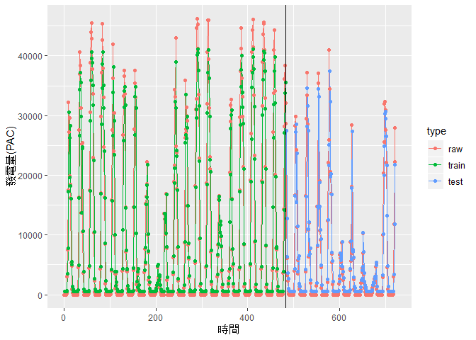
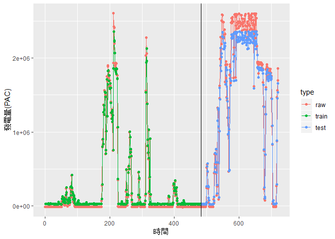

# 1. About the research
#### The data from Electronics Testing Center, Taiwan. Due to the limited dimensions, date from solar generator included DOWNWARD SHORT WAVE FLUX AT GROUND SURFACE(SWDOWN) and electricity production (PAC), and data from wind drive generator included 10 meter high of wind speed(WS10m), 65 meter high of wind speed (WS65m) and electricity production(PAC).   
#### 本次研究案電子檢驗中心提供兩種發電數據:風力發電及太陽能發電，由於本次提供數據維度有限，太陽能發電的數據僅能從地表輻射(SWDOWN)和發電量(PAC)觀察;風力發電僅能參考發電機10公尺觀測到的風速(WS10m)、65公尺觀測到的風速(WS65m)及發電量(PAC)三個變數。

# 2. Data preparation for solar generator

#### Load the library all we need in this study first. 

```r
library(lubridate)
```

```
## 
## Attaching package: 'lubridate'
```

```
## The following object is masked from 'package:base':
## 
##     date
```

```r
library(dygraphs)
library(ggplot2)
library(caret)
```

```
## Loading required package: lattice
```

```r
library(corrplot)
```

```
## corrplot 0.84 loaded
```

```r
library(Metrics)
```

```
## 
## Attaching package: 'Metrics'
```

```
## The following objects are masked from 'package:caret':
## 
##     precision, recall
```

```r
library(reshape2)
library(dplyr)
```

```
## 
## Attaching package: 'dplyr'
```

```
## The following objects are masked from 'package:lubridate':
## 
##     intersect, setdiff, union
```

```
## The following objects are masked from 'package:stats':
## 
##     filter, lag
```

```
## The following objects are masked from 'package:base':
## 
##     intersect, setdiff, setequal, union
```

```r
library(xts)
```

```
## Loading required package: zoo
```

```
## 
## Attaching package: 'zoo'
```

```
## The following objects are masked from 'package:base':
## 
##     as.Date, as.Date.numeric
```

```
## 
## Attaching package: 'xts'
```

```
## The following objects are masked from 'package:dplyr':
## 
##     first, last
```

### 2.1 loading data
#### Five observed sites near the solar generators. Each of the sites recorded multiple information, and the most important variable is SWDOWN and PAC. We combined all the sites to a big data frame.  

```r
chunghwa <- read.csv("C:/Users/Christine Liou/Documents/ETC/Data_1105/14.csv")
chunghwa$location <- "chunghwa"
dreamhouse <- read.csv("C:/Users/Christine Liou/Documents/ETC/Data_1105/19.csv")
dreamhouse$location <- "dreamhouse"
futurehouse <- read.csv("C:/Users/Christine Liou/Documents/ETC/Data_1105/18.csv")
futurehouse$location <- "futurehouse"
xinglongmarket <- read.csv("C:/Users/Christine Liou/Documents/ETC/Data_1105/39.csv")
xinglongmarket$location <- "xinglongmarket"
nuclearresearch <- read.csv("C:/Users/Christine Liou/Documents/ETC/Data_1105/40.csv")
nuclearresearch$location <- "nuclearresearch"
cbso <- rbind(chunghwa,dreamhouse,futurehouse,xinglongmarket,nuclearresearch)
rm(chunghwa,dreamhouse,futurehouse,xinglongmarket,nuclearresearch)

names(cbso)
```

```
##  [1] "SESSIONS"      "RANK"          "MYTIME"        "MYHOUR"       
##  [5] "INITIAL_DATE"  "FCST"          "STNNO"         "FCST_DATETIME"
##  [9] "WS10M"         "WS65M"         "SWDOWN"        "USER_ID"      
## [13] "INITIAL_TIME"  "EQUIPMENT_ID"  "T2"            "SHUM2"        
## [17] "RAIN"          "PAC"           "VAC"           "IAC"          
## [21] "EAC"           "location"
```

```r
names(cbso)[c(1:2,4:8,12:17)] 
```

```
##  [1] "SESSIONS"      "RANK"          "MYHOUR"        "INITIAL_DATE" 
##  [5] "FCST"          "STNNO"         "FCST_DATETIME" "USER_ID"      
##  [9] "INITIAL_TIME"  "EQUIPMENT_ID"  "T2"            "SHUM2"        
## [13] "RAIN"
```

```r
cbso <- cbso[,-c(1:2,4:8,12:17)] 
summary(cbso)
```

```
##            MYTIME         WS10M              WS65M          
##  2018/09/01 00:   5   Min.   :   0.043   Min.   :-999.0000  
##  2018/09/01 01:   5   1st Qu.:   1.232   1st Qu.:   1.7948  
##  2018/09/01 02:   5   Median :   2.197   Median :   3.0540  
##  2018/09/01 03:   5   Mean   :   5.789   Mean   :   0.7302  
##  2018/09/01 04:   5   3rd Qu.:   3.125   3rd Qu.:   4.2880  
##  2018/09/01 05:   5   Max.   :1412.799   Max.   :  10.3460  
##  (Other)      :6418                                         
##      SWDOWN            PAC                VAC             IAC         
##  Min.   :-999.0   Min.   :    0.00   Min.   :191.1   Min.   :  0.000  
##  1st Qu.:   0.0   1st Qu.:    0.00   1st Qu.:221.2   1st Qu.:  0.400  
##  Median :   0.0   Median :   53.33   Median :226.6   Median :  0.825  
##  Mean   : 165.5   Mean   : 4779.09   Mean   :274.1   Mean   : 12.608  
##  3rd Qu.: 253.4   3rd Qu.: 5401.49   3rd Qu.:230.9   3rd Qu.: 13.963  
##  Max.   : 988.9   Max.   :48605.86   Max.   :447.6   Max.   :126.870  
##                                                                       
##       EAC          location        
##  Min.   : 5317   Length:6448       
##  1st Qu.:17941   Class :character  
##  Median :32655   Mode  :character  
##  Mean   :29537                     
##  3rd Qu.:37748                     
##  Max.   :49195                     
## 
```


### 2.2 dealing time series 
#### Shift the data frame to be time series format. 

```r
head(cbso$MYTIME)
```

```
## [1] 2018/09/01 00 2018/09/01 01 2018/09/01 02 2018/09/01 03 2018/09/01 04
## [6] 2018/09/01 05
## 1503 Levels: 2018/09/01 00 2018/09/01 01 2018/09/01 02 ... 2018/11/05 10
```

```r
date <- substr(cbso$MYTIME, 1,10)
time <- paste(substr(cbso$MYTIME,12, 13),":00:00",sep = "") 
cbso$MYTIME <- as.POSIXct(paste(date,time, sep = " "))

cbso$location <- factor(cbso$location)

summary(cbso)
```

```
##      MYTIME                        WS10M              WS65M          
##  Min.   :2018-09-01 00:00:00   Min.   :   0.043   Min.   :-999.0000  
##  1st Qu.:2018-09-15 11:00:00   1st Qu.:   1.232   1st Qu.:   1.7948  
##  Median :2018-10-01 18:00:00   Median :   2.197   Median :   3.0540  
##  Mean   :2018-10-02 02:40:59   Mean   :   5.789   Mean   :   0.7302  
##  3rd Qu.:2018-10-18 00:00:00   3rd Qu.:   3.125   3rd Qu.:   4.2880  
##  Max.   :2018-11-05 10:00:00   Max.   :1412.799   Max.   :  10.3460  
##      SWDOWN            PAC                VAC             IAC         
##  Min.   :-999.0   Min.   :    0.00   Min.   :191.1   Min.   :  0.000  
##  1st Qu.:   0.0   1st Qu.:    0.00   1st Qu.:221.2   1st Qu.:  0.400  
##  Median :   0.0   Median :   53.33   Median :226.6   Median :  0.825  
##  Mean   : 165.5   Mean   : 4779.09   Mean   :274.1   Mean   : 12.608  
##  3rd Qu.: 253.4   3rd Qu.: 5401.49   3rd Qu.:230.9   3rd Qu.: 13.963  
##  Max.   : 988.9   Max.   :48605.86   Max.   :447.6   Max.   :126.870  
##       EAC                   location   
##  Min.   : 5317   chunghwa       :1503  
##  1st Qu.:17941   dreamhouse     :1503  
##  Median :32655   futurehouse    :1503  
##  Mean   :29537   nuclearresearch: 436  
##  3rd Qu.:37748   xinglongmarket :1503  
##  Max.   :49195
```

### 2.3 remove missing data
#### The missing data were recorded in "-999", therefore, we removed all the data showed "-999".

```r
table(cbso$WS65M=="-999")
```

```
## 
## FALSE  TRUE 
##  6432    16
```

```r
cbso <- subset(cbso,WS65M!="-999")
summary(cbso)
```

```
##      MYTIME                        WS10M           WS65M       
##  Min.   :2018-09-01 00:00:00   Min.   :0.043   Min.   : 0.086  
##  1st Qu.:2018-09-15 10:00:00   1st Qu.:1.229   1st Qu.: 1.803  
##  Median :2018-10-01 16:00:00   Median :2.192   Median : 3.058  
##  Mean   :2018-10-02 01:20:40   Mean   :2.289   Mean   : 3.217  
##  3rd Qu.:2018-10-17 22:00:00   3rd Qu.:3.119   3rd Qu.: 4.290  
##  Max.   :2018-11-05 10:00:00   Max.   :9.142   Max.   :10.346  
##      SWDOWN           PAC             VAC             IAC        
##  Min.   :  0.0   Min.   :    0   Min.   :191.1   Min.   :  0.00  
##  1st Qu.:  0.0   1st Qu.:    0   1st Qu.:221.2   1st Qu.:  0.40  
##  Median :  0.0   Median :   50   Median :226.6   Median :  0.81  
##  Mean   :168.4   Mean   : 4784   Mean   :274.1   Mean   : 12.62  
##  3rd Qu.:254.2   3rd Qu.: 5408   3rd Qu.:230.9   3rd Qu.: 13.97  
##  Max.   :988.9   Max.   :48606   Max.   :447.6   Max.   :126.87  
##       EAC                   location   
##  Min.   : 5317   chunghwa       :1499  
##  1st Qu.:17929   dreamhouse     :1499  
##  Median :32651   futurehouse    :1499  
##  Mean   :29523   nuclearresearch: 436  
##  3rd Qu.:37696   xinglongmarket :1499  
##  Max.   :49195
```

### 2.4 standardize data
#### Standardized the numeriacal data.

```r
cbso_sc <- cbso[,c(2:5)]
cbso_sc <- scale(cbso_sc)
cbso_z <- as.data.frame(cbso_sc)
cbso_z <- cbind(cbso$MYTIME,cbso$location,cbso_z)
colnames(cbso_z) <- c("mytime","location","ws10m","ws65m","swdown","pac")
summary(cbso_z)
```

```
##      mytime                               location        ws10m         
##  Min.   :2018-09-01 00:00:00   chunghwa       :1499   Min.   :-1.70944  
##  1st Qu.:2018-09-15 10:00:00   dreamhouse     :1499   1st Qu.:-0.80698  
##  Median :2018-10-01 16:00:00   futurehouse    :1499   Median :-0.07387  
##  Mean   :2018-10-02 01:20:40   nuclearresearch: 436   Mean   : 0.00000  
##  3rd Qu.:2018-10-17 22:00:00   xinglongmarket :1499   3rd Qu.: 0.63185  
##  Max.   :2018-11-05 10:00:00                          Max.   : 5.21567  
##      ws65m              swdown             pac          
##  Min.   :-1.77558   Min.   :-0.6335   Min.   :-0.55077  
##  1st Qu.:-0.80190   1st Qu.:-0.6335   1st Qu.:-0.55077  
##  Median :-0.09021   Median :-0.6335   Median :-0.54502  
##  Mean   : 0.00000   Mean   : 0.0000   Mean   : 0.00000  
##  3rd Qu.: 0.60872   3rd Qu.: 0.3228   3rd Qu.: 0.07185  
##  Max.   : 4.04270   Max.   : 3.0864   Max.   : 5.04569
```

# 3. Data visulation for solar generator
#### Preparing the data frame to draw prictures. 

```r
cbso_sc <- cbso_z[,-2]
lcbso_sc <- melt(cbso_sc, id.vars='mytime', variable.name = "variable")
lcbso_sc$month <- factor(month(lcbso_sc$mytime))
lcbso_sc$day <- factor(day(lcbso_sc$mytime)) 
lcbso_sc$hour <- factor(hour(lcbso_sc$mytime))

DF_hour <- aggregate(value ~ hour*variable, data = lcbso_sc, FUN = mean)
DF_month <- aggregate(value ~ month*variable, data = lcbso_sc, FUN = mean)
day <- subset(DF_hour,DF_hour$hour %in% c(6:18))
night <- subset(DF_hour,DF_hour$hour %in% c(0:5,19:23))
```

### 3.1 all solar data for different time range 
#### As the picture shows below, SWDOWN and PAC have the similar path during one day. These two variables rise when the sunrise, and decline to zero after the sunset. 

```r
mytheme <- theme_grey(base_family="STKaiti")
ggplot(data = DF_hour, mapping = aes(x = hour, y = value, color = variable, group = variable)) + geom_line()  + mytheme + theme(axis.text.x=element_text(angle=45, vjust=0.5)) + labs(x = "Time(hour)") + labs(y = "ws,swdown and pac") + ggtitle("solar generator for every hour (by mean)")
```

```
## Warning in grid.Call(C_stringMetric, as.graphicsAnnot(x$label)): font
## family not found in Windows font database

## Warning in grid.Call(C_stringMetric, as.graphicsAnnot(x$label)): font
## family not found in Windows font database
```

```
## Warning in grid.Call(C_textBounds, as.graphicsAnnot(x$label), x$x, x$y, :
## font family not found in Windows font database
```

```
## Warning in grid.Call(C_stringMetric, as.graphicsAnnot(x$label)): font
## family not found in Windows font database
```

```
## Warning in grid.Call(C_textBounds, as.graphicsAnnot(x$label), x$x, x$y, :
## font family not found in Windows font database

## Warning in grid.Call(C_textBounds, as.graphicsAnnot(x$label), x$x, x$y, :
## font family not found in Windows font database

## Warning in grid.Call(C_textBounds, as.graphicsAnnot(x$label), x$x, x$y, :
## font family not found in Windows font database

## Warning in grid.Call(C_textBounds, as.graphicsAnnot(x$label), x$x, x$y, :
## font family not found in Windows font database

## Warning in grid.Call(C_textBounds, as.graphicsAnnot(x$label), x$x, x$y, :
## font family not found in Windows font database

## Warning in grid.Call(C_textBounds, as.graphicsAnnot(x$label), x$x, x$y, :
## font family not found in Windows font database

## Warning in grid.Call(C_textBounds, as.graphicsAnnot(x$label), x$x, x$y, :
## font family not found in Windows font database

## Warning in grid.Call(C_textBounds, as.graphicsAnnot(x$label), x$x, x$y, :
## font family not found in Windows font database

## Warning in grid.Call(C_textBounds, as.graphicsAnnot(x$label), x$x, x$y, :
## font family not found in Windows font database
```

```
## Warning in grid.Call.graphics(C_text, as.graphicsAnnot(x$label), x$x,
## x$y, : font family not found in Windows font database

## Warning in grid.Call.graphics(C_text, as.graphicsAnnot(x$label), x$x,
## x$y, : font family not found in Windows font database

## Warning in grid.Call.graphics(C_text, as.graphicsAnnot(x$label), x$x,
## x$y, : font family not found in Windows font database

## Warning in grid.Call.graphics(C_text, as.graphicsAnnot(x$label), x$x,
## x$y, : font family not found in Windows font database

## Warning in grid.Call.graphics(C_text, as.graphicsAnnot(x$label), x$x,
## x$y, : font family not found in Windows font database

## Warning in grid.Call.graphics(C_text, as.graphicsAnnot(x$label), x$x,
## x$y, : font family not found in Windows font database

## Warning in grid.Call.graphics(C_text, as.graphicsAnnot(x$label), x$x,
## x$y, : font family not found in Windows font database

## Warning in grid.Call.graphics(C_text, as.graphicsAnnot(x$label), x$x,
## x$y, : font family not found in Windows font database

## Warning in grid.Call.graphics(C_text, as.graphicsAnnot(x$label), x$x,
## x$y, : font family not found in Windows font database

## Warning in grid.Call.graphics(C_text, as.graphicsAnnot(x$label), x$x,
## x$y, : font family not found in Windows font database

## Warning in grid.Call.graphics(C_text, as.graphicsAnnot(x$label), x$x,
## x$y, : font family not found in Windows font database

## Warning in grid.Call.graphics(C_text, as.graphicsAnnot(x$label), x$x,
## x$y, : font family not found in Windows font database

## Warning in grid.Call.graphics(C_text, as.graphicsAnnot(x$label), x$x,
## x$y, : font family not found in Windows font database

## Warning in grid.Call.graphics(C_text, as.graphicsAnnot(x$label), x$x,
## x$y, : font family not found in Windows font database

## Warning in grid.Call.graphics(C_text, as.graphicsAnnot(x$label), x$x,
## x$y, : font family not found in Windows font database

## Warning in grid.Call.graphics(C_text, as.graphicsAnnot(x$label), x$x,
## x$y, : font family not found in Windows font database

## Warning in grid.Call.graphics(C_text, as.graphicsAnnot(x$label), x$x,
## x$y, : font family not found in Windows font database

## Warning in grid.Call.graphics(C_text, as.graphicsAnnot(x$label), x$x,
## x$y, : font family not found in Windows font database

## Warning in grid.Call.graphics(C_text, as.graphicsAnnot(x$label), x$x,
## x$y, : font family not found in Windows font database

## Warning in grid.Call.graphics(C_text, as.graphicsAnnot(x$label), x$x,
## x$y, : font family not found in Windows font database

## Warning in grid.Call.graphics(C_text, as.graphicsAnnot(x$label), x$x,
## x$y, : font family not found in Windows font database

## Warning in grid.Call.graphics(C_text, as.graphicsAnnot(x$label), x$x,
## x$y, : font family not found in Windows font database

## Warning in grid.Call.graphics(C_text, as.graphicsAnnot(x$label), x$x,
## x$y, : font family not found in Windows font database

## Warning in grid.Call.graphics(C_text, as.graphicsAnnot(x$label), x$x,
## x$y, : font family not found in Windows font database

## Warning in grid.Call.graphics(C_text, as.graphicsAnnot(x$label), x$x,
## x$y, : font family not found in Windows font database

## Warning in grid.Call.graphics(C_text, as.graphicsAnnot(x$label), x$x,
## x$y, : font family not found in Windows font database

## Warning in grid.Call.graphics(C_text, as.graphicsAnnot(x$label), x$x,
## x$y, : font family not found in Windows font database

## Warning in grid.Call.graphics(C_text, as.graphicsAnnot(x$label), x$x,
## x$y, : font family not found in Windows font database

## Warning in grid.Call.graphics(C_text, as.graphicsAnnot(x$label), x$x,
## x$y, : font family not found in Windows font database

## Warning in grid.Call.graphics(C_text, as.graphicsAnnot(x$label), x$x,
## x$y, : font family not found in Windows font database

## Warning in grid.Call.graphics(C_text, as.graphicsAnnot(x$label), x$x,
## x$y, : font family not found in Windows font database

## Warning in grid.Call.graphics(C_text, as.graphicsAnnot(x$label), x$x,
## x$y, : font family not found in Windows font database

## Warning in grid.Call.graphics(C_text, as.graphicsAnnot(x$label), x$x,
## x$y, : font family not found in Windows font database

## Warning in grid.Call.graphics(C_text, as.graphicsAnnot(x$label), x$x,
## x$y, : font family not found in Windows font database

## Warning in grid.Call.graphics(C_text, as.graphicsAnnot(x$label), x$x,
## x$y, : font family not found in Windows font database

## Warning in grid.Call.graphics(C_text, as.graphicsAnnot(x$label), x$x,
## x$y, : font family not found in Windows font database

## Warning in grid.Call.graphics(C_text, as.graphicsAnnot(x$label), x$x,
## x$y, : font family not found in Windows font database

## Warning in grid.Call.graphics(C_text, as.graphicsAnnot(x$label), x$x,
## x$y, : font family not found in Windows font database

## Warning in grid.Call.graphics(C_text, as.graphicsAnnot(x$label), x$x,
## x$y, : font family not found in Windows font database

## Warning in grid.Call.graphics(C_text, as.graphicsAnnot(x$label), x$x,
## x$y, : font family not found in Windows font database

## Warning in grid.Call.graphics(C_text, as.graphicsAnnot(x$label), x$x,
## x$y, : font family not found in Windows font database

## Warning in grid.Call.graphics(C_text, as.graphicsAnnot(x$label), x$x,
## x$y, : font family not found in Windows font database

## Warning in grid.Call.graphics(C_text, as.graphicsAnnot(x$label), x$x,
## x$y, : font family not found in Windows font database

## Warning in grid.Call.graphics(C_text, as.graphicsAnnot(x$label), x$x,
## x$y, : font family not found in Windows font database

## Warning in grid.Call.graphics(C_text, as.graphicsAnnot(x$label), x$x,
## x$y, : font family not found in Windows font database

## Warning in grid.Call.graphics(C_text, as.graphicsAnnot(x$label), x$x,
## x$y, : font family not found in Windows font database

## Warning in grid.Call.graphics(C_text, as.graphicsAnnot(x$label), x$x,
## x$y, : font family not found in Windows font database
```

```
## Warning in grid.Call(C_textBounds, as.graphicsAnnot(x$label), x$x, x$y, :
## font family not found in Windows font database
```

```
## Warning in grid.Call.graphics(C_text, as.graphicsAnnot(x$label), x$x,
## x$y, : font family not found in Windows font database
```

```
## Warning in grid.Call(C_textBounds, as.graphicsAnnot(x$label), x$x, x$y, :
## font family not found in Windows font database

## Warning in grid.Call(C_textBounds, as.graphicsAnnot(x$label), x$x, x$y, :
## font family not found in Windows font database

## Warning in grid.Call(C_textBounds, as.graphicsAnnot(x$label), x$x, x$y, :
## font family not found in Windows font database
```

<!-- -->

#### Despite there are only three month of data, we can still find out that SWDOWN and PAC data in Sep to Nov go down smoothly, because of the shorter day light in winter. 

```r
mytheme <- theme_grey(base_family="STKaiti")
ggplot(data = DF_month, mapping = aes(x = month, y = value, color = variable, group = variable)) + geom_line()  + mytheme +  labs(x = "Time(month)") + labs(y = "ws,swdown and pac")+ ggtitle("solar generator for month (by mean)")
```

```
## Warning in grid.Call(C_textBounds, as.graphicsAnnot(x$label), x$x, x$y, :
## font family not found in Windows font database

## Warning in grid.Call(C_textBounds, as.graphicsAnnot(x$label), x$x, x$y, :
## font family not found in Windows font database

## Warning in grid.Call(C_textBounds, as.graphicsAnnot(x$label), x$x, x$y, :
## font family not found in Windows font database

## Warning in grid.Call(C_textBounds, as.graphicsAnnot(x$label), x$x, x$y, :
## font family not found in Windows font database

## Warning in grid.Call(C_textBounds, as.graphicsAnnot(x$label), x$x, x$y, :
## font family not found in Windows font database

## Warning in grid.Call(C_textBounds, as.graphicsAnnot(x$label), x$x, x$y, :
## font family not found in Windows font database

## Warning in grid.Call(C_textBounds, as.graphicsAnnot(x$label), x$x, x$y, :
## font family not found in Windows font database

## Warning in grid.Call(C_textBounds, as.graphicsAnnot(x$label), x$x, x$y, :
## font family not found in Windows font database

## Warning in grid.Call(C_textBounds, as.graphicsAnnot(x$label), x$x, x$y, :
## font family not found in Windows font database

## Warning in grid.Call(C_textBounds, as.graphicsAnnot(x$label), x$x, x$y, :
## font family not found in Windows font database

## Warning in grid.Call(C_textBounds, as.graphicsAnnot(x$label), x$x, x$y, :
## font family not found in Windows font database

## Warning in grid.Call(C_textBounds, as.graphicsAnnot(x$label), x$x, x$y, :
## font family not found in Windows font database
```

```
## Warning in grid.Call.graphics(C_text, as.graphicsAnnot(x$label), x$x,
## x$y, : font family not found in Windows font database
```

```
## Warning in grid.Call(C_textBounds, as.graphicsAnnot(x$label), x$x, x$y, :
## font family not found in Windows font database

## Warning in grid.Call(C_textBounds, as.graphicsAnnot(x$label), x$x, x$y, :
## font family not found in Windows font database

## Warning in grid.Call(C_textBounds, as.graphicsAnnot(x$label), x$x, x$y, :
## font family not found in Windows font database
```

<!-- -->

### 3.2 solar data visulation for different location 
#### Three month of the PAC data were draw by different locations. As the picture showed below, the red line (chungwa) were higher than other locations and the xinglongmarket was the lowest.


```r
pac_graph <- ggplot(cbso_z, aes(x=mytime, y=pac, colour = location, group = location)) + geom_line() + ggtitle("發電量(PAC)")+  labs(x = "Time")+ labs(y = "electricity production(PAC)")
pac_graph
```

<!-- -->

#### different location of the generators
#### 

```r
chunghwa <- filter(cbso_z, cbso_z$location=="chunghwa")
chunghwa_graph <- chunghwa[,c(1,5,6)]
lchunghwa <- melt(chunghwa_graph,id.vars = "mytime",measure.vars = colnames(chunghwa_graph[-1]))
lchunghwa$hour <- factor(hour(lchunghwa$mytime))
DF_chunghwa <- aggregate(value ~ hour*variable, data = lchunghwa, FUN = mean)
mytheme <- theme_grey(base_family="STKaiti")
graph_chunghwa <- ggplot(data = DF_chunghwa, mapping = aes(x = hour, y = value, color = variable, group = variable)) + geom_line()  + mytheme  + labs(x = "Time(hour)") + labs(y = "SWDOWN and PAC")+ ggtitle("Chunghwa") + scale_color_discrete(labels=c("swdown(W/m2)","PAC(KW)"))
graph_chunghwa
```

```
## Warning in grid.Call(C_textBounds, as.graphicsAnnot(x$label), x$x, x$y, :
## font family not found in Windows font database

## Warning in grid.Call(C_textBounds, as.graphicsAnnot(x$label), x$x, x$y, :
## font family not found in Windows font database

## Warning in grid.Call(C_textBounds, as.graphicsAnnot(x$label), x$x, x$y, :
## font family not found in Windows font database

## Warning in grid.Call(C_textBounds, as.graphicsAnnot(x$label), x$x, x$y, :
## font family not found in Windows font database

## Warning in grid.Call(C_textBounds, as.graphicsAnnot(x$label), x$x, x$y, :
## font family not found in Windows font database

## Warning in grid.Call(C_textBounds, as.graphicsAnnot(x$label), x$x, x$y, :
## font family not found in Windows font database

## Warning in grid.Call(C_textBounds, as.graphicsAnnot(x$label), x$x, x$y, :
## font family not found in Windows font database

## Warning in grid.Call(C_textBounds, as.graphicsAnnot(x$label), x$x, x$y, :
## font family not found in Windows font database

## Warning in grid.Call(C_textBounds, as.graphicsAnnot(x$label), x$x, x$y, :
## font family not found in Windows font database

## Warning in grid.Call(C_textBounds, as.graphicsAnnot(x$label), x$x, x$y, :
## font family not found in Windows font database

## Warning in grid.Call(C_textBounds, as.graphicsAnnot(x$label), x$x, x$y, :
## font family not found in Windows font database

## Warning in grid.Call(C_textBounds, as.graphicsAnnot(x$label), x$x, x$y, :
## font family not found in Windows font database
```

```
## Warning in grid.Call.graphics(C_text, as.graphicsAnnot(x$label), x$x,
## x$y, : font family not found in Windows font database
```

```
## Warning in grid.Call(C_textBounds, as.graphicsAnnot(x$label), x$x, x$y, :
## font family not found in Windows font database

## Warning in grid.Call(C_textBounds, as.graphicsAnnot(x$label), x$x, x$y, :
## font family not found in Windows font database

## Warning in grid.Call(C_textBounds, as.graphicsAnnot(x$label), x$x, x$y, :
## font family not found in Windows font database
```

<!-- -->


```r
dreamhouse <- filter(cbso_z, cbso_z$location=="dreamhouse")
dreamhouse_graph <- dreamhouse[,c(1,5,6)]
ldreamhouse <- melt(dreamhouse_graph,id.vars = "mytime",measure.vars = colnames(chunghwa_graph[-1]))
ldreamhouse$hour <- factor(hour(ldreamhouse$mytime))
DF_dreamhouse <- aggregate(value ~ hour*variable, data = ldreamhouse, FUN = mean)
graph_dreamhouse <- ggplot(data = DF_dreamhouse, mapping = aes(x = hour, y = value, color = variable, group = variable)) + geom_line()  + mytheme+ labs(x = "Time(hour)") + labs(y = "SWDOWN and PAC")+ ggtitle("Dreamhouse")+ scale_color_discrete(labels=c("swdown(W/m2)","PAC(KW)"))
graph_dreamhouse
```

```
## Warning in grid.Call(C_textBounds, as.graphicsAnnot(x$label), x$x, x$y, :
## font family not found in Windows font database

## Warning in grid.Call(C_textBounds, as.graphicsAnnot(x$label), x$x, x$y, :
## font family not found in Windows font database

## Warning in grid.Call(C_textBounds, as.graphicsAnnot(x$label), x$x, x$y, :
## font family not found in Windows font database

## Warning in grid.Call(C_textBounds, as.graphicsAnnot(x$label), x$x, x$y, :
## font family not found in Windows font database

## Warning in grid.Call(C_textBounds, as.graphicsAnnot(x$label), x$x, x$y, :
## font family not found in Windows font database

## Warning in grid.Call(C_textBounds, as.graphicsAnnot(x$label), x$x, x$y, :
## font family not found in Windows font database

## Warning in grid.Call(C_textBounds, as.graphicsAnnot(x$label), x$x, x$y, :
## font family not found in Windows font database

## Warning in grid.Call(C_textBounds, as.graphicsAnnot(x$label), x$x, x$y, :
## font family not found in Windows font database

## Warning in grid.Call(C_textBounds, as.graphicsAnnot(x$label), x$x, x$y, :
## font family not found in Windows font database

## Warning in grid.Call(C_textBounds, as.graphicsAnnot(x$label), x$x, x$y, :
## font family not found in Windows font database

## Warning in grid.Call(C_textBounds, as.graphicsAnnot(x$label), x$x, x$y, :
## font family not found in Windows font database

## Warning in grid.Call(C_textBounds, as.graphicsAnnot(x$label), x$x, x$y, :
## font family not found in Windows font database
```

```
## Warning in grid.Call.graphics(C_text, as.graphicsAnnot(x$label), x$x,
## x$y, : font family not found in Windows font database
```

```
## Warning in grid.Call(C_textBounds, as.graphicsAnnot(x$label), x$x, x$y, :
## font family not found in Windows font database

## Warning in grid.Call(C_textBounds, as.graphicsAnnot(x$label), x$x, x$y, :
## font family not found in Windows font database

## Warning in grid.Call(C_textBounds, as.graphicsAnnot(x$label), x$x, x$y, :
## font family not found in Windows font database
```

<!-- -->


```r
futurehouse <- filter(cbso_z, cbso_z$location=="futurehouse")
futurehouse_graph <- futurehouse[,c(1,5,6)]
lfuturehouse <- melt(futurehouse_graph,id.vars = "mytime",measure.vars = colnames(futurehouse_graph[-1]))
lfuturehouse$hour <- factor(hour(lfuturehouse$mytime))
DF_futurehouse <- aggregate(value ~ hour*variable, data = lfuturehouse, FUN = mean)
graph_futurehouse <- ggplot(data = DF_futurehouse, mapping = aes(x = hour, y = value, color = variable, group = variable)) + geom_line()  + mytheme + labs(x = "Time(hour)") + labs(y = "SWDOWN and PAC")+ ggtitle("Futurehouse")+ scale_color_discrete(labels=c("swdown(W/m2)","PAC(KW)"))
graph_futurehouse
```

```
## Warning in grid.Call(C_textBounds, as.graphicsAnnot(x$label), x$x, x$y, :
## font family not found in Windows font database

## Warning in grid.Call(C_textBounds, as.graphicsAnnot(x$label), x$x, x$y, :
## font family not found in Windows font database

## Warning in grid.Call(C_textBounds, as.graphicsAnnot(x$label), x$x, x$y, :
## font family not found in Windows font database

## Warning in grid.Call(C_textBounds, as.graphicsAnnot(x$label), x$x, x$y, :
## font family not found in Windows font database

## Warning in grid.Call(C_textBounds, as.graphicsAnnot(x$label), x$x, x$y, :
## font family not found in Windows font database

## Warning in grid.Call(C_textBounds, as.graphicsAnnot(x$label), x$x, x$y, :
## font family not found in Windows font database

## Warning in grid.Call(C_textBounds, as.graphicsAnnot(x$label), x$x, x$y, :
## font family not found in Windows font database

## Warning in grid.Call(C_textBounds, as.graphicsAnnot(x$label), x$x, x$y, :
## font family not found in Windows font database

## Warning in grid.Call(C_textBounds, as.graphicsAnnot(x$label), x$x, x$y, :
## font family not found in Windows font database

## Warning in grid.Call(C_textBounds, as.graphicsAnnot(x$label), x$x, x$y, :
## font family not found in Windows font database

## Warning in grid.Call(C_textBounds, as.graphicsAnnot(x$label), x$x, x$y, :
## font family not found in Windows font database

## Warning in grid.Call(C_textBounds, as.graphicsAnnot(x$label), x$x, x$y, :
## font family not found in Windows font database
```

```
## Warning in grid.Call.graphics(C_text, as.graphicsAnnot(x$label), x$x,
## x$y, : font family not found in Windows font database
```

```
## Warning in grid.Call(C_textBounds, as.graphicsAnnot(x$label), x$x, x$y, :
## font family not found in Windows font database

## Warning in grid.Call(C_textBounds, as.graphicsAnnot(x$label), x$x, x$y, :
## font family not found in Windows font database

## Warning in grid.Call(C_textBounds, as.graphicsAnnot(x$label), x$x, x$y, :
## font family not found in Windows font database
```

<!-- -->


```r
nuclearresearch <- filter(cbso_z, cbso_z$location=="nuclearresearch")
nuclearresearch_graph <- futurehouse[,c(1,5,6)]
lnuclearresearch <- melt(nuclearresearch_graph,id.vars = "mytime",measure.vars = colnames(nuclearresearch_graph[-1]))
lnuclearresearch$hour <- factor(hour(lnuclearresearch$mytime))
DF_nuclearresearch <- aggregate(value ~ hour*variable, data = lnuclearresearch, FUN = mean)
graph_nuclearresearch <- ggplot(data = DF_nuclearresearch, mapping = aes(x = hour, y = value, color = variable, group = variable)) + geom_line()  + mytheme  + labs(x = "Time(hour)") + labs(y = "SWDOWN and PAC")+ ggtitle("Nuclearresearch")+ scale_color_discrete(labels=c("swdown(W/m2)","PAC(KW)"))
graph_nuclearresearch
```

```
## Warning in grid.Call(C_textBounds, as.graphicsAnnot(x$label), x$x, x$y, :
## font family not found in Windows font database

## Warning in grid.Call(C_textBounds, as.graphicsAnnot(x$label), x$x, x$y, :
## font family not found in Windows font database

## Warning in grid.Call(C_textBounds, as.graphicsAnnot(x$label), x$x, x$y, :
## font family not found in Windows font database

## Warning in grid.Call(C_textBounds, as.graphicsAnnot(x$label), x$x, x$y, :
## font family not found in Windows font database

## Warning in grid.Call(C_textBounds, as.graphicsAnnot(x$label), x$x, x$y, :
## font family not found in Windows font database

## Warning in grid.Call(C_textBounds, as.graphicsAnnot(x$label), x$x, x$y, :
## font family not found in Windows font database

## Warning in grid.Call(C_textBounds, as.graphicsAnnot(x$label), x$x, x$y, :
## font family not found in Windows font database

## Warning in grid.Call(C_textBounds, as.graphicsAnnot(x$label), x$x, x$y, :
## font family not found in Windows font database

## Warning in grid.Call(C_textBounds, as.graphicsAnnot(x$label), x$x, x$y, :
## font family not found in Windows font database

## Warning in grid.Call(C_textBounds, as.graphicsAnnot(x$label), x$x, x$y, :
## font family not found in Windows font database

## Warning in grid.Call(C_textBounds, as.graphicsAnnot(x$label), x$x, x$y, :
## font family not found in Windows font database

## Warning in grid.Call(C_textBounds, as.graphicsAnnot(x$label), x$x, x$y, :
## font family not found in Windows font database
```

```
## Warning in grid.Call.graphics(C_text, as.graphicsAnnot(x$label), x$x,
## x$y, : font family not found in Windows font database
```

```
## Warning in grid.Call(C_textBounds, as.graphicsAnnot(x$label), x$x, x$y, :
## font family not found in Windows font database

## Warning in grid.Call(C_textBounds, as.graphicsAnnot(x$label), x$x, x$y, :
## font family not found in Windows font database

## Warning in grid.Call(C_textBounds, as.graphicsAnnot(x$label), x$x, x$y, :
## font family not found in Windows font database
```

<!-- -->


```r
xinglongmarket <- filter(cbso_z, cbso_z$location=="xinglongmarket")
xinglongmarket_graph <-  xinglongmarket[,c(1,5,6)]
lxinglongmarket <- melt(xinglongmarket_graph,id.vars = "mytime",measure.vars = colnames(xinglongmarket_graph[-1]))
lxinglongmarket$hour <- factor(hour(lxinglongmarket$mytime))
DF_xinglongmarket <- aggregate(value ~ hour*variable, data = lxinglongmarket, FUN = mean)
graph_xinglongmarket <- ggplot(data = DF_xinglongmarket, mapping = aes(x = hour, y = value, color = variable, group = variable)) + geom_line()  + mytheme  + labs(x = "Time(hour)") + labs(y = "SWDON and PAC")+ ggtitle("Xinglongmarket")+ scale_color_discrete(labels=c("swdown(W/m2)","PAC(KW)"))
graph_xinglongmarket
```

```
## Warning in grid.Call(C_textBounds, as.graphicsAnnot(x$label), x$x, x$y, :
## font family not found in Windows font database

## Warning in grid.Call(C_textBounds, as.graphicsAnnot(x$label), x$x, x$y, :
## font family not found in Windows font database

## Warning in grid.Call(C_textBounds, as.graphicsAnnot(x$label), x$x, x$y, :
## font family not found in Windows font database

## Warning in grid.Call(C_textBounds, as.graphicsAnnot(x$label), x$x, x$y, :
## font family not found in Windows font database

## Warning in grid.Call(C_textBounds, as.graphicsAnnot(x$label), x$x, x$y, :
## font family not found in Windows font database

## Warning in grid.Call(C_textBounds, as.graphicsAnnot(x$label), x$x, x$y, :
## font family not found in Windows font database

## Warning in grid.Call(C_textBounds, as.graphicsAnnot(x$label), x$x, x$y, :
## font family not found in Windows font database

## Warning in grid.Call(C_textBounds, as.graphicsAnnot(x$label), x$x, x$y, :
## font family not found in Windows font database

## Warning in grid.Call(C_textBounds, as.graphicsAnnot(x$label), x$x, x$y, :
## font family not found in Windows font database

## Warning in grid.Call(C_textBounds, as.graphicsAnnot(x$label), x$x, x$y, :
## font family not found in Windows font database

## Warning in grid.Call(C_textBounds, as.graphicsAnnot(x$label), x$x, x$y, :
## font family not found in Windows font database

## Warning in grid.Call(C_textBounds, as.graphicsAnnot(x$label), x$x, x$y, :
## font family not found in Windows font database
```

```
## Warning in grid.Call.graphics(C_text, as.graphicsAnnot(x$label), x$x,
## x$y, : font family not found in Windows font database
```

```
## Warning in grid.Call(C_textBounds, as.graphicsAnnot(x$label), x$x, x$y, :
## font family not found in Windows font database

## Warning in grid.Call(C_textBounds, as.graphicsAnnot(x$label), x$x, x$y, :
## font family not found in Windows font database

## Warning in grid.Call(C_textBounds, as.graphicsAnnot(x$label), x$x, x$y, :
## font family not found in Windows font database
```

<!-- -->

### 3.3 correlation between PAC and SWDOWN (ex. Chunghwa)


```r
chunghwa_cor <- chunghwa[,-c(1:2)]
head(nearZeroVar(chunghwa_cor,saveMetrics = TRUE))
```

```
##         freqRatio percentUnique zeroVar   nzv
## ws10m    1.666667      84.32288   FALSE FALSE
## ws65m    1.333333      88.59239   FALSE FALSE
## swdown 772.000000      48.56571   FALSE FALSE
## pac    353.500000      52.70180   FALSE FALSE
```

```r
names(chunghwa_cor)[nearZeroVar(chunghwa_cor,saveMetrics = TRUE)$zeroVar]
```

```
## character(0)
```

```r
correlations <- cor(chunghwa_cor)
dim(correlations)
```

```
## [1] 4 4
```

```r
corrplot(correlations,order = "hclust",tl.cex = 0.5)
```

<!-- -->

# 4. Data preparation for wind driven generator

```r
formosa <- read.csv("C:/Users/Christine Liou/Documents/ETC/Data_1105/17.csv")
formosa$location <- "formosa"
chengloong <- read.csv("C:/Users/Christine Liou/Documents/ETC/Data_1105/47.csv")
chengloong$location <- "chengloong"
cbwd <- rbind(formosa,chengloong)
rm(formosa,chengloong)

names(cbwd)
```

```
##  [1] "SESSIONS"      "RANK"          "MYTIME"        "MYHOUR"       
##  [5] "INITIAL_DATE"  "FCST"          "STNNO"         "FCST_DATETIME"
##  [9] "WS10M"         "WS65M"         "SWDOWN"        "USER_ID"      
## [13] "INITIAL_TIME"  "EQUIPMENT_ID"  "T2"            "SHUM2"        
## [17] "RAIN"          "PAC"           "VAC"           "IAC"          
## [21] "EAC"           "location"
```

```r
names(cbwd)[c(1:2,4:8,12:17)] 
```

```
##  [1] "SESSIONS"      "RANK"          "MYHOUR"        "INITIAL_DATE" 
##  [5] "FCST"          "STNNO"         "FCST_DATETIME" "USER_ID"      
##  [9] "INITIAL_TIME"  "EQUIPMENT_ID"  "T2"            "SHUM2"        
## [13] "RAIN"
```

```r
cbwd <- cbwd[,-c(1:2,4:8,12:17)] 
summary(cbwd)
```

```
##            MYTIME         WS10M              WS65M         
##  2018/09/01 00:   2   Min.   :   0.100   Min.   :-999.000  
##  2018/09/01 01:   2   1st Qu.:   3.224   1st Qu.:   4.154  
##  2018/09/01 02:   2   Median :   5.812   Median :   7.521  
##  2018/09/01 03:   2   Mean   :  10.373   Mean   :   5.402  
##  2018/09/01 04:   2   3rd Qu.:   9.250   3rd Qu.:  11.321  
##  2018/09/01 05:   2   Max.   :1412.799   Max.   :  22.980  
##  (Other)      :2982                                        
##      SWDOWN            PAC               VAC             IAC        
##  Min.   :-999.0   Min.   : -19048   Min.   :11097   Min.   :  0.21  
##  1st Qu.:   0.0   1st Qu.: -10296   1st Qu.:11243   1st Qu.:  0.87  
##  Median :   0.0   Median : 316522   Median :11412   Median : 16.11  
##  Mean   : 235.2   Mean   : 671181   Mean   :11389   Mean   : 35.23  
##  3rd Qu.: 501.4   3rd Qu.:1281052   3rd Qu.:11529   3rd Qu.: 65.36  
##  Max.   : 980.4   Max.   :2605056   Max.   :11663   Max.   :138.45  
##                                                                     
##       EAC            location        
##  Min.   :3374057   Length:2994       
##  1st Qu.:3608466   Class :character  
##  Median :4101334   Mode  :character  
##  Mean   :4975430                     
##  3rd Qu.:6265252                     
##  Max.   :7189438                     
## 
```


```r
date <- substr(cbwd$MYTIME, 1,10)
time <- paste(substr(cbwd$MYTIME,12, 13),":00:00",sep = "") 
cbwd$MYTIME <- as.POSIXct(paste(date,time, sep = " "))

cbwd$location <- factor(cbwd$location)

table(cbwd$WS65M=="-999")
```

```
## 
## FALSE  TRUE 
##  2986     8
```

```r
table(cbwd$PAC< 0 )
```

```
## 
## FALSE  TRUE 
##  2075   919
```

```r
cbwd <- subset(cbwd,WS65M!="-999")
cbwd <- subset(cbwd,PAC>0)
summary(cbwd)
```

```
##      MYTIME                        WS10M            WS65M       
##  Min.   :2018-09-01 12:00:00   Min.   : 0.289   Min.   : 0.760  
##  1st Qu.:2018-09-26 06:00:00   1st Qu.: 4.930   1st Qu.: 6.820  
##  Median :2018-10-08 10:00:00   Median : 7.569   Median : 9.683  
##  Mean   :2018-10-07 14:00:47   Mean   : 8.235   Mean   :10.056  
##  3rd Qu.:2018-10-20 18:00:00   3rd Qu.:10.705   3rd Qu.:12.695  
##  Max.   :2018-11-05 10:00:00   Max.   :20.998   Max.   :22.980  
##      SWDOWN            PAC                 VAC             IAC        
##  Min.   :  0.00   Min.   :    109.9   Min.   :11097   Min.   :  0.21  
##  1st Qu.:  0.00   1st Qu.: 265608.5   1st Qu.:11242   1st Qu.: 13.69  
##  Median : 20.05   Median : 828466.1   Median :11417   Median : 42.30  
##  Mean   :262.28   Mean   : 975241.7   Mean   :11388   Mean   : 50.55  
##  3rd Qu.:561.47   3rd Qu.:1624053.6   3rd Qu.:11530   3rd Qu.: 82.77  
##  Max.   :980.44   Max.   :2605055.7   Max.   :11652   Max.   :138.45  
##       EAC                location   
##  Min.   :3374100   chengloong:1045  
##  1st Qu.:3652177   formosa   :1022  
##  Median :4100099                    
##  Mean   :5046608                    
##  3rd Qu.:6473596                    
##  Max.   :7189438
```

```r
cbwd_sc <- as.data.frame(scale(cbwd[,c(2:5)]))
cbwd_scframe <- cbind(cbwd$MYTIME,cbwd$location,cbwd_sc)
colnames(cbwd_scframe) <- c("mytime","location","ws10m","ws65m","swdown","pac")
summary(cbwd_scframe)
```

```
##      mytime                          location        ws10m        
##  Min.   :2018-09-01 12:00:00   chengloong:1045   Min.   :-1.9297  
##  1st Qu.:2018-09-26 06:00:00   formosa   :1022   1st Qu.:-0.8026  
##  Median :2018-10-08 10:00:00                     Median :-0.1617  
##  Mean   :2018-10-07 14:00:47                     Mean   : 0.0000  
##  3rd Qu.:2018-10-20 18:00:00                     3rd Qu.: 0.5999  
##  Max.   :2018-11-05 10:00:00                     Max.   : 3.0996  
##      ws65m              swdown             pac         
##  Min.   :-2.20263   Min.   :-0.7929   Min.   :-1.2697  
##  1st Qu.:-0.76681   1st Qu.:-0.7929   1st Qu.:-0.9240  
##  Median :-0.08848   Median :-0.7323   Median :-0.1911  
##  Mean   : 0.00000   Mean   : 0.0000   Mean   : 0.0000  
##  3rd Qu.: 0.62528   3rd Qu.: 0.9045   3rd Qu.: 0.8448  
##  Max.   : 3.06202   Max.   : 2.1712   Max.   : 2.1222
```

```r
cbwd_sc_noloc <- cbwd_scframe[,-2]
```


# 5. Deep learning for LSTM 

### 5.1 solar data 
#### We use solar generator data observed from Chunghwa to build the model.

```r
library(keras)
library(dplyr)
library(ggplot2)
library(ggthemes)
library(lubridate)
library(xts)
set.seed(7)

dataframe <- read.csv(
  'C:/Users/Christine Liou/Documents/ETC/Data_1105/14.csv')

date <- substr(dataframe$MYTIME, 1,10)
time <- paste(substr(dataframe$MYTIME,12, 13),":00:00",sep = "") 
dataframe$MYTIME <- as.POSIXct(paste(date,time, sep = " "))


dataframe <- dataframe[order(dataframe$MYTIME),]
```


```r
ggplot(
  data = dataframe,
  mapping = aes(
    x = MYTIME,
    y = PAC)) +
  geom_line() +
  geom_point() +
  labs(x = "Time") + 
  labs(y = "electricity production(PAC)")
```

<!-- -->

#### September from Chunghwa

```r
sept <- dataframe[1:720,]

ggplot(
  data = sept,
  mapping = aes(
    x = MYTIME,
    y = PAC)) +
  geom_line() +
  geom_point() +
  labs(x = "Time") + 
  labs(y = "electricity production(PAC)")
```

<!-- -->

```r
names(sept)
```

```
##  [1] "SESSIONS"      "RANK"          "MYTIME"        "MYHOUR"       
##  [5] "INITIAL_DATE"  "FCST"          "STNNO"         "FCST_DATETIME"
##  [9] "WS10M"         "WS65M"         "SWDOWN"        "USER_ID"      
## [13] "INITIAL_TIME"  "EQUIPMENT_ID"  "T2"            "SHUM2"        
## [17] "RAIN"          "PAC"           "VAC"           "IAC"          
## [21] "EAC"
```

```r
sept <- sept[,c(3,18)]
```

#### data normalization

```r
max_value <- max(sept$PAC)
min_value <- min(sept$PAC)
spread <- max_value - min_value

dataset <- (sept$PAC - min_value) / spread #正規化資料
range(dataset)
```

```
## [1] 0 1
```

#### build the model

```r
create_dataset <- function(dataset,
                           look_back = 1)
{
  l <- length(dataset)
  dataX <- array(dim = c(l - look_back, look_back))
  
  for (i in 1:ncol(dataX))
  {
    dataX[, i] <- dataset[i:(l - look_back + i - 1)]
  }
  
  dataY <- array(
    data = dataset[(look_back + 1):l],
    dim = c(l - look_back, 1))
  
  return(
    list(
      dataX = dataX,
      dataY = dataY))
} #設定x y 的資料格式 

train_size <- as.integer(length(dataset) * 0.67)
test_size <- length(dataset) - train_size

train <- dataset[1:train_size]
test <- dataset[(train_size + 1):length(dataset)]

cat(length(train), length(test))  #切分訓練集與測試集
```

```
## 482 238
```

```r
# 482 238

look_back <- 1           #設定t-1
trainXY <- create_dataset(train, look_back)
testXY <-  create_dataset(test, look_back)

dim_train <- dim(trainXY$dataX)
dim_test <- dim(testXY$dataX)

# reshape input to be [samples, time steps, features]
dim(trainXY$dataX) <- c(dim_train[1], 1, dim_train[2])
dim(testXY$dataX) <- c(dim_test[1], 1, dim_test[2])
```

#### training data

```r
library(keras)
library(tensorflow)
```

```
## 
## Attaching package: 'tensorflow'
```

```
## The following object is masked from 'package:caret':
## 
##     train
```

```r
model <- keras_model_sequential()

model %>%
  layer_lstm(
    units = 4,
    input_shape = c(1, look_back)) %>%
  layer_dense(
    units = 1) %>%
  compile(
    loss = 'mean_squared_error',
    optimizer = 'adam') %>%
  fit(trainXY$dataX,
      trainXY$dataY,
      epochs = 30,  #調30代就差不多
      batch_size = 1,
      verbose = 2)
```

#### result

```r
trainScore <- model %>%
  evaluate(
    trainXY$dataX,
    trainXY$dataY,
    verbose = 2)

testScore <- model %>%
  evaluate(
    testXY$dataX,
    testXY$dataY,
    verbose = 2)

# trainScore_inv = trainScore * spread + min_value

sprintf(
  'Train Score: %.4f MSE (%.4f RMSE)',
  trainScore * spread^2,
  sqrt(trainScore) * spread)
```

```
## [1] "Train Score: 31166664.7642 MSE (5582.7112 RMSE)"
```

```r
sprintf(
  'Test Score: %.4f MSE (%.4f RMSE)',
  testScore * spread^2,
  sqrt(testScore) * spread)
```

```
## [1] "Test Score: 23737309.2285 MSE (4872.0950 RMSE)"
```

#### visulation of the result

```r
trainPredict <- model %>%
  predict(
    trainXY$dataX,
    verbose = 2)
testPredict <- model %>%
  predict(
    testXY$dataX,
    verbose = 2)

trainPredict <- trainPredict * spread + min_value
testPredict <- testPredict * spread + min_value

df <- data.frame(
  index = 1:length(dataset),
  value = dataset * spread + min_value,
  type = 'raw') %>%
  rbind(
    data.frame(
      index = 1:length(trainPredict) + look_back,
      value = trainPredict,
      type = 'train')) %>%
  rbind(
    data.frame(
      index = 1:length(testPredict) + look_back + length(train),
      value = testPredict,
      type = 'test'))

ggplot(data = df) +
  geom_line(
    mapping = aes(
      x = index,
      y = value,
      color = type)) +
  geom_point(
    mapping = aes(
      x = index,
      y = value,
      color = type)) +
  geom_vline(
    xintercept = length(train) + 0.5) +
  labs(x = "時間") + 
  labs(y = "發電量(PAC)")
```

<!-- -->


```r
mean((trainPredict - mean(trainPredict))^2)
```

```
## [1] 168984808
```

```r
sqrt(mean((trainPredict - mean(trainPredict))^2))
```

```
## [1] 12999.42
```

```r
trainActual = trainXY$dataY * spread + min_value
mean(trainActual)
```

```
## [1] 9608.909
```

```r
sd(trainActual)
```

```
## [1] 14108.3
```

```r
#summary(trainActual)
#summary(trainPredict)
```

```r
cor(trainActual, trainPredict)
```

```
##           [,1]
## [1,] 0.9184542
```

```r
plot(trainActual, trainPredict)
abline(a = 0, b = 1)
```

<!-- -->


```r
testActual = testXY$dataY * spread + min_value
mean(testActual)
```

```
## [1] 5210.124
```

```r
sd(testActual)
```

```
## [1] 9215.629
```

```r
#summary(testActual)
#summary(testPredict)

cor(testActual, testPredict)
```

```
##           [,1]
## [1,] 0.8568535
```

```r
plot(testActual, testPredict)
abline(a = 0, b = 1)
```

<!-- -->

#### total Chunghwa data

```r
max_value <- max(dataframe$PAC)
min_value <- min(dataframe$PAC)
spread <- max_value - min_value

dataset <- (dataframe$PAC - min_value) / spread #正規化資料
range(dataset)
```

```
## [1] 0 1
```

```r
create_dataset <- function(dataset,
                           look_back = 1)
{
  l <- length(dataset)
  dataX <- array(dim = c(l - look_back, look_back))
  
  for (i in 1:ncol(dataX))
  {
    dataX[, i] <- dataset[i:(l - look_back + i - 1)]
  }
  
  dataY <- array(
    data = dataset[(look_back + 1):l],
    dim = c(l - look_back, 1))
  
  return(
    list(
      dataX = dataX,
      dataY = dataY))
} #設定x y 的資料格式 

train_size <- as.integer(length(dataset) * 0.67)
test_size <- length(dataset) - train_size

train <- dataset[1:train_size]
test <- dataset[(train_size + 1):length(dataset)]

cat(length(train), length(test))  #切分訓練集與測試集
```

```
## 1007 496
```

```r
#1007 496
```


```r
for (i in c(1:5)){
  look_back <- i           #設定t-1
  trainXY <- create_dataset(train, look_back)
  testXY <-  create_dataset(test, look_back)
  
  dim_train <- dim(trainXY$dataX)
  dim_test <- dim(testXY$dataX)
  
  # reshape input to be [samples, time steps, features]
  dim(trainXY$dataX) <- c(dim_train[1], 1, dim_train[2])
  dim(testXY$dataX) <- c(dim_test[1], 1, dim_test[2])
  
  
  #建模訓練
  model <- keras_model_sequential()
  
  model %>%
    layer_lstm(
      units = 4,
      input_shape = c(1, look_back)) %>%
    layer_dense(
      units = 1) %>%
    compile(
      loss = 'mean_squared_error',
      optimizer = 'adam') %>%
    fit(trainXY$dataX,
        trainXY$dataY,
        epochs = 30,  #調30代就差不多
        batch_size = 1,
        verbose = 2)
  
  #訓練結果
  trainScore <- model %>%
    evaluate(
      trainXY$dataX,
      trainXY$dataY,
      verbose = 2)
  
  testScore <- model %>%
    evaluate(
      testXY$dataX,
      testXY$dataY,
      verbose = 2)
  
  # trainScore_inv = trainScore * spread + min_value
  
  train_RMSE <- sprintf(
    'Train Score: %.4f MSE (%.4f RMSE)',
    trainScore * spread^2,
    sqrt(trainScore) * spread)
  print(train_RMSE)
  
  
  test_RMSE <- sprintf(
    'Test Score: %.4f MSE (%.4f RMSE)',
    testScore * spread^2,
    sqrt(testScore) * spread)
  print(test_RMSE)
  
  
  #把訓練集的擬合值、測試及的預測值和原始數據畫在一起
  #灰線是真實數據，深藍色是訓練集的訓練結果，淺藍色是預測集的預測值
  trainPredict <- model %>%
    predict(
      trainXY$dataX,
      verbose = 2)
  testPredict <- model %>%
    predict(
      testXY$dataX,
      verbose = 2)
  
  trainPredict <- trainPredict * spread + min_value
  testPredict <- testPredict * spread + min_value
  
  df <- data.frame(
    index = 1:length(dataset),
    value = dataset * spread + min_value,
    type = 'raw') %>%
    rbind(
      data.frame(
        index = 1:length(trainPredict) + look_back,
        value = trainPredict,
        type = 'train')) %>%
    rbind(
      data.frame(
        index = 1:length(testPredict) + look_back + length(train),
        value = testPredict,
        type = 'test'))
  
  
  
  mean((trainPredict - mean(trainPredict))^2)
  sqrt(mean((trainPredict - mean(trainPredict))^2))
  
  trainActual = trainXY$dataY * spread + min_value
  mean(trainActual)
  sd(trainActual)
  
  train_cor <- cor(trainActual, trainPredict)
  print(train_cor)
  
  
  testActual = testXY$dataY * spread + min_value
  mean(testActual)
  sd(testActual)
  
  test_cor <- cor(testActual, testPredict)
  print(test_cor)
  
}
```

```
## [1] "Train Score: 27654294.1574 MSE (5258.7350 RMSE)"
## [1] "Test Score: 24957002.6587 MSE (4995.6984 RMSE)"
##           [,1]
## [1,] 0.9066135
##           [,1]
## [1,] 0.8934762
## [1] "Train Score: 22255104.5873 MSE (4717.5316 RMSE)"
## [1] "Test Score: 20682084.2458 MSE (4547.7560 RMSE)"
##          [,1]
## [1,] 0.924712
##           [,1]
## [1,] 0.9131339
## [1] "Train Score: 19716380.1286 MSE (4440.3131 RMSE)"
## [1] "Test Score: 20868900.9756 MSE (4568.2492 RMSE)"
##           [,1]
## [1,] 0.9335593
##         [,1]
## [1,] 0.91178
## [1] "Train Score: 18153686.4599 MSE (4260.7143 RMSE)"
## [1] "Test Score: 19989143.5484 MSE (4470.9220 RMSE)"
##           [,1]
## [1,] 0.9383417
##           [,1]
## [1,] 0.9146763
## [1] "Train Score: 17162934.7328 MSE (4142.8172 RMSE)"
## [1] "Test Score: 18841697.3160 MSE (4340.7024 RMSE)"
##           [,1]
## [1,] 0.9422508
##           [,1]
## [1,] 0.9189586
```

### 5.2 wind data
#### We only use wind driven generator observed from Formosa. 

```r
dataframe <- read.csv(
  'C:/Users/Christine Liou/Documents/ETC/Data_1105/17.csv')

date <- substr(dataframe$MYTIME, 1,10)
time <- paste(substr(dataframe$MYTIME,12, 13),":00:00",sep = "") 
dataframe$MYTIME <- as.POSIXct(paste(date,time, sep = " "))


dataframe <- dataframe[order(dataframe$MYTIME),]

ggplot(
  data = dataframe,
  mapping = aes(
    x = MYTIME,
    y = PAC)) +
  geom_line() +
  geom_point() +
  labs(x = "Time") + 
  labs(y = "electricity production(PAC)")
```

<!-- -->


#### only September 

```r
sept <- dataframe[1:720,]

ggplot(
  data = sept,
  mapping = aes(
    x = MYTIME,
    y = PAC)) +
  geom_line() +
  geom_point() +
  labs(x = "Time") + 
  labs(y = "electricity production(PAC)")
```

<!-- -->

#### normalization 

```r
max_value <- max(sept$PAC)
min_value <- min(sept$PAC)
spread <- max_value - min_value

dataset <- (sept$PAC - min_value) / spread #正規化資料
range(dataset)
```

```
## [1] 0 1
```

#### build the model

```r
create_dataset <- function(dataset,
                           look_back = 1)
{
  l <- length(dataset)
  dataX <- array(dim = c(l - look_back, look_back))
  
  for (i in 1:ncol(dataX))
  {
    dataX[, i] <- dataset[i:(l - look_back + i - 1)]
  }
  
  dataY <- array(
    data = dataset[(look_back + 1):l],
    dim = c(l - look_back, 1))
  
  return(
    list(
      dataX = dataX,
      dataY = dataY))
} #設定x y 的資料格式 

train_size <- as.integer(length(dataset) * 0.67)
test_size <- length(dataset) - train_size

train <- dataset[1:train_size]
test <- dataset[(train_size + 1):length(dataset)]

cat(length(train), length(test))  #切分訓練集與測試集
```

```
## 482 238
```

```r
# 482 238

look_back <- 1           #設定t-1
trainXY <- create_dataset(train, look_back)
testXY <-  create_dataset(test, look_back)

dim_train <- dim(trainXY$dataX)
dim_test <- dim(testXY$dataX)

# reshape input to be [samples, time steps, features]
dim(trainXY$dataX) <- c(dim_train[1], 1, dim_train[2])
dim(testXY$dataX) <- c(dim_test[1], 1, dim_test[2])
```

#### result

```r
model <- keras_model_sequential()

model %>%
  layer_lstm(
    units = 4,
    input_shape = c(1, look_back)) %>%
  layer_dense(
    units = 1) %>%
  compile(
    loss = 'mean_squared_error',
    optimizer = 'adam') %>%
  fit(trainXY$dataX,
      trainXY$dataY,
      epochs = 30,  #調30代就差不多
      batch_size = 1,
      verbose = 2)

#訓練結果
trainScore <- model %>%
  evaluate(
    trainXY$dataX,
    trainXY$dataY,
    verbose = 2)

testScore <- model %>%
  evaluate(
    testXY$dataX,
    testXY$dataY,
    verbose = 2)

# trainScore_inv = trainScore * spread + min_value

sprintf(
  'Train Score: %.4f MSE (%.4f RMSE)',
  trainScore * spread^2,
  sqrt(trainScore) * spread)
```

```
## [1] "Train Score: 26111846742.0192 MSE (161591.6048 RMSE)"
```

```r
sprintf(
  'Test Score: %.4f MSE (%.4f RMSE)',
  testScore * spread^2,
  sqrt(testScore) * spread)
```

```
## [1] "Test Score: 88750860631.0756 MSE (297910.8266 RMSE)"
```


#### visulation of the result

```r
trainPredict <- model %>%
  predict(
    trainXY$dataX,
    verbose = 2)
testPredict <- model %>%
  predict(
    testXY$dataX,
    verbose = 2)

trainPredict <- trainPredict * spread + min_value
testPredict <- testPredict * spread + min_value

df <- data.frame(
  index = 1:length(dataset),
  value = dataset * spread + min_value,
  type = 'raw') %>%
  rbind(
    data.frame(
      index = 1:length(trainPredict) + look_back,
      value = trainPredict,
      type = 'train')) %>%
  rbind(
    data.frame(
      index = 1:length(testPredict) + look_back + length(train),
      value = testPredict,
      type = 'test'))

ggplot(data = df) +
  geom_line(
    mapping = aes(
      x = index,
      y = value,
      color = type)) +
  geom_point(
    mapping = aes(
      x = index,
      y = value,
      color = type)) +
  geom_vline(
    xintercept = length(train) + 0.5) +
  labs(x = "時間") + 
  labs(y = "發電量(PAC)")
```

<!-- -->


```r
mean((trainPredict - mean(trainPredict))^2)
```

```
## [1] 236390622985
```

```r
sqrt(mean((trainPredict - mean(trainPredict))^2))
```

```
## [1] 486200.2
```

```r
trainActual = trainXY$dataY * spread + min_value
mean(trainActual)
```

```
## [1] 210391.1
```

```r
sd(trainActual)
```

```
## [1] 521377.3
```

```r
#summary(trainActual)
#summary(trainPredict)

cor(trainActual, trainPredict)
```

```
##           [,1]
## [1,] 0.9508593
```

```r
plot(trainActual, trainPredict)
abline(a = 0, b = 1)
```

<!-- -->


```r
testActual = testXY$dataY * spread + min_value
mean(testActual)
```

```
## [1] 1526237
```

```r
sd(testActual)
```

```
## [1] 979714.4
```

```r
#summary(testActual)
#summary(testPredict)

cor(testActual, testPredict)
```

```
##           [,1]
## [1,] 0.9610983
```

```r
plot(testActual, testPredict)
abline(a = 0, b = 1)
```

<!-- -->

#### total Formosa data

```r
max_value <- max(dataframe$PAC)
min_value <- min(dataframe$PAC)
spread <- max_value - min_value

dataset <- (dataframe$PAC - min_value) / spread #正規化資料
range(dataset)
```

```
## [1] 0 1
```

```r
create_dataset <- function(dataset,
                           look_back = 1)
{
  l <- length(dataset)
  dataX <- array(dim = c(l - look_back, look_back))
  
  for (i in 1:ncol(dataX))
  {
    dataX[, i] <- dataset[i:(l - look_back + i - 1)]
  }
  
  dataY <- array(
    data = dataset[(look_back + 1):l],
    dim = c(l - look_back, 1))
  
  return(
    list(
      dataX = dataX,
      dataY = dataY))
} #設定x y 的資料格式 

train_size <- as.integer(length(dataset) * 0.67)
test_size <- length(dataset) - train_size

train <- dataset[1:train_size]
test <- dataset[(train_size + 1):length(dataset)]

cat(length(train), length(test)) 
```

```
## 1002 494
```


```r
for (i in c(1:5)){
  look_back <- i           #設定t-1
  trainXY <- create_dataset(train, look_back)
  testXY <-  create_dataset(test, look_back)
  
  dim_train <- dim(trainXY$dataX)
  dim_test <- dim(testXY$dataX)
  
  # reshape input to be [samples, time steps, features]
  dim(trainXY$dataX) <- c(dim_train[1], 1, dim_train[2])
  dim(testXY$dataX) <- c(dim_test[1], 1, dim_test[2])
  
  
  #建模訓練
  model <- keras_model_sequential()
  
  model %>%
    layer_lstm(
      units = 4,
      input_shape = c(1, look_back)) %>%
    layer_dense(
      units = 1) %>%
    compile(
      loss = 'mean_squared_error',
      optimizer = 'adam') %>%
    fit(trainXY$dataX,
        trainXY$dataY,
        epochs = 30,  #調30代就差不多
        batch_size = 1,
        verbose = 2)
  
  #訓練結果
  trainScore <- model %>%
    evaluate(
      trainXY$dataX,
      trainXY$dataY,
      verbose = 2)
  
  testScore <- model %>%
    evaluate(
      testXY$dataX,
      testXY$dataY,
      verbose = 2)
  
  # trainScore_inv = trainScore * spread + min_value
  
  train_RMSE <- sprintf(
    'Train Score: %.4f MSE (%.4f RMSE)',
    trainScore * spread^2,
    sqrt(trainScore) * spread)
  print(train_RMSE)
  
  
  test_RMSE <- sprintf(
    'Test Score: %.4f MSE (%.4f RMSE)',
    testScore * spread^2,
    sqrt(testScore) * spread)
  print(test_RMSE)
  
  
  #把訓練集的擬合值、測試及的預測值和原始數據畫在一起
  #灰線是真實數據，深藍色是訓練集的訓練結果，淺藍色是預測集的預測值
  trainPredict <- model %>%
    predict(
      trainXY$dataX,
      verbose = 2)
  testPredict <- model %>%
    predict(
      testXY$dataX,
      verbose = 2)
  
  trainPredict <- trainPredict * spread + min_value
  testPredict <- testPredict * spread + min_value
  
  df <- data.frame(
    index = 1:length(dataset),
    value = dataset * spread + min_value,
    type = 'raw') %>%
    rbind(
      data.frame(
        index = 1:length(trainPredict) + look_back,
        value = trainPredict,
        type = 'train')) %>%
    rbind(
      data.frame(
        index = 1:length(testPredict) + look_back + length(train),
        value = testPredict,
        type = 'test'))
  
  
  
  mean((trainPredict - mean(trainPredict))^2)
  sqrt(mean((trainPredict - mean(trainPredict))^2))
  
  trainActual = trainXY$dataY * spread + min_value
  mean(trainActual)
  sd(trainActual)
  
  train_cor <- cor(trainActual, trainPredict)
  print(train_cor)
  
  
  testActual = testXY$dataY * spread + min_value
  mean(testActual)
  sd(testActual)
  
  test_cor <- cor(testActual, testPredict)
  print(test_cor)
  
}
```

```
## [1] "Train Score: 54917546879.7715 MSE (234344.9314 RMSE)"
## [1] "Test Score: 70918160849.1094 MSE (266304.6392 RMSE)"
##         [,1]
## [1,] 0.97264
##           [,1]
## [1,] 0.9279809
## [1] "Train Score: 56450031356.4630 MSE (237592.1534 RMSE)"
## [1] "Test Score: 75455682476.0754 MSE (274691.9775 RMSE)"
##           [,1]
## [1,] 0.9731528
##           [,1]
## [1,] 0.9301794
## [1] "Train Score: 53511194173.8213 MSE (231324.8672 RMSE)"
## [1] "Test Score: 71616969554.5968 MSE (267613.4704 RMSE)"
##           [,1]
## [1,] 0.9729795
##           [,1]
## [1,] 0.9285726
## [1] "Train Score: 54767005047.6925 MSE (234023.5139 RMSE)"
## [1] "Test Score: 72730381966.8979 MSE (269685.7096 RMSE)"
##           [,1]
## [1,] 0.9734719
##           [,1]
## [1,] 0.9280392
## [1] "Train Score: 52682149915.2296 MSE (229525.9243 RMSE)"
## [1] "Test Score: 70718651512.0847 MSE (265929.7868 RMSE)"
##           [,1]
## [1,] 0.9732983
##           [,1]
## [1,] 0.9293124
```

